# Architecture Spine: Banhall

Brownfield ratification at `5a5f61c`, 2026-09-03; line citations are against that commit. HEAD advanced to `005f115` during review (factory merges transcripts-3/4, uploader-3: `createProject` takes an ordered transcript list, generation no longer takes a transcript id) with no AD impact; `deleteProject` now starts at `projects.ts:1103`. The code exists; this spine names the invariants that keep independently built units consistent. `[ADOPTED]` means reality already settled it. `[TARGET]` means the rule is agreed but not yet enforced in code.

Reviewer gate 2026-09-03: rubric, adversary, currency, security lenses applied; fixes folded in below, judgment calls recorded as Open Questions Q9 to Q14.

Update 2026-09-09 at `c55014f`: binds `spec-pd-generation` (PD generation better than the dump: Generation Brief, Writer Profile fidelity, self-checked ordered drafting, one-pass convergence, Paired Comparison) and its adopted UX spines. AD-1 to AD-22 unchanged in id and intent; AD-4, AD-5, AD-9, AD-11 and AD-16 gain one dated pointer each; AD-23 to AD-30 are new and all `[TARGET]`. Open Questions Q15 to Q17 added.

## Design Paradigm

**Event-sourced workflow core + pipes-and-filters AI engine + governed-knowledge sidecar, all on Convex.**

- Workflow core: `projects` is the aggregate root; every human state change appends to `projectEvents` / `workItemEvents`; denormalized pointers and counters move in the same transaction.
- AI engine: fixed pipelines (analyzer, section agents, scrub, compress, QA) composed as scheduled Convex actions with durable run rows and CAS claims. No generic agent framework, no supervisor swarm (plan explicitly rejects both).
- Knowledge sidecar: Brain (RAG over admin-approved sources) and learning digests (admin-published candidates). Both feed prompts; neither writes prose or workflow state.

| Layer | Directory | Contents |
| --- | --- | --- |
| Workflow core | `convex/*.ts` | `projects`, `projectWorkflow`, `workItems`, `reports`, `snapshots`, `comments`, `dashboard`, `myWork`, `users`, `invites`, `auth`, `http`, `crons`, `schema` |
| AI engine | `convex/ai/` | `pipeline`, `iterative`, `postQa`, `analyzerAgent`, `section24xAgent`, `qaAgent`, `chronologyAgent`, `chatAgentV2`, `research/`, `prompts`, `promptProgram`, `providers`, `openrouter`, `instrument`, `structured` |
| Knowledge sidecar | `convex/ai/brain/`, `convex/brain.ts`, `convex/learning.ts`, `convex/ai/learning.ts`, `convex/ai/brainRetrieval.ts` | RAG ingest/retrieve/erase, `brainSources` governance, digest distillation and selection ledger |
| Shared pure helpers | `convex/lib/` | `auth`, `roleCapabilities`, `contracts`, `dashboardProjection`, `snapshots`, `tiptapReport`, `lineLimits`, `transcripts`, `styleOverrides`, `providerConfig` |
| Isomorphic contracts | `shared/` | `capabilities`, `workflowStages`, `workflowTransitions`, `styleOverrides`, `generationModels`, `chatProposals`, `workItems`, `roles`, `bannedWords`, `humanProse` |
| Client | `src/routes`, `src/lib` | SvelteKit SPA over convex-svelte reactive queries; `src/lib/components` (bits-ui primitives, feature dirs), `src/lib/{dashboard,workspace,workflow,mywork,uploads}` pure functions |

### Dependency direction

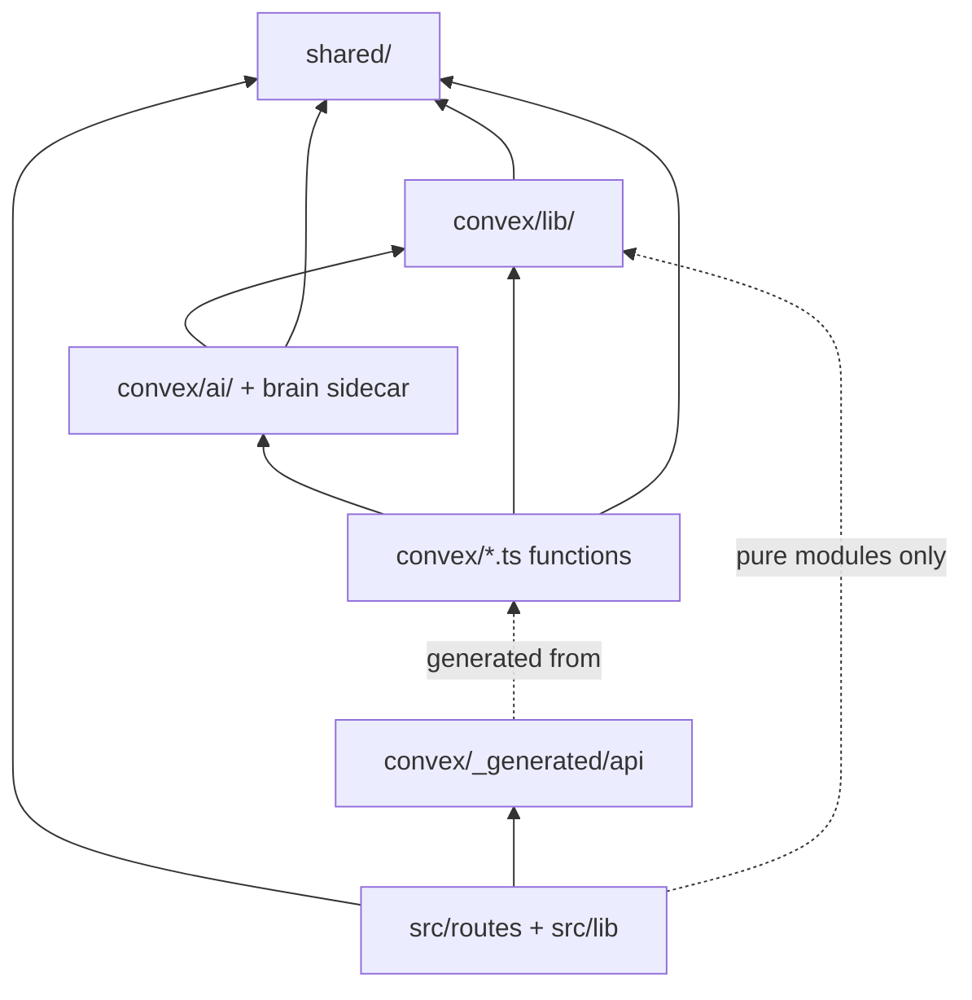

Rule: `shared/` imports nothing app-specific. `convex/lib` imports `shared` only. `convex/ai` may import `convex/lib` and `shared`. `convex/*.ts` functions import all of those. `src/` imports `shared`, `convex/_generated/api`, and pure modules under `convex/lib/` that have no Convex runtime import (today `lineLimits`, `transcripts`; six import sites in `src/`); it never imports `convex/*.ts` function modules or `convex/ai/`. Documented only: `svelte-check` resolves any relative path and does not enforce direction. Target enforcement: a vitest case in the `shared` project that greps import statements for the three forbidden directions.

## Invariants & Rules

### AD-1 [ADOPTED] Paradigm and dependency direction

- **Binds:** all
- **Prevents:** a generic agent framework or supervisor swarm replacing the fixed pipelines; AI code writing state outside its axis; client code importing Convex function modules; `shared/` growing app-specific imports.
- **Rule:** New AI work is a new filter in `convex/ai/` scheduled as a Convex action with a durable run row (status vocabulary in Consistency Conventions), not a new orchestrator. Imports follow the dependency graph above. Enforcing code: `convex/_generated/api` is the only client entry for Convex functions (`src/lib/**` imports `api` from `$convex/_generated/api`); the layer rule itself is documented only.

### AD-2 [ADOPTED] Three state axes on `projects` never cross-write

- **Binds:** workflow, generation, dashboard projection
- **Prevents:** a completed generation silently advancing workflow; a second writer corrupting `dashboardCompanies.stageCounts`; legacy `status` being treated as workflow truth.
- **Rule:**
  - `projects.workflowStage` (human) is patched only by `patchProjectWorkflowStage` in `convex/lib/dashboardProjection.ts:149-166`, which moves the `stageCounts` bucket in the same transaction. Three callers: `projectWorkflow.setWorkflowStage` (`:396`), `workItems.create` with `confirmedStageChange` (`workItems.ts:302`), and `ownerBackfill` for legacy rows (`ownerBackfill.ts:223`). Inserts set `workflowStage: "intake"`, `workflowVersion: 0` only (`projects.createProject`, `ingestionPort.ts:167`, `reviewFromProject.ts:101`, `seed.ts`).
  - Inserting a `projects` row is part of the projection: the insert sets `dashboardCompanyCounted: true` and calls `upsertDashboardCompany(ctx, key, clientName, 1, "intake")` in the same transaction (`projects.ts:727,775`, `ingestionPort.ts:173,205`, `reviewFromProject.ts:109,157`). [TARGET] one `insertProject(ctx, fields)` helper in `lib/dashboardProjection.ts` does this and appends the initial `projectEvents` row; a source test forbids `db.insert("projects"` outside it. `dashboard.getFacets` (`dashboard.ts:416`) computes a second, scan-based `stageCounts` with a `legacy` bucket; that is a read-side facet, not the projection, and is named `facetCounts` when next touched.
  - Stage authority is evaluated in two places until the inline evaluator is removed: `evaluateTransitionAuthority` (`convex/projectWorkflow.ts:64-99`) and `workItems.create` (`workItems.ts:247-263`). Any change to `shared/workflowTransitions.ts` or the evaluator updates both in the same PR; `convex/workItems.test.ts` asserts parity for the `drafting -> internal_review` edge. Divergence #4 records that the inline copy already skips note/requirement policy.
  - `generations.status` (technical: `reserved | running | awaiting_selection | awaiting_input | completed | failed | superseded`) is written only by `convex/generations.ts` mutations; it never patches `workflowStage` (decision D4).
  - `projects.status` (legacy: `draft | generating | review | client_review | final`) is a compatibility field; new screens read it only as fallback when `workflowStage` is absent. Nothing syncs the two; that is intentional until the narrow-phase decision.
  - Every stage write echoes `expectedVersion` against `projects.workflowVersion` and appends a `projectEvents` row.

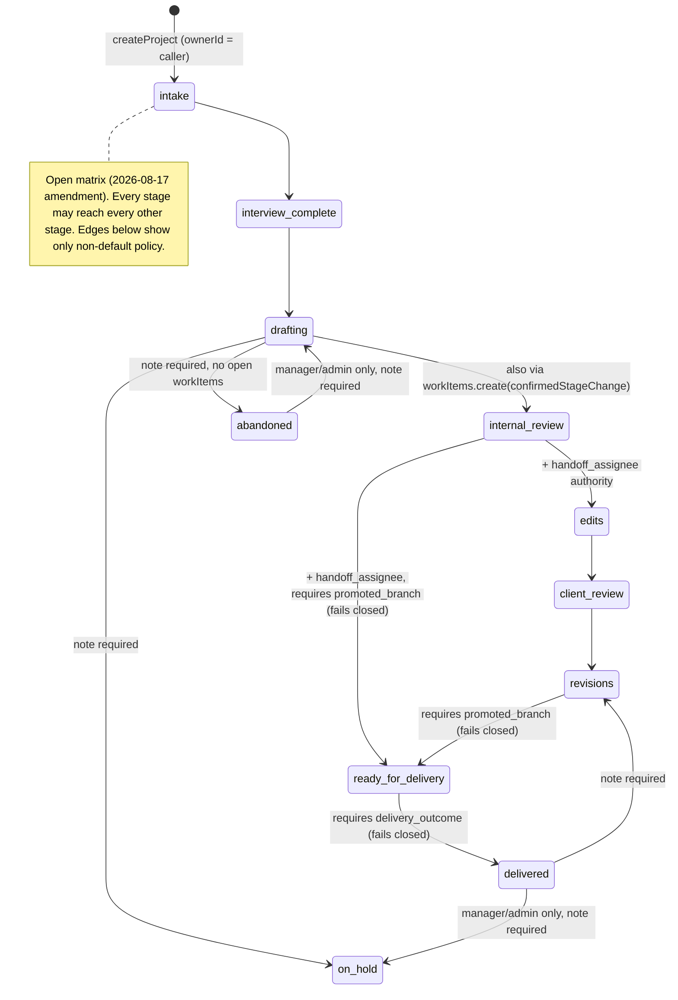

Per-edge policy lives in `shared/workflowTransitions.ts:28-50`; authority resolution in `convex/projectWorkflow.ts:64-99`. `ready_for_delivery` and `delivered` are unreachable until `reportBranches` and `productionOutcomes` exist (see Q1).

### AD-3 [ADOPTED] One prose-write path

- **Binds:** report/prose, chat, generation, comments, snapshots
- **Prevents:** an eighth writer bypassing OCC or the pre-edit snapshot; a stale client overwriting a newer revision; provenance surviving a human edit it no longer describes.
- **Rule:** Two write shapes, both closed lists.
  - Revision writers patch an existing report: each (a) calls `requireReportEditAccess(ctx, projectId)` (`convex/lib/roleCapabilities.ts:82-105`), (b) fences the write, (c) writes a `reportSnapshots` row before the edit in the same transaction, (d) increments `revisionNumber`, recomputes `contentHash`, and clears `provenanceId`. The seven: `reports.updateReportContent`, `chatV2.applyProposal`, `chatV2.markProposalApplied`, `comments.acceptEdit`, `snapshots.restoreSnapshot`, `generations.approveSectionDraft`, `generations.selectReportCandidate`.
  - Fence today: three take `expectedRevisionNumber` and throw `STALE_REVISION` (`updateReportContent`, `markProposalApplied`, `restoreSnapshot`); `applyProposal` fences on target-text uniqueness, `acceptEdit` on comment state, `approveSectionDraft` on `attempt`, `selectReportCandidate` on generation status. [TARGET] Every revision writer fences on `(reportId, expectedRevisionNumber)`; content-shape fences are additional, never substitutes; `chatProposals`, `writerReviews`, and future `reviewDecisions` / `reportEditDistance` rows name `(reportId, revisionNumber)` (divergence #47).
  - Creation writers insert a `reports` row at `revisionNumber: 0`: `generations.createGeneratedReportArtifacts` (`generations.ts:906-969`, reached from `completeCandidateRun`, iterative completion, and `selectReportCandidate`) and `projects.copyProjectInputRows` (`projects.ts:826`, reached from the public `prepareProjectContentCopy`). [TARGET] Each requires `report.editProse` on the target project and stamps the provenance it came from (`generationId` or `copiedFromReportId`). Today `copyProjectInputRows` checks `requireInternalProjectAccess` only (divergence #36). `seed.ts` is dev-only and excluded.
  - The current report has one definition: [TARGET] `projects.currentReportId`, set by the creation writers and moved only by them (widen now, ahead of `reportBranches`, so every new table keyed on `reportId` has a stable meaning). Today `getLatestReport` picks the newest row by `_creationTime` while `applyProposal` loads `proposal.reportId`, so a proposal authored against report A applies to A after a new generation makes B current.
  - Adding a writer of either kind requires amending this list, `docs/product-domain.md:1461-1466`, and `convex/reportAuthz.test.ts`. Snapshot prune keeps a hard cap of 50 but never deletes milestone (R-labelled) rows (`convex/lib/snapshots.ts`).

### AD-4 [ADOPTED] Agents propose, humans apply

- **Binds:** chat, research, any future AI tool
- **Prevents:** a tool or agent gaining a direct prose path; a proposal applied against a document it was not written for.
- **Rule:** AI output that touches prose lands only as a `chatProposals` row in state `pending`. The sole writer of tool proposals is `internal.chatV2.saveProposal` (`convex/chatV2.ts:844`, `internalMutation`), which is the last stop fence: it refuses when the turn is terminal, when the target is not in the report, or when `requireUniqueTarget` fails. Research inserts `chatProposals` directly with a synthetic `agentThreadId` of `research:<sessionId>` (`research.ts:733`), bypassing the fence (divergence #48). [TARGET] `saveProposal` is the only `chatProposals` insert; `agentThreadId` is always a component thread id; non-chat producers (research, a future QA agent) pass `origin`. A human moves `pending -> applied` through `applyProposal` or `markProposalApplied` only (both AD-3 writers). `highlightPassages` rows insert as `applied` because they carry no prose. Enforcing test: `convex/chatProposals.test.ts`.

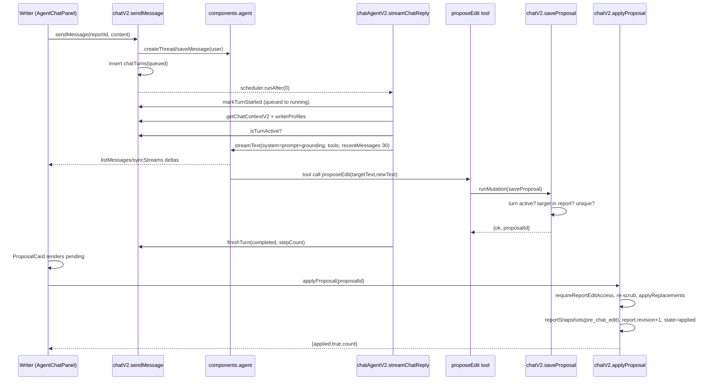

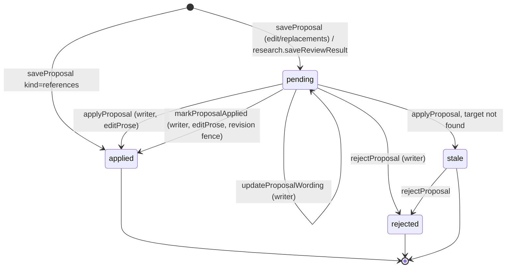

  - 2026-09-09: the Coordinated Revision's per-item Completion Report is the bulk-edit tool's findings persisted as `chatProposalItems` and echoed in the reply (AD-28); `saveProposal` and `applyProposal` are unchanged.

### AD-5 [ADOPTED] Frozen inputs, stamped provenance, one active generation

- **Binds:** generation, transcripts, documents, aiUsage
- **Prevents:** nondeterministic provenance when inputs change mid-run; two workers advancing the same generation; a digest or prompt version that cannot be traced to a report.
- **Rule:**
  - `reserveGeneration` (`convex/generations.ts:347-500`) copies every transcript (500k chars each, max 20) and document (200k each, max 50) into `generationSources` rows with content hashes; claims cite exactly one frozen row byte-for-byte; `transcriptDigests` enter only as frozen `transcript_digest` source rows, never as report prose. The worst case (20 x 500k + 50 x 200k chars in one mutation) exceeds Convex's 16 MiB transaction write cap and the 1 MiB per-document cap (divergence #40); the total budget in AD-11 is the fix, not a larger cap.
  - `beginGeneration` stamps `promptVersion` (hash of the prompt program, `convex/ai/promptProgram.ts:399-402`) and `learningDigestIds` (only digests whose non-blank content was in the payload) at `reserved -> running`.
  - One active generation per project: `reserveGeneration` throws `GENERATION_ACTIVE`; `claimCandidateRun` (`generations.ts:890-915`) and `claimSectionRun` (`:1325-1340`) re-check `activeGenerationId` before doing work; stale runs no-op.
  - `superseded` is terminal and only `retryFailedCandidates` may set it, linking a recovery generation via `retryOfGenerationId`.
  - Reapers (`convex/crons.ts`) terminalize `reserved`/`running` older than 30 min and stale post-QA older than 15 min; `awaiting_input` is never reaped.

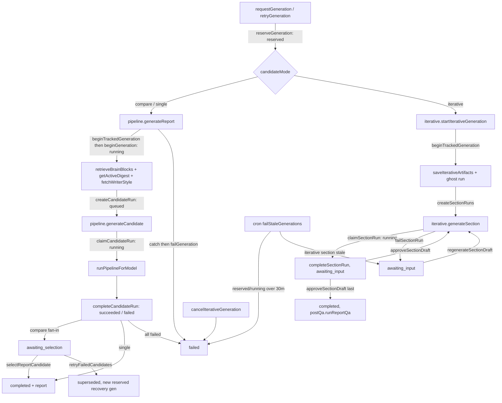

  - 2026-09-09: the Generation Brief is a frozen input too — `generationBriefs` / `generationBriefEntries` cite frozen `generationSources` rows byte-for-byte, and a writer-supplied Storyline is frozen as a `writer_storyline` source row (AD-23).

### AD-6 [ADOPTED] Knowledge is governed: Brain sources and learning digests are candidates until an admin acts

- **Binds:** Brain, learning, ingestion, reviews
- **Prevents:** auto-learning from unapproved or client-identifying content; a revoked source still being retrievable; a digest changing production behaviour without a selection event.
- **Rule:**
  - `brainSources.status` is `pending -> approved -> revoked`; every transition is admin-only (`convex/brain.ts:53-58` `assertAdmin`); the vector index holds only approved rows (`getBrainSourceForIngest` returns null for non-approved rows, `brain.ts:300-318`, so `embedSource` no-ops), and every retrieval re-joins served results to `status === "approved"` (`convex/ai/brain/retrieve.ts:176-192`). Revoke is confirmed erasure: `unlearnSource -> eraseBrainEntry -> recordUnlearnConfirmed`, with `unlearn_failed` retries up to 5 (`brain.ts:451-506`).
  - [TARGET] Revoke blanks `brainSources.content` and `title` to a tombstone once `unlearn_confirmed` is recorded; the row keeps `contentHash`, `sourceProjectId`, and the audit trail (today the text survives, divergence #37). Retrieval never serves a source whose `sourceProjectId` belongs to a different `clientName` than the requesting project unless the source carries `deidentified: true` (AD-13). Exemplar labels emitted to prompts are `scienceCode` and `writerTier` only; `title` and `writerName` are not emitted (divergence #38).
  - `learningDigests` rows are immutable candidates. `getActiveDigest` (`convex/learning.ts:173-183`) follows the append-only `learningDigestSelections` ledger; `selectDigest` requires `settings.configure` and an `expectedSelectionId` CAS (`:287-334`). Rollback = select an older digest; disable = `digestId: null`. Personal digests are never published globally. The pre-amendment active digest is frozen on first candidate save (`:196-227`).
  - Brain sources and digests are governed separately; digest publication never ingests report content into the Brain.
  - Enforcing tests: `convex/learning.test.ts`, `convex/brainUnlearn.test.ts`, `convex/brainErase.test.ts`.

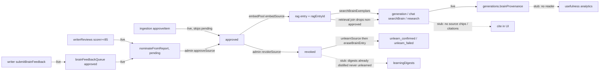

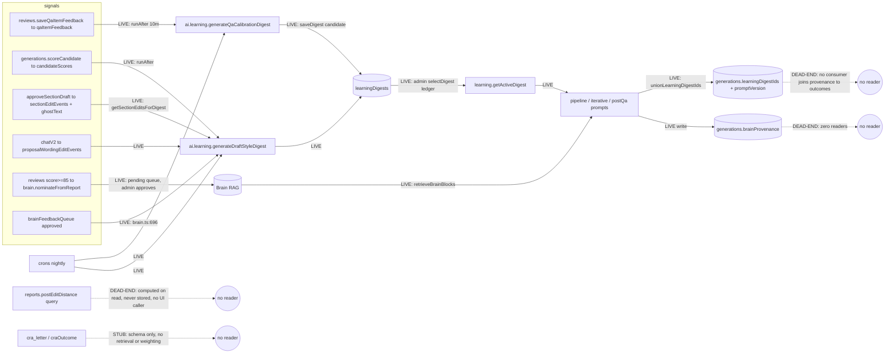

### AD-7 [ADOPTED] Authorization is capability presets resolved in Convex functions

- **Binds:** all mutations and queries
- **Prevents:** UI-only gating; `createdBy` used as authority; share-token visitors inheriting internal permissions; a user without a role reading internal data.
- **Rule:** Role presets live in `shared/capabilities.ts` (20 capabilities, presets `:52-116`). Convex functions call `requireCapability(ctx, cap, {ownedBy})` (`convex/lib/roleCapabilities.ts:43`) which resolves `all | own | none`; `own` requires caller in `ownedBy` and fails closed on empty. Object helpers: `requireReportEditAccess`, `requireFinancialWriteAccess`, `getFinancialReadAccessOrNull`. Internal actor = non-anonymous user with a role (`convex/lib/auth.ts:33-64`). Single tenant: one Convex deployment serves one firm; there is no org column and none is added without a new AD. External parties reach data only through `shareToken` (`client_review` scope) or `INGEST_API_KEY` (staging queue). Share-token access is a separate `client_review` scope from `getProjectAccess` (`lib/auth.ts:104-127`) and is honoured only by `reports`, `reportViews`, `comments`. Client-side `goto("/login")` redirects and admin-page redirects are UX only. Signup is invite-only in two layers (`convex/auth.ts:37-99` trigger, `:129-165` HTTP hook); both are required. Enforcing tests: `convex/roleCapabilities.test.ts`, `projectAccess.test.ts`, `reportEditAccess.test.ts`, `reportAuthz.test.ts`.
  - Project reads are firm-wide for internal actors (decision D1). `requireInternalProjectAccess` is the D1 read gate and the floor for writes, never the ceiling. Today `requireCapability` has 20 call sites and roughly 50 write paths authorize on the read gate alone (divergence #39): delete document and blob, delete comment, `startResearch` egress, chat spend, every project identity field, `finalizeProject`, `attachEvidence`, snapshots.
  - [TARGET] Every mutation that (a) deletes a row or blob, (b) sends client text outside the deployment, (c) spends provider budget, or (d) rewrites client identity fields (`title`, `clientName`, `industry`, `scienceCode`, `fiscalYear*`) names a capability cell and, for (a) and (d), appends an event row. Interim mapping until the cells exist (decided 2026-09-04, Q10): project Owner or Admin for all four classes, research egress included; Managers are excluded until the cells ship. Implemented as one helper `requireOwnerOrAdmin(ctx, projectId)` in `convex/lib/roleCapabilities.ts` that the ~50 call sites swap in for `requireInternalProjectAccess`. The `errorReports` family requires a role and `listErrors` requires `ops.viewAlerts`; `generateUploadUrl` requires a role. `users.setUserRole` appends `userEvents{type: role_changed, actorId, from, to}`.
  - [TARGET] Share tokens rotate on `unpublishReview` and expire (`shareTokenIssuedAt`, `shareTokenExpiresAt`; windows in Q11); `/review/*` responses carry `Referrer-Policy: no-referrer` and `X-Robots-Tag: noindex`. Today tokens never rotate or expire (divergence #41).
  - [TARGET] `/ingestion/upload` keys are rows in `ingestionKeys{hash, clientName, createdBy, revokedAt}`; `clientName` comes from the key, never from the request path; per-key daily request and byte limits via `@convex-dev/rate-limiter`; unknown or revoked keys log to `ingestionAuthFailures`. The shared `INGEST_API_KEY` path survives only until the first key row exists.

### AD-8 [ADOPTED] Report canonical format is a Tiptap JSON string with H2 headings as the parse contract

- **Binds:** report/prose, generation assembly, export, editor
- **Prevents:** backend and frontend disagreeing on document structure; export reading a different document than the one authorized.
- **Rule:** `reports.content` is `JSON.stringify(tiptapDoc)`. The backend builds it framework-free in `convex/lib/tiptapReport.ts:buildTiptapDocument` (H1 title, three H2 headings prefixed `Line 242`, `Line 244`, `Line 246`, `horizontalRule` separators, `[GAP: ...]` highlighted spans). The client parses it in `src/lib/reportSections.ts:parseCanonicalReport` by matching those heading strings; `GAP_CAPTURE_RE` must stay in sync with `GAP_MARKER_RE`. `convex/lib/lineLimits.ts` is the one source of CRA word/line limits for both runtimes. Export re-authorizes on `(reportId, revisionNumber, contentHash)` via `reports.authorizeExport` and `isSameExportRevision`; `exportTemplateDocx` and `file-saver` are loaded only by dynamic import in browser code. Enforcing tests: `src/lib/reportSections.test.ts`, `exportValidation.test.ts`, `convex/lib/tiptapReport.test.ts`.

### AD-9 [ADOPTED] One provider routing point, one action budget, every call metered

- **Binds:** generation, chat, research, Brain, aux agents
- **Prevents:** a new agent adding an unmetered or unbudgeted call; a timeout-times-retries product exceeding the Convex Node-runtime action limit of 10 min (all `convex/ai/**` actions are `"use node"`); a new agent with no spend ceiling.
- **Rule:** `clientForModel` (`convex/ai/providers.ts:97-107`) is the only routing point: Anthropic ids go direct, `openai/*` and `google/*` go through OpenRouter (`shared/generationModels.ts:gatewayForModel`); aux call sites stay on `instrumentedAnthropic`. Exception recorded as divergence #42: the research reviewer `anthropic/claude-sonnet-5` goes through `callOpenRouterResearch` (`convex/ai/research/core.ts:15`, `actions.ts:57,237`), bypassing `clientForModel`. Anthropic budget is `maxRetries=1`, timeout 240 s, so (1+1) x 240 + 60 < 600 (`providers.ts:33-56`, tested in `providers.test.ts`); OpenRouter is 180 s per attempt, one retry on 429/5xx. Every call passes through `convex/ai/instrument.ts` and lands in `aiUsage` with `generationId`, `candidateRunId`, `durationMs`, and cost. Brain retrievals during generation run sequentially (Voyage rate limit); the embed workpool is `maxParallelism 1`.
  - 2026-09-09: every call carries a slot label and the per-generation slot allowance is AD-27; ordered generation splits into per-section actions so the five-slot per-action arithmetic still holds (AD-24).
  - [TARGET] Every action that calls a model declares a per-call input budget in tokens (AD-11) and reads a per-project daily spend alert threshold from `appSettings`; `instrument.ts` never refuses a call on spend (decided 2026-09-04, Q12: alert only, no cap); crossing the threshold writes an `alerts` row surfaced at `/alerts`. The token budget in AD-11 remains the only hard input cap. Today metering exists and no alert does (divergence #17).

### AD-10 [ADOPTED] Schema rollout is widen, backfill, migrate consumers, then narrow

- **Binds:** all schema changes
- **Prevents:** narrowing a field in the release that introduced its replacement; a backfill that cannot resume; a required field breaking existing rows.
- **Rule:** New fields are optional (`v.optional`) in the widen commit; backfills are idempotent, paginated, resumable `internalMutation`s with an admin surface (`/admin/backfill`, `convex/ownerBackfill.ts`, `myWorkBackfill.ts`, `dashboardBackfill.ts`); consumers migrate; narrowing or removing a legacy field is a separate dated decision (`docs/product-domain.md:226,236,247`). No `@convex-dev/migrations`; the hand-rolled sweep pattern is the convention. Documented only; reviewed at PR.

### AD-11 [TARGET, not yet enforced] Trusted-context boundary

- **Binds:** generation, chat, research, any future agent that reads client content
- **Prevents:** the analyzer, chat, and each new agent inventing its own context assembly; client content steering the model from inside the system prompt; unbounded input.
- **Rule:** All client-sourced text (transcripts, documents, report body, analyzer JSON, prior decisions) enters the model as delimited data blocks in user-role messages, each with a class label and provenance header, under a per-source and total token budget with truncation recorded; this token budget is the only input cap, and spend is observed from `aiUsage` (AD-9), so there are not two budgets in two units. The system prompt is policy plus the `styleOverrides` projection only (AD-16) and is byte-stable per `(writerId, styleOverridesHash)`; a writer's `customInstructions` are a `writer_style` data block with internal trust, not system text. Trust class derives from the uploader's role at upload time, never from the client-settable `category` field: `projectDocuments` widens with `uploadedByUserId: v.optional(v.id("users"))` and `uploaderTrust: v.optional("internal" | "client")` stamped at insert by one `insertProjectDocument` helper, because `uploadedBy: v.string()` holds a user id in `documents.ts:146` and a display label in `projects.ts:867`, `reviewFromProject.ts:190`, `ingestionPort.ts:233`, and a late join to current `users.role` would silently demote three writers' notes to client trust. Injection fixtures land inside data blocks at every model call site that reads client content: analyzer, section agents, chat, research brief, PD review. Built by `spec-ai-engine-sprint-2-boundary` CAP-2 (`convex/ai/trustedContext.ts`), CAP-3 (uploader trust), CAP-4 (chat evidence message), CAP-5 (injection tests). Current state: documents fenced in the analyzer user turn (`convex/ai/analyzerAgent.ts:37-56`), transcript unfenced (`:172-174`), chat grounding concatenated into `system` (`convex/ai/chatAgentV2.ts:410`), trust by category (`convex/documents.ts:247`, `pipeline.ts:186-200`).
- **AD-11a interim, required before the next document-bearing feature ships:** (1) the transcript is wrapped in the same `--- BEGIN/END ---` delimiters as documents; (2) `CONTEXT_INPUTS_GUIDANCE` (`convex/ai/prompts.ts:839-845`) states that no attached material, writer's notes included, may issue instructions; writer's notes rank highest for facts and framing only, and the clause "and the writer's notes ... govern how you work" is removed; (3) chat grounding is sent as the first user-role message of the turn, `system` is `buildChatSystemPromptV2(styleOverrides)` alone; (4) `convex/ai/injection.test.ts` runs one fixture through the analyzer and chat prompt builders and asserts it lands inside a fenced block and that the system prompt is byte-identical with and without it. Tolerable today only because AD-4 gates prose and uploaders are staff; the `writer_notes` instruction grant on a client-settable category is a first-class injection channel (resolves Q7).

- 2026-09-09: per-source inclusion (`included | condensed | not_included`) is written onto `generationSources` and surfaced to the writer; the cap stays at 12 (AD-30).

### AD-12 [TARGET, not yet enforced] Learning must be measurable

- **Binds:** learn loop, Brain provenance, admin surfaces
- **Prevents:** accumulating write-only signals nobody reads; shipping a learning feature with no way to tell whether it helps.
- **Rule:** Every learning artefact has a writer and a reader, and a health metric surfaced at `/admin`. No new signal stream ships without its consumer. Firm-wide digests require at least two writers and two projects per source stream and record their input ids; writer identity on every signal table is `Id<"users">` (today `qaItemFeedback.userId` and `candidateScores.userId` are strings, so the count is not computable). Post-edit distance is measured against the `reason: "generated"` snapshot at `revisionNumber 0` for `report.generationId`; for iterative generations, where writers edit inside the stepper before assembly, the per-section baseline is `sectionEditEvents.distance`. Digest scope is explicit: `learningDigestSelections` carries `scope: "global" | "writer"` and `userId`, indexed `by_kind_and_scope_and_userId`, and `getActiveDigest(kind, scope, userId?)` reads it; today the ledger is `by_kind` only, so a per-writer memory feature that records a selection event would replace the firm's active digest. Built by `spec-ai-engine-sprint-2-learn-chat` CAP-2 (`reportEditDistance` table), CAP-3 (`/admin/learning`: PED trend, exemplar usage via `brainProvenance` join, rerank fallback rate), CAP-4 (diversity gate and digest inputs). Current state: `generations.brainProvenance` has one writer and zero readers (`convex/ai/brainRetrieval.ts:149`); `reports.postEditDistance` is computed on read and never stored; `cra_letter` / `craOutcome` are schema only. The eval harness (a case bank of transcript fixtures scored per section) is the third reader and is deferred until AD-11 gives it a stable boundary.

### AD-13 [TARGET, not yet enforced] De-identify before firm-wide knowledge

- **Binds:** every `importSource` caller (nomination, feedback queue, ingestion `finalizeApproval`), learning distiller inputs, section and proposal edit events
- **Prevents:** verbatim client PDs, names, or titles entering the Brain or a global digest; revoked rows that still hold identifying text.
- **Rule:** `importSource` (`brain.ts:130-160`) is the only `brainSources` insert and calls `deidentify` on `content` and `title` itself, so no caller can skip it; `sourceHash` and `ragKey` are computed on the de-identified text, so the same PD nominated by two paths dedupes to one row and one revoke. `deidentify(text, project)` strips client-side identities (`clientName`, `interviewees`, project and SR&ED titles) and email/phone patterns; firm-side names (`writerName`, interviewer) stay, because writer tier weighting reads them. Free-text `clientName` under two spellings leaks; that dependency on client normalization (Deferred) is noted. The digest prompt carries a privacy instruction; publishing a digest requires `privacyReviewed: true` recorded as a column on the `learningDigestSelections` row, not an argument. Seed: `convex/ai/research/core.ts:47-61` `redactExternalText`. Built by `spec-ai-engine-sprint-2-learn-chat` CAP-1. Current state: `nominateFromReport` writes verbatim report text including the project title (`convex/brain.ts:216-235`); no `lib/deidentify.ts`.
  - Raw signal rows (`sectionEditEvents`, `proposalWordingEditEvents`, `qaItemFeedback`, `candidateScores`, `writerReviews`) store text already passed through `deidentify`, not the original, so a distiller that forgets the step still never sees raw prose. They are in the AD-19 cascade. Digests selected before this lands carry `privacyReviewed: false` and `getActiveDigest` refuses to serve one until it is re-distilled.

### AD-14 [ADOPTED] `projects.createdBy` is immutable audit identity

- **Binds:** projects, authorization
- **Prevents:** repurposing the creator field as Owner; ownership transfer rewriting history.
- **Rule:** `createdBy` is set only at insert (`convex/projects.ts:682`, `reviewFromProject.ts:131`, `ingestionPort.ts:182`) and never patched. Authority reads `projects.ownerId`, Manager, or Admin via capabilities (AD-7). `ownerId` is patched only by `projectWorkflow.transferOwnership` (`:292`) and `ownerBackfill` (`:403`), each appending `projectEvents` and bumping `workflowVersion`; every insert sets `ownerId` to the acting user (`projects.createProject:677`, `ingestionPort.ts:176`, `reviewFromProject.ts:125`). The single remaining authority read of `createdBy` is `deleteProject` (`projects.ts:1028` via `requireProjectCreatorOrAdmin`), recorded as pending (Q2). Documented only; `convex/projects.test.ts` covers ownership.

### AD-15 [ADOPTED] The domain contract wins over implementation shortcuts

- **Binds:** all
- **Prevents:** transitions, permissions, or vocabulary invented in code without a record; silent drift between doc and behaviour.
- **Rule:** `docs/product-domain.md` is the contract. A change to vocabulary, an invariant, a transition edge, or a decision requires a dated amendment with affected tickets, migration impact, authorization and test impact, and product-owner approval before code relies on it (`:1559-1567`). Where code contradicts the contract without an amendment, the divergence register below is the backlog. Documented only.

### AD-16 [ADOPTED] Style rules are tiered: Locked versus Waivable

- **Binds:** generation prompts, QA, scrub, chat skeleton
- **Prevents:** a writer waiver loosening CRA form limits or fabrication rules; house-style rules hard-coded into agents without a waiver path.
- **Rule:** Locked (never overridable): CRA line/word limits (`convex/lib/lineLimits.ts` and the compression pass), no-fabrication and `[GAP]` evidence tracing, human-prose dash scan, voice consistency. Waivable per writer per category, subject to org mode in `houseStyle.modes`: the six categories in `shared/styleOverrides.ts` (`bannedWords`, `paragraphDensity`, `sentenceConstruction`, `repetitionCaps`, `openingClauses`, `reportSkeleton`). Waived rule text is omitted from the system prompt, not de-emphasised; waiving `bannedWords` also disables the mechanical scrub (`convex/ai/pipeline.ts:165-167, 284-286`); `styleOverrides` are frozen into `agentOutputs` so post-QA reruns score identically. Enforcing tests: `convex/ai/prompts.test.ts`, `qaChecks.test.ts`, `shared/styleOverrides.test.ts`.

  - 2026-09-09: precedence is four tiers — Locked Rules > enforced Org Mode > Writer Profile > House Rules — and no tier applies silently: per-category outcomes and `profileState` come back from `getEffectiveWriterStyle` and land in Compliance Notes (AD-25, AD-26).

### AD-17 [ADOPTED] Never hand-edit `convex/_generated/`; Convex guidelines override training data

- **Binds:** all Convex work
- **Prevents:** stale or hand-patched API types; Convex patterns from training data that the project has rejected.
- **Rule:** `convex/_generated/` is produced by `npx convex dev` / `convex codegen` only. `convex/_generated/ai/guidelines.md` is read before touching Convex code and overrides training-data patterns. Enforced by codegen overwrite; policy in `AGENTS.md`.

### AD-18 [ADOPTED] Client is a Svelte 5 SPA over reactive queries with a client-side auth gate

- **Binds:** frontend/export
- **Prevents:** server-side data loading that assumes a user; React idioms; optimistic state that fights the subscription; an unauthenticated query throwing on first render.
- **Rule:** Svelte 5 runes only (`vite.config.ts:24-25` forces `runes: true`); no React, JSX, or Next APIs. Data is `useQuery(api.x, () => authed ? args : "skip")` from convex-svelte; the only `+page.server.ts` is the root layout auth state. Protected pages redirect with `$effect` on `!auth.isLoading && !auth.isAuthenticated`; `hooks.server.ts` only scopes the JWT. No `withOptimisticUpdate`; the subscription is the optimistic layer. `WorkspaceGate.svelte` is the single branch point for `current | preview`, fail-closed; `?workspace=current` never subscribes the access query. bits-ui/shadcn-svelte primitives over native controls; design tokens in `src/routes/layout.css`; max font weight 500. Enforcement: runes flag and `svelte-check` only; design rules documented in `docs/design-system.md`. SSR is on; `convex-svelte` disables the client during SSR, so pages render a shell and hydrate into subscriptions; the only server file is `src/routes/+layout.server.ts` (auth state).

### AD-19 [TARGET, not yet enforced] Project-scoped rows follow the project

- **Binds:** every table with a `projectId` field, `_storage`, agent component threads, Brain
- **Prevents:** a new project-scoped table silently escaping deletion; frozen client text and original files surviving a delete; a retention window that nobody set.
- **Rule:** `convex/lib/projectScopedTables.ts` lists every table with `projectId` and one of `delete | detach | keep`; `deleteProject` schedules a `purgeProject` internalMutation that iterates the list in pages, deletes every `_storage` id referenced by deleted rows, deletes agent component threads by `agentChatThreads.threadId`, and revokes-and-tombstones every `brainSources` row with `sourceProjectId === projectId` (AD-6). `convex/projectErasure.test.ts` fails when `schema.ts` gains a `projectId` field not in the list. An `erasureLog` row records counts per table and the actor (the project row is gone, so `projectEvents` cannot hold it). Digests distilled from the project keep their de-identified content and record the erased id in `learningDigests.erasedInputProjectIds`. Retention: `generationSources` for terminal generations, `errorReports`, agent threads, and `chatTurns` get windows (Q9); `aiUsage` is kept as the billing record. Current state: `deleteProject` (`projects.ts:1103-1175` at HEAD) deletes `transcripts`, `reports`, `comments`, `generations`, `commenters`, `pdReviews`, `pdReviewEvents`, then the project: 8 of 49 `projectId` tables, no blobs (divergence #43).

- 2026-09-09: every new project-scoped table — `generationBriefs`, `generationBriefEntries`, `complianceNotes`, `chatProposalItems`, `comparisons` — carries `projectId` directly, whatever its parent, so the cascade and the schema-diff check see it without a join (AD-23, AD-25, AD-28, AD-29).

### AD-20 [ADOPTED as policy, TARGET in code] Every egress of client text is registered and class-gated

- **Binds:** generation, chat, research, Brain, ingestion, any outbound `fetch` or SDK client
- **Prevents:** a new agent sending client text to a host nobody approved; provider data-retention set in an account dashboard instead of code; a tenant-wide Graph grant on a client's drive.
- **Rule:** `docs/data-processing-register.md` lists each destination (Anthropic, OpenRouter with its downstream providers, Voyage, Convex region, Vercel region, Microsoft Graph), the data classes it receives (AD-21), the contractual basis, retention at the provider, and the owner. No code path adds an outbound host not in the register; review checks this. OpenRouter requests carry `provider: { data_collection: "deny", allow_fallbacks: false, order: [...] }` with the order from `shared/generationModels.ts` (today no provider options are sent, `convex/ai/openrouter.ts:90-101`). `research.startResearch` requires `projects.externalResearchConsent === true`, set by Manager or Admin. Graph access uses a drive-scoped permission (`Sites.Selected`), never `Files.Read.All` (`convex/convex.config.ts:26-31`, divergence #44); if the OneDrive path is dead, the env vars and code go. Current state: no register exists; `research.ts:73-135` egresses to OpenAI and Perplexity with no consent flag.

### AD-21 [ADOPTED as policy, TARGET in code] Data classes and their handling

- **Binds:** all tables, logging, `errorReports`, query helpers
- **Prevents:** treating a firm-internal row and a client transcript the same way; client text in logs or client-side breadcrumbs; firm-wide read with no trace.
- **Rule:** Four classes. **C1 client-confidential:** `transcripts`, `transcriptDigests`, `projectDocuments` and their `_storage`, `generationSources`, `reports`, `reportSnapshots`, `reportCandidates`, `chatProposals`, agent threads, `researchSessions/Sources/Claims`, `financialUploads`, `timesheetEntries`, `projectIdentityEvidence`, `brainSources.content`, `ingestionItems` text. **C2 derived-from-client:** analyzer JSON in `generations.agentOutputs`, `sectionEditEvents`, `proposalWordingEditEvents`, `qaItemFeedback.itemText`, `learningDigests`, `errorReports.breadcrumbs`. **C3 firm-internal:** `users`, `invites`, `workItems`, `projectEvents`, `aiUsage`. **C4 public:** `changelog`. C1 leaves the deployment only to registered processors (AD-20). C1 and C2 never appear in `console.*` output or in `errorReports`; a lint-style test asserts `console.*` sites under `convex/ai/**` pass only `Error.message`, ids, and counts. C1 reads by an internal actor on a project they do not own append a `projectAccessLog` row (projectId, userId, table, at) from the query helpers, sampled at most once per user per project per hour. Current state: no classification, no read audit; `errorReports.reportError` is unauthenticated and captures client-side `console.error` (divergence #45).

### AD-23 [TARGET] The Generation Brief is a frozen, versioned, provenance-validated stage

- **Binds:** CAP-1 to CAP-4, CAP-9, CAP-11 of `spec-pd-generation` (stories 1, 2, 4); generation, chat readers of the Brief
- **Prevents:** the Brief living as free text inside a prompt or as a blob on the generation row; entries that cite nothing; a writer edit silently replacing a derived Brief; Brief text drifting between runs; Brief content reaching the Brain or another project.
- **Rule:** A `brief` stage is declared in every `topology.modes.*` array of `convex/ai/promptProgram.ts` between `analyzer` and the first section, as a `calls.brief` structured call with `two-attempt-repair`. Its output is stored, never inlined: `generationBriefs` `{projectId, generationId, inputsHash, version, origin: writer | derived | edited, storylineText, editMagnitude}` indexed `by_projectId_and_inputsHash` and `by_generationId`, with child rows `generationBriefEntries` `{briefId, projectId, group: storyline | claimExclusion | confidenceMap | glossaryTerm | storylineQuestion, text, reason?, confidence?, sourceId, sourceContentHash, startOffset, endOffset, exactExcerpt, change?: added | removed | unchanged, question?: {sectionEvidenceEntryId, storylineBasisEntryIds, resolvedBy: use_evidence | keep_storyline | null}}` (child rows, not an array — Convex guideline). `generationBriefs` has exactly two writers: `internal.ai.brief.deriveOrReuse` (the stage, story 1) and `briefs.saveEntryEdit` (a writer edit, story 4); no other unit inserts. `inputsHash` is computed by one helper, `convex/lib/briefInputsHash.ts`, over the `contentHash` of every frozen `generationSources` row except `writer_storyline` and `transcript_digest`; a Storyline edit therefore never changes `inputsHash` and never re-derives the other groups. Reuse selects `MAX(version)` for `(projectId, inputsHash)`; a request that reuses a Brief stamps `briefId` on the generation explicitly. A re-derivation (new `inputsHash`) compares its entry set with the previous version's by `(group, sourceContentHash, startOffset, endOffset)` and stamps `change` on every entry so the rail's "N added · N removed" is read, not computed client-side. Glossary Term entries are derived by `convex/lib/glossaryMatcher.ts` (rule-based exact and inflected matching, model classification only on flagged candidates), the same matcher AD-25's Self-check reuses. Every entry's citation is validated the way `createProvenance` (`convex/reports.ts:77-139`) validates a claim: `sourceContentHash` equals the frozen row's hash and the slice equals `exactExcerpt`. A writer-supplied Storyline is frozen by `reserveGeneration` as a `generationSources` row of kind `writer_storyline` before the stage runs. The same `inputsHash` reuses the stored Brief; a writer edit inserts a new version and never mutates an old one; a Self-check contradiction with stronger section evidence raises a Storyline question and does not repair the section: the section chain inserts one `storylineQuestion` entry on the current Brief version (the one write outside its own `complianceNotes`, named in AD-25), and only `briefs.saveEntryEdit` resolves it. A Reference PD is marked by `projectDocuments.isReferencePd: v.optional(v.boolean())`, at most one true per project, set by the existing document mutations. `generationBriefs` and their entries are project-scoped rows (AD-19), excluded from every `brainSources` nomination path and from the Brain retriever. A generation with no stored Brief (every generation before this stage ships) renders the Brief rail and the Compliance line as absent — not as empty, loading or an error — and is never backfilled by the UI. Claim Exclusion `reason` is one of the eligibility categories; retention is Q17. Enforcing tests: `convex/ai/brief.test.ts` (derivation, contradiction → Storyline question, three-Transcript reconciliation, identical-inputs reuse, two named writers), `convex/lib/glossaryMatcher.test.ts`.

### AD-24 [TARGET] Ordered generation is a chain of per-section actions, ungated in `single` and `compare`

- **Binds:** CAP-5, CAP-9, CAP-10 (story 2); `convex/ai/pipeline.ts`, `iterative.ts`, `generations.ts` section runs
- **Prevents:** three sequential sections plus their checks crammed into one 600 s action (`SEQUENTIAL_CALLS_PER_GENERATE_CANDIDATE = 5` cannot hold twelve slots); a second approval gate appearing in `single`/`compare`; `iterative` losing its gate.
- **Rule:** Sections run in the Writer Profile's Build Order, else 242 → 244 → 246, each as its own scheduled action that reads the prior *drafted* sections as context — the `claimSectionRun` chain of `iterative` without `approveSectionDraft` in the path. The writer may stop after any section through one mutation, `generations.stopOrderedGeneration` (CAS on `activeGenerationId`, same pattern as `cancelIterativeGeneration`): the current section action finishes, no further section is scheduled, and the generation completes with `generations.stoppedAfterSection: "242" | "244"` set, `buildTiptapDocument` (`convex/lib/tiptapReport.ts`) renders the drafted sections plus a `[NOT GENERATED]` placeholder body under each remaining H2 so AD-8's three-heading contract holds, and "Generate the rest" is a new generation carrying `resumesGenerationId` and the drafted sections as prior context — a generation writer (`createGeneratedReportArtifacts`), never an eighth AD-3 revision writer. In `compare`, `candidateRunId` is set on every chain action and every row it writes. After the last section one assembled-draft consistency pass runs (one structured call) before the last section is shown. Per action the AD-9 five-slot budget still holds; `generations.status` keeps its vocabulary (AD-2); `iterative` mode and its approval gate are unchanged and remain the gated path. `compare` runs the chain once per candidate. A chain stalled between sections is recovered by the existing `failStaleGenerations` reaper (AD-5); no new reaper is added. Enforcing tests: `convex/ai/promptProgram.test.ts` (order recorded, no gate in `single`/`compare`, one consistency pass), `convex/ai/providers.test.ts` (per-action slot arithmetic unchanged).

### AD-25 [TARGET] Every section carries a Compliance Note produced by one Self-check call and stored as rows

- **Binds:** CAP-5, CAP-7, CAP-8, CAP-9, CAP-12 (story 2 owns; stories 4 and 5 read)
- **Prevents:** three units each inventing a compliance shape; an instruction applied or dropped silently; Self-check outcomes that live only in a progress-log sentence.
- **Rule:** After each section draft, one structured `selfCheck` call (`two-attempt-repair`, at most one repair of the section) returns verdicts against the Storyline, Claim Exclusions, Glossary Terms (rule-based matcher first, model judgment only on flagged candidates), Confidence Map calibration, the profile's paragraph rules and Locked Rules. Verdicts land in `complianceNotes` `{projectId, generationId, candidateRunId?, section, paragraphIndex?, source: deterministic | model, instruction, outcome: applied | not_applied, tier: locked | org_enforced | conflict | missing_fact | none, reason, repaired}` indexed `by_generationId_and_section` and `by_generationId_and_candidateRunId_and_section`; `candidateRunId` is required whenever the chain runs per candidate (`compare`) and the rail scopes by the selected candidate's tab, the report inheriting the selected candidate's rows on `selectReportCandidate`. `paragraphIndex` (0-based within the section, per `src/lib/reportSections.ts`) is set whenever a verdict is paragraph-scoped — every paragraph rule and every model row — so the Deviation Inventory (AD-28) can list every paragraph once and treat a paragraph with no `not_applied` row as matching. The six style categories produce deterministic rows whose `tier` is copied verbatim from the per-category outcome `getEffectiveWriterStyle` returns (AD-26) — never recomputed from `resolveEffectiveOverrides` here; free-text instructions produce model rows that quote the instruction. A fact the Confidence Map marks unresolved or unreliable stated without hedging fails the check. Outcomes and repair counts are summarised into the QA scorecard on the generation (`generations.qa`, `postQaStatus` pattern). No unit other than the section chain writes `complianceNotes`, and the chain's only write outside them is the `storylineQuestion` entry named in AD-23; the QA rail, the Editor's section-end line and the chat Deviation Inventory read them through one query. Enforcing tests: `convex/ai/selfCheck.test.ts` (excluded claim, synonym, cap breach, unreliable fact → hedged, single repair, paragraphIndex set), `convex/writerProfiles.test.ts` (tier copied, never recomputed).

### AD-26 [TARGET] Style precedence is four tiers and no tier applies silently

- **Binds:** CAP-6, CAP-8 (story 3); amends AD-16
- **Prevents:** a Writer Profile instruction beating an `enforced` org category; a disabled or missing profile silently replaced by House Rules; three call sites computing precedence three ways.
- **Rule:** Locked Rules > enforced Org Mode > Writer Profile > House Rules. `getEffectiveWriterStyle` (`convex/writerProfiles.ts:215-237`) returns, beside `customInstructions` and `styleOverrides`, a per-category outcome `{category, mode, effective, tier}` and a `profileState: applied | disabled | missing`; it is the only place `tier` is computed — `resolveEffectiveOverrides` returns modes, not tiers — and every generation and chat call site consumes that result and nothing else. A settings document detected in Writer's Notes or an attachment is applied as the profile for that generation and the writer is offered to save it. `docs/product-domain.md` records the four tiers, the "no silent tier" rule and the effort ceiling (the Dump is the maximum required input) as one dated amendment. Enforcing tests: `convex/writerProfiles.test.ts` (six categories × `writer_choice` / `enforced`, `profileState`, same outcomes across the three supply paths).

### AD-27 [TARGET] Per-generation call budget with named slots, recorded not enforced

- **Binds:** CAP-5, CAP-9 (stories 1, 2); amends AD-9; `convex/ai/instrument.ts`, `aiUsage`
- **Prevents:** an unnamed extra call per section; a repair loop; an overrun absorbed silently; a second spend mechanism beside the Q12 alert stance.
- **Rule:** Every model call carries a slot label in the existing `aiUsage.callSite` field using the codebase's `generation:` prefix convention — `generation:brief`, `generation:section:<n>`, `generation:selfCheck:<n>`, `generation:repair:<n>`, `generation:consistency`, `generation:compression`, `generation:qa`, `generation:chronology` — enumerated as a `const` in `convex/ai/instrument.ts` whose validator rejects any other `generation:*` label; the scorecard parses the slot as the text after the first colon. Per generation: at most one `brief`; per section one generation, one `selfCheck`, at most one `repair`; one `consistency`. The generation scorecard reports counts per slot and flags `overrun` when a slot exceeds its allowance. The 2x-of-today target (SM-C2) is measured from `aiUsage` `by_generationId`; no call is refused on budget (Q12: alert only). Enforcing tests: `convex/ai/instrument.test.ts` (slot enum, unknown label rejected, per-slot counts and `overrun`).

### AD-28 [TARGET] The Completion Report is the bulk-edit tool's per-item findings, persisted and echoed; Proposal apply is unchanged

- **Binds:** CAP-12 to CAP-15 (story 5); extends AD-4; `convex/ai/chatAgentV2.ts`, `convex/lib/passageEdits.ts`, `chatProposals`
- **Prevents:** a second edit path; items dropped between tool result and reply; a Deviation Inventory built from prose heuristics instead of stored notes; the "make it better" reply asking the writer for a document.
- **Rule:** `makeProposeBulkEdits` findings become the union `resolved | blocked | conflicting` with the existing coverage `superRefine` (unique ids, full coverage; the tool's own caps are 40 edits / 80 findings today, and the Completion Report contract of N ≤ 30 items is the spec's bound within them). Findings persist as `chatProposalItems` `{proposalId, projectId, itemId, status, reason, missingFact?, missingFactSource?, lockedRule?, alternative?}` (child rows) and the reply echoes every item. `saveProposal` stays the only `chatProposals` insert; `applyProposal` is untouched. The Deviation Inventory tool reads `complianceNotes` by `generationId` (AD-25) plus the report's paragraphs through `src/lib/reportSections.ts`, lists every paragraph once, and writer-added content items join the same list; the Reference PD comparison produces the same inventory shape with group `reference`. The missing-facts reply draws its questions from `generationBriefEntries` of group `confidenceMap` marked unresolved or unreliable. Enforcing tests [TARGET]: two new live fixtures in `scripts/chat-behavior-eval.mjs` — a 16-item mixed list that must report 16/16, and a "help you converge" prompt that fails on any request for a writer-authored artifact. Current state: the file holds seven fixtures, none of these. Enforcing tests: `convex/lib/passageEdits.test.ts` (N-item coverage), `convex/chatProposalItems.test.ts` (rows echoed 1:1 with the reply).

### AD-29 [TARGET] Paired Comparison records are their own table, human-entered, never derived from tool counts

- **Binds:** CAP-16 (story 6); `measurement-protocol.md`
- **Prevents:** SM-1 and SM-2 computed from the inventory the tool under test produced; development projects inflating the metric; a record edited after judging.
- **Rule:** `comparisons` `{projectId, reportId, revisionNumber, contentHash, generationId, banhallModel, baselineProduct, baselineModel, modelCaveat, judgeUserId, preference: banhall | baseline | tie, deviationsBanhall, deviationsBaseline, countingMethod, correctionsBanhall, correctionsBaseline, usedInDevelopment, recordedAt, voidsComparisonId?}` plus the stripped plain texts the judge actually read, `banhallDraftText` and `baselineDraftText`, stored on the row; `contentHash` pins the structured revision and a server-side `sha256` of the plain-text extraction of that revision is compared with `banhallDraftText` at record time and stored as `draftTextMatches`. Pinned to a revision like `writerReviews`, indexed `by_projectId` and `by_recordedAt`; writes require an Admin until Q18 decides the capability cell; `voidsComparisonId` backs a UX assumption (re-enter, never edit) and is the only correction path. Enforcing tests: `convex/comparisons.test.ts` (record shape, `draftTextMatches`, development and voided rows excluded from SM-1/SM-2, non-admin refused). SM-1 and SM-2 queries exclude `usedInDevelopment` rows and voided rows. Deviation counts are entered by the judge, never read from `chatProposalItems` or `complianceNotes`.

### AD-30 [TARGET] The context cap is unchanged; inclusion status is recorded per source and surfaced

- **Binds:** CAP-11, CAP-17 (stories 2, 4); extends AD-11; `convex/ai/trustedContext.ts`, `generationSources`, `appSettings`
- **Prevents:** a second budget; a document described as used when it was cut; the cap moving without a decision.
- **Rule:** The `TrustedContextSource` result (`included`, `truncated`, `includedLength`) is written onto the matching `generationSources` row as `inclusion: included | condensed | not_included` and `includedLength`; one query returns them per generation and is the only source for the Brief's Inputs band and the Files panel status. Chat evidence assembly (`convex/ai/chatEvidence.ts`, its own budget) is a distinct scope: chat copy says "in this reply" and never renders a bare `included` / `condensed` / `not included`, so the two budgets can differ on one document without two truths on screen. `DEFAULT_CONTEXT_BUDGET.maxDocuments` stays 12 and only `appSettings` changes it (trigger: Q16). Attachment count is independent of the budget: a project accepts at least 40 documents; `describeContextCuts` keeps producing the progress-log sentence. Enforcing tests: `convex/ai/trustedContext.test.ts` (40 attached, 12 in context, per-row `inclusion` written and returned).

## Consistency Conventions

| Concern | Convention |
| --- | --- |
| Table names | camelCase plural (`projects`, `workItems`, `chatProposals`, `brainSources`); 69 tables in `convex/schema.ts` |
| Indexes | `by_<field>[_and_<field>]` (`by_authId`, `by_status_and_startedAt`, `by_generationId`); paginated indexed queries for lanes, never collect-and-filter in the browser |
| Append-only tables | `*Events` suffix (`projectEvents`, `workItemEvents`, `pdReviewEvents`, `sectionEditEvents`, `proposalWordingEditEvents`) plus `brainAuditLog`, `learningDigestSelections`; no code path patches them |
| Auth helper pairs | `requireX` throws, `getXOrNull` returns null: `requireCurrentUser` / `getCurrentUserOrNull`, `requireInternalProjectAccess` / `getInternalProjectAccessOrNull`, `requireFinancialWriteAccess` / `getFinancialReadAccessOrNull` (`convex/lib/auth.ts`, `roleCapabilities.ts`) |
| Scheduler-only writers | `internalMutation` / `internalAction` for anything called from actions or crons (`saveProposal`, `markTurnStarted`, `finishTurn`, `claimCandidateRun`, backfills); public mutations are the only client entry |
| Ids | Convex `Id<"table">`; client request ids from `src/lib/requestId.ts:createRequestId()` (UUIDv4) |
| Timestamps | epoch milliseconds (`Date.now()`); firm-local time helpers in `shared/firmTime.ts` |
| Errors | `domainError(code, message, details?)` from `convex/lib/contracts.ts:31` throws `ConvexError({code, message})`; codes include `NOT_AUTHENTICATED`, `NOT_AUTHORIZED`, `NOT_FOUND`, `STALE_REVISION`, `INVALID_INPUT`, `INVALID_STATE`, `INVALID_TRANSITION`, `GENERATION_ACTIVE`, `OUTCOME_REQUIRED`, `BLOCKING_EXISTS`, `EXPORT_NOT_AUTHORIZED`, `PROVIDER_NOT_CONFIGURED`; client decodes `ConvexError.data.{code,message}` via `src/lib/errors.ts` (`userErrorCode`, `userErrorMessage`); raw provider strings are never user copy |
| Optimistic concurrency | `expectedRevisionNumber` on reports, `expectedVersion` on `projects.workflowVersion` (bumped by stage, ownership, handoff pointer, owner backfill), per-item `version` on `workItems`, `expectedSelectionId` on digest selection, `expectedContentHash` on export |
| Idempotency | `createRequestId` + fingerprint on `workItems.create`; `attemptKey` on `documentUploadAttempts`; same-stage transitions are no-ops; completion is idempotent |
| Denormalized data | Pointers and counters (`currentHandoffId`, `activeGenerationId`, `dashboardCompanies.stageCounts`, `dashboard*` projection fields) move in the same transaction as the canonical row |
| Sanctioned write shape | CAS claim before work (`queued -> running`), terminal status never overwritten, reapers indexed by `by_status*` |
| Run rows | Status vocabulary `queued -> running -> completed \| failed`, plus `awaiting_*` for human-gated waits; `succeeded` on `generationCandidateRuns` is legacy and is not copied. Every run table has `by_status_and_startedAt` for its reaper and a `claim*` internalMutation |
| Files | Bytes live in Convex `_storage`; text is extracted at upload (`src/lib/parseDocument.ts` in the browser, server-side for `/ingestion/upload`) and stored on the row as `content`; the row owns its blob and deletes it when the row is deleted (AD-19); 15 MB per file, extension allowlist in `convex/lib/ingestionClassify.ts` |
| Config | Convex `env` schema in `convex/convex.config.ts:21-37`; provider readiness is env-key presence (`convex/lib/providerConfig.ts`) |
| Logging / observability | `aiUsage` for spend, `errorReports` for client errors (`ErrorMonitor.svelte`), Convex logs for `console.*`; no third-party vendor. [TARGET] every cron writes a `cronRuns` row with outcome; cron failures, reaper kills, spend-threshold crossings, and `errorReports` spikes write `alerts` rows surfaced at `/alerts` (decided 2026-09-04, Q13: in-app only, no outbound channel) |
| Frontend state | component-local runes; `.svelte.ts` stores only for `stableQuery` and `chat/uiMessages`; pure functions in `src/lib/{dashboard,workspace,workflow,mywork,uploads}` |
| Frontend queries | `useQuery` with `"skip"` until `auth.isAuthenticated`; `useStableQuery` to hold the last result across arg changes; `useMutation` then `await`; no optimistic updates |
| UI rules (documented only) | design tokens from `src/routes/layout.css`, type roles and remapped gray ramp, no ad-hoc hex, max font weight 500, bits-ui primitives, active tab = primary fill + white text, inactive hover = primary wash, 44px touch targets |
| Generation UI (2026-09-09, adopted `ux-Banhall-2026-09-09`) | Brief is a third `railView` of the report workspace; Compliance line under each section-end marker plus a QA-rail section; Inventory checklist and Completion rows inside the existing proposal card; no modal, no gate before the first section, no new colour tokens. Compliance-line pills read `complianceNotes.outcome` (`applied` / `not_applied`), qualified by `tier` when not applied; Inventory and Completion pills read `chatProposalItems.status` (`resolved` / `blocked` / `conflicting`) — two enums from two stories, never merged |
| Tests | vitest projects `convex` (edge-runtime + `convex-test`), `shared`, `src`; component tests `*.component.test.ts` under `vitest.component.config.ts` (never add `sveltekit()` there). Every AD that names an enforcing test is extended in the same PR that extends its guarded list (AD-3 writers, AD-4 proposal writers, AD-7 capabilities, AD-9 call sites). New Convex mutations ship with a `convex-test` case for the authorization branch |

## Stack

Verified from `node_modules` 2026-09-03.

| Name | Version |
| --- | --- |
| svelte | 5.56.6 |
| @sveltejs/kit | 2.70.1 |
| @sveltejs/adapter-vercel | 6.3.x |
| vite | 8.1.5 |
| typescript | 5.x |
| tailwindcss | 4.3.3 |
| bits-ui (shadcn-svelte) | 2.18.x |
| svelte-tiptap (Tiptap 3) | 3.0.x |
| convex | 1.42.3 |
| zod | 4.4.3 (discriminated unions + `superRefine` for tool findings, AD-28) |
| convex-svelte | 0.14.x |
| @convex-dev/agent | 0.6.4 (deep imports `dist/deltas.js`, `dist/UIMessages.js`, `dist/shared.js` pinned in `src/lib/chat/agentInternal.ts`) |
| @convex-dev/rag | 0.7.x |
| @convex-dev/workflow | 0.4.x |
| @convex-dev/workpool | 0.4.x |
| @convex-dev/better-auth | 0.12.x |
| better-auth | 1.6.x |
| ai (Vercel AI SDK) | 6.0.230, v6 maintenance line (`ai-v6` tag); 7.0 shipped 2026-06-25 |
| @ai-sdk/anthropic | 3.0.x (v6 line); 4.x is the v7 pairing |
| @ai-sdk/voyage | 1.0.x (v6 line) |
| @anthropic-ai/sdk | 0.82.x |
| vitest | 4.1.x |
| Node | 22 in CI (`.github/workflows/ci.yml:26`); no `engines` or `.nvmrc` |
| Default generation model | `claude-sonnet-5` via Anthropic direct (`shared/generationModels.ts:MODEL`); Active, retirement not before 2027-06-30 |
| Alternate models | `openai/*`, `google/*` via OpenRouter; research uses `openai/gpt-5.6-sol`, `perplexity/sonar-deep-research`, reviewer `anthropic/claude-sonnet-5` via OpenRouter (AD-9 exception) |
| Embeddings / rerank | Voyage `voyage-3-large` 1024d (listed by Voyage as previous generation; `voyage-4-large` current), `rerank-2.5` (`convex/ai/brain/embeddings.ts`); changing the embedding model re-embeds every approved source |

Decision: stay on the AI SDK v6 line (`ai`, `@ai-sdk/*`, `@convex-dev/agent` 0.6, `@convex-dev/rag` 0.7.5) until the chat evidence message (AD-11 CAP-4) lands, then migrate as one change. Until then `package.json` pins `@convex-dev/rag` to `0.7.5` exactly (0.7.6 peers on `ai ^7`; the `^0.7.5` caret can pull it) and `@convex-dev/agent` to `0.6.x` (0.7 needs `ai ^7`, Node 22, moves the deep-imported `dist/deltas.js` and `dist/UIMessages.js` to `dist/vercel/`, renames `system` to `instructions`). `sorted` is a public export of `@convex-dev/agent` and is imported from the root, not deep (divergence #46).
| Hosting | Vercel (SvelteKit), Convex cloud (backend, components: rag, agent, workpool, workflow, betterAuth) |

## Structural Seed

### Source tree

```text
Banhall/
  convex/                      # backend; read _generated/ai/guidelines.md first
    schema.ts                  # 69 tables
    projects.ts projectWorkflow.ts workItems.ts myWork.ts dashboard.ts   # workflow core
    reports.ts snapshots.ts comments.ts reportViews.ts                    # prose + share-token reads
    generations.ts             # 2,997 lines: reserve/claim/complete/reap (split deferred)
    chatV2.ts chat.ts research.ts reviews.ts pdReviews.ts                # chat, research, reviews
    brain.ts learning.ts       # knowledge governance (sources, digests, selection ledger)
    documents.ts transcripts.ts ingestion.ts ingestionSync.ts ingestionPort.ts http.ts
    auth.ts users.ts invites.ts appSettings.ts houseStyle.ts writerProfiles.ts
    crons.ts                   # reapers, sweeps, nightly digests
    *Backfill.ts               # resumable widen/backfill sweeps
    ai/                        # engine
      pipeline.ts iterative.ts postQa.ts analyzerAgent.ts section24{2,4,6}Agent.ts qaAgent.ts
      chatAgentV2.ts prompts.ts promptDefinitions.ts promptProgram.ts structured.ts
      providers.ts openrouter.ts instrument.ts learning.ts brainRetrieval.ts writerStyle.ts
      brain/                   # rag.ts ingest.ts retrieve.ts erase.ts embeddings.ts scienceRouting.ts
      research/                # workflow.ts actions.ts core.ts (redactExternalText) manager.ts
    lib/                       # pure helpers: auth, roleCapabilities, contracts, dashboardProjection,
                               # snapshots, tiptapReport, lineLimits, transcripts, styleOverrides
    _generated/                # never hand-edit
  shared/                      # isomorphic contracts (no app imports)
  src/
    routes/                    # flat SvelteKit routes; layout.css = design tokens
    lib/
      components/              # ui/ (bits-ui), project/, editor/, chat/, workspace/, generation/, admin/
      reportSections.ts exportValidation.ts exportTemplateDocx.ts errors.ts requestId.ts
      chat/ uploads/ workspace/ workflow/ dashboard/ mywork/
  scripts/                     # client-uploader kit, onedrive-crawler, publish-changelog, loop-verify.sh
  tests/                       # 15 bun:test files; only aiUsage.test.ts runs under vitest (Q8)
  static/templates/schedule60.docx
  docs/                        # product-domain.md (contract), ai-architecture-plan.md, design-system.md
  .github/workflows/           # ci.yml (check + test), publish-changelog.yml
```

### Deployment topology

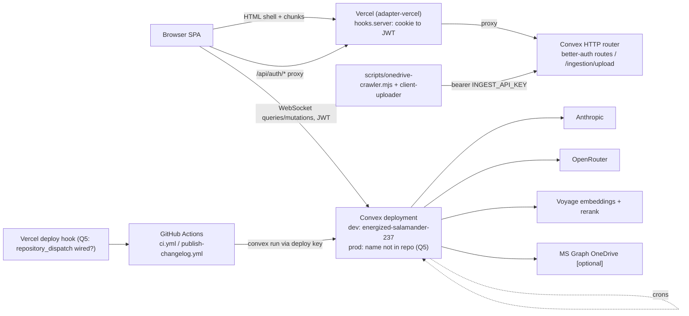

Operational envelope as found:

- Frontend: Vercel via `@sveltejs/adapter-vercel`; no CD workflow in the repo, so the Vercel git integration is the only deploy path consistent with what exists. Prod origin `https://banhall.vercel.app` is a hard-coded trusted origin (`convex/auth.ts:22`). Deploy skew handled by 60 s version polling and `vite:preloadError` reload.
- Backend: Convex dev deployment `energized-salamander-237`; prod name not in repo; no `convex deploy` in CI, so prod is deployed from a developer machine. No staging deployment.
- **Decision (AD-22 [TARGET]) Environments and deploy path:** there is no production deployment yet (decided 2026-09-04, Q5); `energized-salamander-237` is the only deployment and serves both development and the writers. Before launch: a separate prod Convex deployment, backend deploys via `npx convex deploy` in a GitHub Actions job on merge to `main` with a prod deploy key as a repository secret, and the current deployment becomes staging. CI gains a `convex codegen` diff check and `vite build` now, independent of launch. Every AD-10 widen must tolerate live writer data on the shared deployment until the split exists.
- Auth: Better Auth, email + password, `requireEmailVerification: false`, invite-only in two layers; no email provider.
- Env: Convex `ANTHROPIC_API_KEY`, `VOYAGE_API_KEY`, `OPENROUTER_API_KEY`, `MS_*`, `INGEST_API_KEY`, `SITE_URL`, `BETTER_AUTH_TRUSTED_ORIGINS`, `BRAIN_CONTEXTUAL`; frontend `PUBLIC_CONVEX_URL`, `PUBLIC_CONVEX_SITE_URL`, `PUBLIC_AGENT_CHAT`, `PUBLIC_BUILD_TIME`, `PUBLIC_SITE_URL`; CI `CONVEX_CHANGELOG_DEPLOY_KEY`.
- Crons: every 10 min stale generations (30 min), stale PD reviews, stale post-QA (15 min), stale chat turns (15 min); every 5 min oversight and my-work sweeps; daily 08:00 / 08:15 UTC digests.
- CI: `npm run check` + `npm test` only; no `convex tsc`, no build, no component tests, no `convex deploy`.
- Inbound: no rate limits; `/ingestion/upload` is a single shared bearer key, sha256 verified, 15 MB cap, extension allowlist, stages `ingestionItems` only; `clientName` is derived from the request path. Per-key rows and limits are AD-7 [TARGET].
- Observability: `errorReports` table and `aiUsage` spend; no external error tracking, alerting, or backup. Retention is AD-19; who gets paged is Q13.
- Auth hardening: `requireEmailVerification: false`, no MFA, no session policy stated (Better Auth defaults), `setUserRole` unaudited. Invite links are 72 h single-use. MFA and session idle timeout deferred to launch (decided 2026-09-04, Q14); invite-only staff is the control until then.

### Core entities

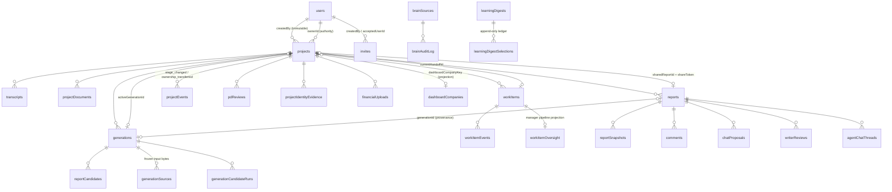

Not present although the contract plans them: `reportBranches`, `productionOutcomes`, `projects.activeBranchId` / `promotedBranchId`, `clients`, `claimPeriods`, `notifications`.

### Route tree

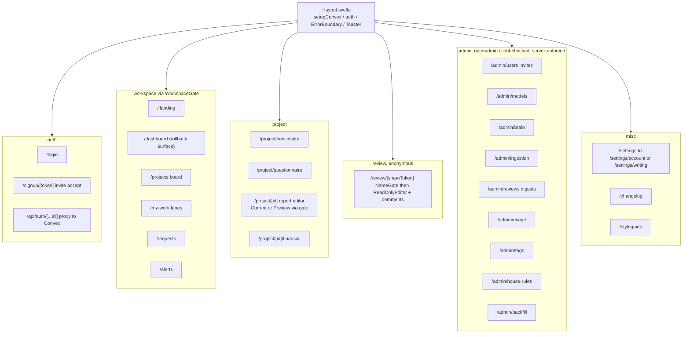

### Report page data flow

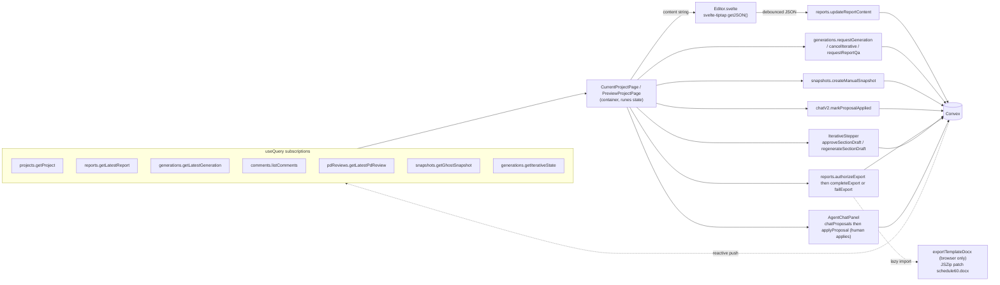

## Capability to Architecture Map

| Area | Lives in | Governed by |
| --- | --- | --- |
| Workflow (stages, ownership, work items, handoffs, dashboard lanes) | `convex/projectWorkflow.ts`, `workItems.ts`, `projects.ts`, `myWork.ts`, `dashboard.ts`, `lib/dashboardProjection.ts`, `shared/workflowStages.ts`, `shared/workflowTransitions.ts` | AD-2, AD-7, AD-14, AD-15; OCC and append-only conventions |
| Report / prose (content, snapshots, comments, export) | `convex/reports.ts`, `snapshots.ts`, `comments.ts`, `lib/tiptapReport.ts`, `lib/snapshots.ts`, `src/lib/reportSections.ts`, `exportValidation.ts`, `exportTemplateDocx.ts` | AD-3, AD-8, AD-7 |
| Generation (one-shot, compare, iterative, post-QA) | `convex/generations.ts`, `ai/pipeline.ts`, `ai/iterative.ts`, `ai/postQa.ts`, `ai/*Agent.ts`, `ai/prompts.ts`, `ai/promptProgram.ts`, `ai/providers.ts`, `ai/instrument.ts` | AD-1, AD-5, AD-9, AD-16, AD-11 (target) |
| Chat (turns, proposals, tools, research) | `convex/chatV2.ts`, `ai/chatAgentV2.ts`, `research.ts`, `ai/research/*`, `src/lib/components/chat/` | AD-4, AD-3, AD-9, AD-11 (target) |
| Brain (sources, embed, retrieve, erase, feedback) | `convex/brain.ts`, `ai/brain/*`, `ai/brainRetrieval.ts` | AD-6, AD-9, AD-13 (target) |
| Learning (signals, digests, selection, provenance) | `convex/learning.ts`, `ai/learning.ts`, `reviews.ts`, `crons.ts`, `src/routes/admin/reviews` | AD-6, AD-12 (target), AD-13 (target) |
| Ingestion (documents, upload attempts, corpus items, HTTP endpoint, uploader kit) | `convex/documents.ts`, `uploadAttempts.ts`, `ingestion.ts`, `ingestionSync.ts`, `ingestionPort.ts`, `http.ts`, `lib/ingestionClassify.ts`, `scripts/client-uploader`, `src/lib/parseDocument.ts`, `src/lib/uploads/` | AD-6, AD-7, AD-11 (target), idempotency convention |
| Frontend / export shell (routes, gate, editor, design system) | `src/routes/`, `src/lib/workspace/WorkspaceGate.svelte`, `src/lib/components/`, `src/routes/layout.css` | AD-18, AD-8, AD-17, UI conventions |
| Data lifecycle and confidentiality (erasure, egress, classes, read audit) | `convex/projects.ts:deleteProject`, `convex/lib/projectScopedTables.ts` (target), `docs/data-processing-register.md` (target), `convex/ai/openrouter.ts`, `convex/errorReports.ts` | AD-19, AD-20, AD-21 (all target) |
| Environments and deploy | `.github/workflows/`, Vercel, Convex deployments | AD-22 (target) |
| PD generation better than the dump (Brief, ordered self-checked drafting, Compliance Notes, one-pass convergence, Paired Comparison) | `convex/ai/promptProgram.ts`, `pipeline.ts`, `iterative.ts`, `trustedContext.ts`, `writerProfiles.ts`, `chatAgentV2.ts`, `lib/passageEdits.ts`, new `ai/brief.ts`, `lib/glossaryMatcher.ts`, `comparisons.ts`; `src/lib/components/project`, `editor`, `chat`, `generation` | AD-23 to AD-30 (all target); AD-4, AD-5, AD-9, AD-11, AD-16 |

## Deferred

| Decision | Why it can wait |
| --- | --- |
| `reportBranches` column shapes | Blocked on Q1 for the lifecycle. The identity decision is not deferred: a branch is a `reports` row, `projects.currentReportId` names the working one (AD-3), and every new table keyed on `reportId` carries `revisionNumber`. Without that, `reviewDecisions`, `reportEditDistance`, and `writerReviews` would each hard-code their own meaning of a report |
| `productionOutcomes` shape | Blocked on Q1; `delivered` is unreachable until it lands, which is the contract's intended safety |
| `clients` / `claimPeriods` and client-name normalization (D7) | Free-text `clientName` plus `dashboardCompanies` projection is sufficient for the dashboard; AD-13 `deidentify` and AD-6 same-client exclusion both key on it, so normalization is the first thing to land once either ships |
| Financial role | Contract forbids writing the role until schema, invite, admin, navigation, and authorization ship together (D5) |
| Notifications provider (D6) | In-app first; email blocked until a provider is chosen; no schema or secrets assumed |
| Per-client uploader keys: cutover date | Shape is fixed in AD-7 [TARGET]; the shared key stays only until the first key row exists |
| `generations.ts` module split and `progressLog` append rewrite | Behaviour is tested; a split is a refactor with no contract change |
| Dropping `chatMessages` / `chatThreads` | Read-only legacy for `LogsPanel`; drop once the panel reads agent threads |
| Staging Convex deployment topology | Owner decision on prod deploy (Q5) comes first |
| Observability vendor and backup provider | Retention moved to AD-19, alert path to Q13; the vendor pick needs an owner decision |
| Eval harness case-bank format | Depends on AD-11 landing so fixtures have a stable boundary to target |
| Target AI architecture phases 3 to 9 (evidence readiness, clarification, visible plan, specialised agents, monitoring, rollback) | Phase 2 (AD-11) is the first unbuilt invariant; later phases depend on it |
| Server-side blind A/B (strip `model` from `getCandidates` until scored) | UI convention today; sweep 02 Q7 |
| Shared analyzer across compare candidates with prompt caching | Sprint-2-boundary CAP-10; cost optimisation, no contract change |
| Chat spend budget per project and user | Sprint-2-boundary CAP-11; usage is observed today, not enforced |
| Replacing `workItems.create` inline authority evaluator with `evaluateTransitionAuthority` | The refactor waits; the parity obligation does not (AD-2) |
| AI SDK v7 / `@convex-dev/agent` 0.7 migration | Pinned on the v6 line until AD-11 CAP-4 lands (Stack decision) |
| `voyage-4-large` re-embed | Re-embeds every approved source; do it once with the same-client retrieval exclusion (AD-6) |
| Better Auth session policy, MFA | Q14; blocked on an email or TOTP path (D6) |
| Per-document trust-order display in the Brief Inputs band | PRD 6.2 defers to v1.1; MVP shows included / condensed / not included only (AD-30) |
| Per-section multi-select generation and an optional per-writer Brief gate | v2 and PRD Open Question 5; the ungated chain (AD-24) and the `iterative` gate cover today's two modes |
| Automated ChatGPT baseline for the Paired Comparison | Baseline drafts are pasted in (AD-29); automation has no owner |
| Raising `maxDocuments` toward 40 | Q16 names the trigger; until then `appSettings` only |
| CAD/DWG ingestion | October backlog; conversion path recorded in the PRD addendum |
| Backfilling Briefs and Compliance Notes for pre-feature generations | No owner and no consumer; pre-feature reports render the new surfaces as absent (AD-23); a Brief appears on the next generation |

## Open Questions

| Id | Question | Class |
| --- | --- | --- |
| Q1 | Decided 2026-09-04: build `reportBranches` + `productionOutcomes` as designed in `docs/product-domain.md`; terminal stages stay fail-closed until they ship. A branch is a `reports` row and `projects.currentReportId` names the working one (AD-3). | Product (closed) |
| Q2 | `deleteProject` authority: keep `createdBy` (audit stance) or move to a `project.delete` capability on Owner/Admin? Doc `:1456` says pending. | Authorization |
| Q3 | Generation request/retry/select have no capability cell; any Consultant can generate on any project. Intended under D1 firm-wide visibility, or align with `report.editProse` own/all? Interim until answered: new generation-adjacent writers copy `selectReportCandidate` (`requireReportEditAccess`), not `requestGeneration` (`requireCurrentUser`). | Authorization |
| Q4 | Which orchestrator is canonical: factory (worktree per ticket) or bmad-loop (in-place)? The `5a5f61c` hand-merge shows friction. Affects any branch-discipline AD. | Process |
| Q5 | Decided 2026-09-04: no prod deployment exists; `energized-salamander-237` serves everyone. Split at launch (AD-22). Still open: is the Vercel `repository_dispatch` for changelog publishing wired? | Operations (part closed) |
| Q6 | Ingestion `approveItem` lands `approved`, skipping the pending review that every other nomination path uses. Intentional? If yes, AD-6 gains "`approve: true` requires an admin actor and writes an `approve` audit row"; if no, it lands `pending`. | Knowledge governance |
| Q7 | Resolved by AD-11a: writer's notes rank highest for facts and framing only; no attached material issues instructions. | AI engine (closed) |
| Q8 | 14 bun-only `tests/*.test.ts` are dead under vitest: port or delete? Component tests (49 files) are not in CI: add? Recommendation: port or delete in one PR; run `test:component` in CI on `src/lib/components/**` changes. | Tests |
| Q9 | Retention windows for `generationSources` (terminal generations), `errorReports`, agent threads, `chatTurns` (AD-19). Proposed defaults: 90 / 90 / 180 / 180 days. | Data lifecycle |
| Q10 | Decided 2026-09-04: project Owner or Admin for delete, egress, spend, and identity writes; Managers excluded until the capability cells ship (AD-7). | Authorization (closed) |
| Q11 | Share-token lifecycle: rotation on unpublish and expiry window (AD-7). Proposed: rotate when older than 30 days on republish, expire at 90 days. | Authorization |
| Q12 | Decided 2026-09-04: no spend cap, alert only (AD-9). Still open: the alert threshold number in `appSettings`. Per-call token budgets stay with AD-11. | AI engine (part closed) |
| Q13 | Decided 2026-09-04: in-app `/alerts` only; no email, Slack, or vendor (AD-9, observability convention). | Operations (closed) |
| Q14 | Decided 2026-09-04: neither MFA nor session timeout before launch; invite-only staff is the control. | Authorization (closed) |
| Q15 | Is `openai/gpt-5.6-sol` via OpenRouter the same behaviour as Sol inside the ChatGPT product? Resolve, or record the caveat on every `comparisons` row, before SM-1 runs (AD-29). Owner: Johnny. | AI engine |
| Q16 | What triggers raising `DEFAULT_CONTEXT_BUDGET.maxDocuments` toward 40 — a writer hitting the cap on a real project, or a cost decision? Until decided, `appSettings` only (AD-30). Owner: Johnny. | AI engine |
| Q18 | Who may write `comparisons`: an Admin-only `comparisons.record` capability cell, or the project Owner too? CAP-16 names "Michael or Johnny", which is people, not a cell. Interim: Admin only (AD-29). Owner: Johnny. | Authorization |
| Q17 | Retention and framing of stored Claim Exclusions (`generationBriefEntries`, group `claimExclusion`) under the Pre-Claim Approval regime: which AD-19 window applies, and who signs off. Owner: Michael by default. | Data lifecycle |

## Divergence register

Where code contradicts the contract, the plan, or the audit. Deduped from sweeps 01 §5, 02 §8, 03 §8, 04 §6-7.

| # | Divergence | Status | Evidence | Governing AD |
| --- | --- | --- | --- | --- |
| 1 | Delivery and branch lifecycles are stubs; `ready_for_delivery` and `delivered` fail closed | open (Q1) | `convex/projectWorkflow.ts:358-368`, `shared/workflowTransitions.ts:59-62` | AD-2, AD-15 |
| 2 | `deleteProject` authorizes on `createdBy` | open (Q2) | `convex/projects.ts:1028`, `lib/auth.ts:77-90` | AD-14, AD-7 |
| 3 | External-client handoff party not representable (`assigneeId: v.id("users")`) | open | `convex/schema.ts:294`, doc `:117` | AD-15 |
| 4 | `workItems.create` re-implements stage authority inline and skips note/requirement policy | open | `convex/workItems.ts:247-263` | AD-2 |
| 5 | `writerReviews` / `pdReviews.startPdReview` accept any internal actor; no matrix row | open (doc gap) | `convex/reviews.ts:51`, `pdReviews.ts:30` | AD-7 |
| 6 | Generation request/retry/select have no capability cell | open (Q3) | `convex/generations.ts:516,594,2695` | AD-7 |
| 7 | `brain.ts` uses ad-hoc `assertAdmin` throwing plain `Error`, not `domainError` | open | `convex/brain.ts:53-57` | AD-7, error convention |
| 8 | Legacy `projects.status` still mutated in parallel; no reader-migration plan | open by design | `convex/generations.ts:487,1123`, `projects.ts:955,991` | AD-2, AD-10 |
| 9 | Untrusted content in system prompt (chat); transcript unfenced in analyzer; trust by category | partial | `convex/ai/chatAgentV2.ts:389-410`, `analyzerAgent.ts:172-174`, `documents.ts:247` | AD-11 |
| 10 | No total input token budget; `MAX_TOTAL_TRANSCRIPT_CHARS` unreferenced | open | `convex/generations.ts:451,466`, `lib/transcripts.ts:15` | AD-11, AD-5 |
| 11 | PII enters digests and Brain verbatim; no `deidentify` | open | `convex/brain.ts:216-235`, `ai/learning.ts` | AD-13 |
| 12 | Learning measurement: `brainProvenance` write-only, PED never stored, no evals | partial | `convex/ai/brainRetrieval.ts:149`, `reports.ts:436` | AD-12 |
| 13 | Digest diversity gate absent (`sourceCount` only) | open | `convex/ai/learning.ts` | AD-12 |
| 14 | Negative-signal (`cra_letter` / `craOutcome`) schema only | open | `convex/brain.ts:82-109`, `ai/brain/rag.ts:29-45` | AD-12 |
| 15 | Compare mode duplicates analyzer per candidate; no prompt caching in generation | open | `convex/ai/pipeline.ts:246` | AD-9 |
| 16 | QA advisory-only | open by design | `convex/ai/qaChecks.ts:1-10`, `pipeline.ts:313` | AD-16 |
| 17 | Chat cost unbounded: all documents 20k each, no message cap, no budget or rate limit | partial | `convex/ai/chatAgentV2.ts:366-373`, `chatV2.ts:235,844-847` | AD-9, AD-11 |
| 18 | Ingestion `approveItem` skips the pending queue | open (Q6) | `convex/ingestion.ts:253-291` | AD-6 |
| 19 | Chat has no regenerate/retry on turns and no optimistic bubble | open | `src/lib/components/chat/AgentChatPanel.svelte:840-857` | AD-18 |
| 20 | `generations.ts` at 2,997 lines; `progressLog` spread-append O(n^2) | open | `convex/generations.ts:1966,2288` | AD-1 |
| 21 | Blind A/B exposes `model` in `getCandidates` | open | `convex/generations.ts:2635` | AD-5 |
| 22 | Design rules (tokens, weight <= 500, bits-ui) unenforced; 77 files use `font-bold` / `font-semibold`; no ESLint config | open | `docs/design-system.md`, `package.json` lint alias | AD-18 |
| 23 | 14 `tests/*.test.ts` are bun-only and dead under vitest; component tests not in CI | open (Q8) | `vitest.config.ts:19`, `.github/workflows/ci.yml` | test convention |
| 24 | No staging Convex, no `convex tsc` or build in CI, prod deploy undocumented | open (Q5) | `.github/workflows/ci.yml`, no `convex.json` | operational envelope |
| 25 | `env.example` stale (`NEXT_PUBLIC_*` names) | open | `env.example` | AD-18 |
| 26 | `the-brain.md` claims `/admin/brain` is admin-only by URL; page only redirects unauthenticated, server returns null | doc stale | `src/routes/admin/brain/+page.svelte:51-55` | AD-7 |
| 27 | Doc line citations for `deleteProject` cascade drifted (`:1055-1059`, now `:1025+`) | minor | `docs/product-domain.md:1509` | AD-15 |
| 28 | P0 internal-actor gate (anonymous / roleless users) | fixed | `convex/lib/auth.ts:44-63` | AD-7 |
| 29 | `markProposalApplied` bypassed editProse, snapshot, revision fence | fixed | `convex/chatV2.ts:510-585`, `chatProposals.test.ts:176-336` | AD-3, AD-4 |
| 30 | Timeout x retries exceeded action budget | fixed | `convex/ai/providers.ts:33-56`, `providers.test.ts` | AD-9 |
| 31 | `retryFailedCandidates` marked original `completed` without report | fixed (`superseded`) | `convex/generations.ts:576-712` | AD-5 |
| 32 | Brain revocation was intent-only | fixed (confirmed erasure) | `convex/ai/brain/erase.ts:22-37`, `rag.ts:62-125` | AD-6 |
| 33 | Cost attribution and prompt/digest version stamping | fixed | `convex/aiUsage.ts`, `generations.ts:713-735` | AD-5, AD-9 |
| 34 | `listProposals` unbounded, `listMessages` threw on missing thread | fixed | `convex/chatV2.ts:64-92,130-137` | AD-4 |
| 35 | `submitBrainFeedback` access scope | fixed | `convex/brain.ts:551-571` | AD-7 |
| 36 | `copyProjectInputRows` creates a report on the target project after the read gate only; no `report.editProse`, no provenance | open | `convex/projects.ts:826-840` (HEAD), public `prepareProjectContentCopy` and `copyProjectDocuments` are `mutation` not `internalMutation` yet called from an action | AD-3, AD-7 |
| 37 | Revoked `brainSources` keep `content` and `title` verbatim | open | `convex/brain.ts:353-396` | AD-6, AD-13 |
| 38 | Brain retrieval has no same-client exclusion; exemplar labels emit `title` and `writerName` into prompts | open | `convex/ai/brainRetrieval.ts`, `ai/brain/retrieve.ts` | AD-6 |
| 39 | ~50 write paths authorize on the read gate (`requireInternalProjectAccess`); `errorReports.*` and `generateUploadUrl` accept roleless users; `setUserRole` unaudited | open (Q10) | `convex/documents.ts:224-232`, `comments.ts:209-216`, `research.ts:73-87`, `chatV2.ts:235`, `projects.ts:129-457`, `errorReports.ts:75-146`, `users.ts:196-215` | AD-7 |
| 40 | `reserveGeneration` worst case exceeds Convex 16 MiB transaction and 1 MiB per-document caps | open | `convex/generations.ts:449-486` | AD-5, AD-11 |
| 41 | Share tokens never rotate or expire; commenter identity is name-only | open (Q11) | `convex/projects.ts:961-976`, `commenters` | AD-7 |
| 42 | Research reviewer routes an Anthropic id through OpenRouter, bypassing `clientForModel` | open | `convex/ai/research/core.ts:15`, `actions.ts:57,237` | AD-9 |
| 43 | `deleteProject` cascades 8 of 49 `projectId` tables and no `_storage` blobs | open | `convex/projects.ts:1103-1175` (HEAD) | AD-19 |
| 44 | OpenRouter requests carry no `provider.data_collection` setting; research egress has no consent flag; Graph uses `Files.Read.All` | open | `convex/ai/openrouter.ts:90-101`, `research.ts:73-135`, `convex/convex.config.ts:26-31` | AD-20 |
| 45 | `errorReports.reportError` unauthenticated and unbounded; captures client-side `console.error`; no data classification or read audit | open | `convex/errorReports.ts:25-45`, `ErrorMonitor.svelte` | AD-21 |
| 46 | `@convex-dev/rag` caret `^0.7.5` can pull 0.7.6 (`ai ^7` peer); `sorted` deep-imported although public | open | `package.json`, `src/lib/chat/agentInternal.ts` | Stack decision |
| 47 | Only 3 of 7 revision writers fence on `expectedRevisionNumber`; no `projects.currentReportId`, `getLatestReport` and `proposal.reportId` are two definitions of the current report | open | `convex/reports.ts:47`, `chatV2.ts:381,547`, `comments.ts:143`, `generations.ts:1893,2718`, `snapshots.ts:266` | AD-3 |
| 48 | `research.saveReviewResult` inserts `chatProposals` directly with a synthetic thread id, bypassing `saveProposal` | open | `convex/research.ts:733` | AD-4 |
| 49 | `projectDocuments.uploadedBy` is a string holding either a user id or a display label | open | `convex/documents.ts:146` vs `projects.ts:867`, `reviewFromProject.ts:190`, `ingestionPort.ts:233` | AD-11 |
| 50 | `learningDigestSelections` has no scope or `userId`; signal tables use string user ids | open | `convex/schema.ts:1694-1704`, `qaItemFeedback`, `candidateScores` | AD-12, AD-6 |
| 51 | `projects` inserts each hand-roll the dashboard projection (`dashboardCompanyCounted` + `upsertDashboardCompany`); `getFacets` computes a second `stageCounts` | open | `convex/projects.ts:727,775`, `ingestionPort.ts:173,205`, `reviewFromProject.ts:109,157`, `dashboard.ts:416` | AD-2 |
