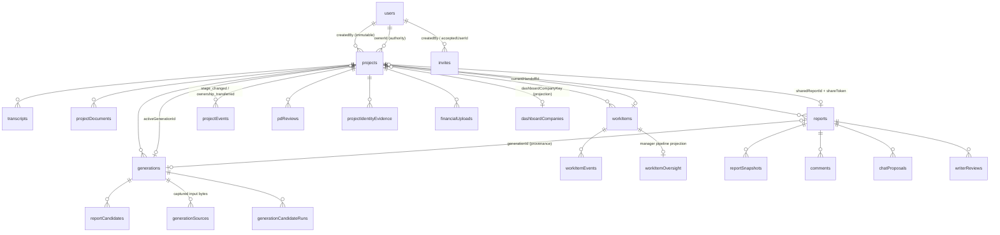
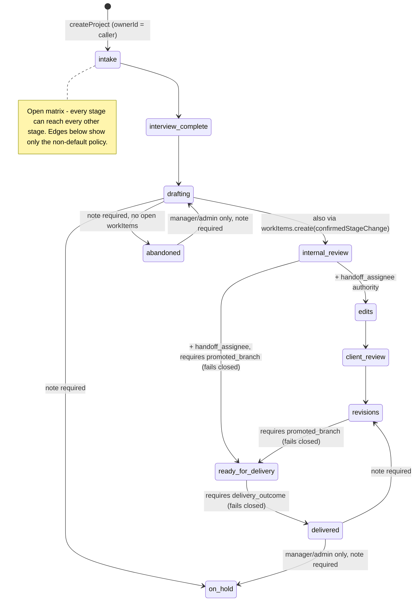

I have enough coverage. Here is the sweep.

---

# Banhall Architecture Sweep: Data Model, Workflow, Authorization, Core Backend

Read-only; no files modified. Repo at commit state as of 2026-09-03. Schema declares **69 tables** (`convex/schema.ts`). This slice covers the human-workflow core; AI pipeline internals are only touched where they write into that core.

## 1. Entity map

Key observations:

- **`projects` is the aggregate root and carries three orthogonal state axes** on one row: legacy `status` (`draft|generating|review|client_review|final`, `schema.ts:136`), human `workflowStage` + `workflowStageRank` + `workflowVersion` (`schema.ts:127-135`), and technical `activeGenerationId` / `generationActivity` (`schema.ts:144`). Dashboard projection fields (`dashboardCompanyKey`, `dashboardFiscalYearRank`, `dashboardSearchText`) are also denormalized onto the row (`lib/dashboardProjection.ts:175-199`).
- **Identity split**: `users.authId` links to the Better Auth component; `role` is optional (`schema.ts:23-25`), and a user without a role is treated as non-internal everywhere (`lib/auth.ts:33-64,116`).
- **Report content is a single string** (`reports.content`) fenced by `revisionNumber`/`contentHash` (`schema.ts:536-537`); `reportSnapshots` hold full copies, pruned to a hard cap of 50 with milestone R-labels preserved (`lib/snapshots.ts`).
- **`dashboardCompanies` is a derived projection, not a Client entity** (`dashboard.ts:198-200`); it stores `stageCounts` that must be moved transactionally with any stage write (`lib/dashboardProjection.ts:136-166`).
- **Doc-planned tables that do not exist**: `reportBranches`, `productionOutcomes`, `projects.activeBranchId/promotedBranchId` (`docs/product-domain.md:35,38`). Grep of schema returns nothing.
- `workItems.assigneeId` is `v.id("users")` only (`schema.ts:294`); the doc's `external_client` discriminated handoff party (`product-domain.md:117`) is unimplemented.

## 2. Workflow state machine

Stages: `shared/workflowStages.ts:1-12` (11 stages incl. `edits`, rank 3.5 at `:56`). Matrix: `shared/workflowTransitions.ts:63-66` builds **every from→to pair** (open matrix, 2026-08-17 amendment).

Per-edge policy (`shared/workflowTransitions.ts:28-50`):
- **Authorities**: default owner/manager/admin; `abandoned→*` and `delivered→on_hold` are manager/admin only; `internal_review→{edits, ready_for_delivery}` adds `handoff_assignee` (resolved from `projects.currentHandoffId` at `projectWorkflow.ts:64-99`).
- **Note required**: `→on_hold`, `→abandoned`, any exit from `delivered` or `abandoned`.
- **Requirements**: `→delivered` throws `OUTCOME_REQUIRED`; `→ready_for_delivery` throws `INVALID_STATE` (`projectWorkflow.ts:358-368`). Both edges are **currently unreachable** in production; the state machine effectively terminates at `revisions`/`client_review`.
- Extra guard: `→abandoned` blocked while any open work item exists (`projectWorkflow.ts:369-381`).

Two sanctioned stage writers, both routed through `patchProjectWorkflowStage` (`lib/dashboardProjection.ts:149-166`): `setWorkflowStage` (`projectWorkflow.ts:396`) and `workItems.create` with `confirmedStageChange: "internal_review"` (`workItems.ts:302`). The latter re-implements authority checks inline (`workItems.ts:251-263`) and explicitly skips `requiresNote`/`requirements` (comment at `:247-250`).

Legacy `projects.status` still moves independently: `requestGeneration` → `generating` (`generations.ts:487`), completion → `review` (`generations.ts:1123, 2089, 2743`), `publishForReview` → `client_review` (`projects.ts:955`), `finalizeProject` → `final` (`projects.ts:991`). Nothing syncs `status` and `workflowStage`.

## 3. Authorization model

**Layers**:

1. **Identity** (`lib/auth.ts:15-31`): Better Auth via `@convex-dev/better-auth`; `users` row looked up `by_authId`. Signup is invite-only in two layers: HTTP hook checks token (`auth.ts:129-165`), and the `onCreate` trigger transactionally requires a pending unexpired invite and consumes it (`auth.ts:37-99`). Roles are assigned from the invite (`auth.ts:78,87`), changed only by admin (`users.ts:196-215`; self-demotion blocked at `:208`).
2. **Internal actor gate** (`lib/auth.ts:33-64`): non-anonymous user with a role. Project reads are **firm-wide** for any internal actor (decision D1, `product-domain.md:214`); no membership or row-level filter exists. Dashboard queries only call `requireCurrentUser` (`dashboard.ts:184`).
3. **Capabilities** (`shared/capabilities.ts:3-42` 20 capabilities; presets `:52-116`): `requireCapability(ctx, cap, {ownedBy})` (`lib/roleCapabilities.ts:43`) resolves `all` / `own` / `none`; `own` requires caller ∈ `ownedBy`, fails closed on empty.
4. **Object-level helpers**: `requireReportEditAccess` (`roleCapabilities.ts:82-105`): owner OR any **open** work item on the project assigned to caller; managers/admins all. `requireFinancialWriteAccess` / `getFinancialReadAccessOrNull` (`:108-127`) return empty results to writers rather than throwing on reads.
5. **Share-token path** (`lib/auth.ts:104-127`): `getProjectAccess` returns `client_review` when `project.shareToken` matches and `sharedReportId` is set. Used only by `reports.ts:26,444`, `reportViews.ts:18`, `comments.ts:30,60,226,266`. Comment application back into prose still requires internal edit access (`comments.ts:197`).

**Enforcement map** (mutations):

| Concern | Guard | Location |
|---|---|---|
| Project create | `project.create` + `ownerId` arg must equal caller | `projects.ts:584-592` |
| Project metadata edits | any internal actor | `projects.ts:398` etc. |
| Bulk edits | `requireRole` + owner filter | `projects.ts` (doc `:1468`) |
| Stage change | matrix authorities, computed from `ownerId`/role/handoff | `projectWorkflow.ts:64-99,350` |
| Ownership transfer | `project.transferOwnership` own/all | `projectWorkflow.ts:253-300` |
| Work item create/manage | `workItem.*` capabilities; financial kind manager/admin only | `workItems.ts:181-185,133-140` |
| Report prose (5 writers) | `requireReportEditAccess` | `reports.ts:62`, `snapshots.ts:297`, `chatV2.ts:492,598`, `comments.ts:197` |
| Generation request/retry/select | any internal actor (no capability) | `generations.ts:516,594,2695` |
| Evidence verify/attestation | `requireRole(manager,admin)` | `projectEvidence.ts:97,123,163` |
| Delete project | **`requireProjectCreatorOrAdmin`** (uses `createdBy`) | `projects.ts:1028`, `lib/auth.ts:77` |
| Admin surfaces (invites, roles, settings, rollout, learning) | `requireRole(["admin"])` or `settings.configure` | `invites.ts:39`, `users.ts:207`, `appSettings.ts:87`, `workspaceRollout.ts:244`, `learning.ts:233` |
| Brain (`brain.ts`) | bespoke `assertAdmin` throwing plain `Error` | `brain.ts:53-57` |
| Dev flags | admin AND (`isDeveloper` or `isOwner`) | `users.ts:222-231` |

Convex `internalMutation`s (`prepareProjectContentCopy`/`finishProjectContentCopy` path, `pdReviews.complete*`, `financial.replaceTimesheetEntries`) rely on being callable only from server-side actions.

## 4. Mutation & concurrency invariants

- **Report OCC**: every prose write takes `expectedRevisionNumber`, throws `STALE_REVISION` on mismatch, and increments `revisionNumber` + recomputes `contentHash` (`reports.ts:47-62`, `snapshots.ts:207-216,266-279`, `chatV2.ts:547-580`, `comments.ts:172`). `applyProposal` also fails when the target passage is no longer unique (`chatV2.ts:455-463`). Snapshot-before-edit is done inside the same transaction.
- **Workflow OCC**: `projects.workflowVersion` is a single monotonic counter shared by stage changes, ownership transfer, handoff pointer changes and owner backfill (`projectWorkflow.ts:249,340`, `workItems.ts:155-163`, `ownerBackfill.ts:403`). Callers echo `expectedVersion`.
- **Work item OCC + idempotency**: per-item `version` (`workItems.ts:97-102`); `createRequestId` + fingerprint makes `create` replay-safe, rejecting reuse with different values (`workItems.ts:198-222`). Close paths are idempotent when already in the target state (`:454-456`).
- **Single blocking handoff**: at most one open blocking item per project, mirrored by `currentHandoffId`; checked on create (`:225-235`) and re-verified on close (`assertPointer`, `:141-152`). Pointer cleared atomically on close (`:494`).
- **Terminal projects reject new work**: `delivered`/`abandoned` block `workItems.create` (`:224`).
- **Stage writes are transactional with dashboard counts**: `patchProjectWorkflowStage` moves the `stageCounts` bucket in the same mutation (`lib/dashboardProjection.ts:149-166`); client-name changes move company buckets (`:181-193`).
- **Single active generation**: `reserveGeneration` throws `GENERATION_ACTIVE` (`generations.ts:398`) and stamps `activeGenerationId`; every worker claim re-checks that pointer (`generations.ts:906,1035,1336`), making stale runs no-op.
- **Generation input capture**: transcripts (500k cap) and documents (200k cap) are copied into `generationSources` with hashes at reservation (`generations.ts:449-490`), so later edits to inputs cannot alter provenance.
- **Owner immutability of `createdBy`**: only set at insert (`projects.ts:682`, `reviewFromProject.ts:131`, `ingestionPort.ts:182`); `ownerId` writers are exactly three (`projectWorkflow.ts:292`, `projects.ts:677`, `ownerBackfill.ts:403`).
- **Event sourcing is append-only** for `projectEvents`, `workItemEvents`, `pdReviewEvents`, `brainAuditLog`; no code path patches them.
- **pdReviews** double-run guard is per-project latest-row status (`pdReviews.ts:45-52`), not a pointer.

## 5. Divergences from `docs/product-domain.md`

1. **Delivery and branch lifecycles are stubs.** Doc §"Report branch lifecycle" (`:122-160`) and vocabulary rows (`:35,38`) describe `reportBranches`/`productionOutcomes`; schema has neither. The two matrix requirements are pure fail-closed throws (`projectWorkflow.ts:358-368`). Acknowledged in code comments (`shared/workflowTransitions.ts:59-62`) but the doc's Migration sequence still presents them as planned rather than blocked.
2. **`deleteProject` authorizes on `createdBy`** (`projects.ts:1028` → `lib/auth.ts:77-90`). Doc `:1456` records this as "pending a separate decision"; it is the one remaining authority read of the immutable audit field, which the doc's own vocabulary row (`:29`) forbids using as Owner.
3. **External-client handoffs** (doc `:117`) cannot be represented; `workItems.assigneeId: v.id("users")` (`schema.ts:294`).
4. **Stage entry via `workItems.create` bypasses note/requirement policy** (`workItems.ts:247-250`). Doc `:73-100` frames the matrix as the single policy source; this is a second, hand-written authority evaluator that must be kept in sync manually.
5. **`writerReviews` / `pdReviews.startPdReview` accept any internal actor** (`reviews.ts:51`, `pdReviews.ts:30`) with no capability; matrix (`:184-200`) has no row for them, so this is a gap in the doc, not necessarily in code.
6. **Generation mutations have no capability cell** (`generations.ts:516,594,2695` use `requireInternalProjectAccess` only). Any Consultant can start a generation on any project, while editing its prose requires ownership. Doc 2026-09-01 amendment (`:1439+`) covers `selectReportCandidate` prose write but not generation request authority.
7. **`brain.ts` uses ad-hoc `assertAdmin` throwing `Error`** (`brain.ts:53-57`) rather than `requireRole`/`domainError`, so clients cannot get typed `NOT_AUTHORIZED`. Doc cross-cutting rules (`:224-235`) call for typed domain errors.
8. **Legacy `projects.status` still mutated in parallel** (Section 2). Doc `:47` says it "remains a compatibility field"; no deprecation sequence or reader migration is recorded.
9. `projects.ts` deleteProject cascade lines cited in doc `:1509` as `1055-1059`; current file positions may have drifted (deleteProject starts at `:1025`). Minor.

## 6. Non-inferable invariants (worth documenting)

- `patchProjectWorkflowStage` is the **only** permitted `workflowStage` writer; a bare `ctx.db.patch` silently corrupts per-client `stageCounts` while keeping sums consistent (`lib/dashboardProjection.ts:136-147`). No lint or test enforces this.
- The "from" bucket for stage moves is the row's actual `workflowStage ?? "legacy"`, not the `intake` fallback used for authority (`projectWorkflow.ts:387-395`).
- A **stored user without `role`** is treated identically to an anonymous share-token visitor (`lib/auth.ts:112-117`); role removal is therefore a soft deactivation.
- `requireReportEditAccess` grants edit rights to anyone with **any** open work item on the project, regardless of `kind` (`roleCapabilities.ts:91-98`). A non-blocking "financial" item confers prose-edit rights.
- `workflowVersion` is bumped by ownership changes and handoff pointer changes, not just stage moves; clients holding a stale header will get `STALE_REVISION` on unrelated actions.
- `workItems.create` replay returns `stageChanged: true` whenever `confirmedStageChange` is present in the replayed args, even if the original call did not change stage (`workItems.ts:213-218`).
- Filing attestation freezes `report.revisionNumber` at approval time (`projectEvidence.ts:181`); `requireFilingReady` (`lib/auth.ts:250`) is what invalidates it, and only `finalizeProject` calls it.
- Snapshot prune HARD_CAP 50 never deletes milestone (R-labelled) snapshots (`lib/snapshots.ts`); a project with >50 milestones grows unbounded.
- Admins always see the preview workspace regardless of rollout switch (`workspaceRollout.ts:184`).
- `generations.previousProjectStatus` is stored so failure paths can restore legacy `status` (`generations.ts:444`).

## 7. Open questions

1. Is the intent to ship `reportBranches`/`productionOutcomes` (unblocking `ready_for_delivery`/`delivered`), or to amend the matrix so projects can reach a terminal state today? Currently no project can be marked delivered.
2. Should `deleteProject` move to Owner/Admin via a `project.delete` capability, or is creator-based deletion a deliberate audit stance?
3. Should generation request/retry/select be gated by a capability (e.g. `report.editProse` own/all) to align with prose-edit authority?
4. Is the plan to retire `projects.status` and derive artifact availability from `reports`/`generations`, and if so which readers (dashboard row exposes both, `dashboardProjection.ts:220`) block that?
5. Should `workItems.create`'s inline authority evaluator be replaced by a shared `evaluateTransitionAuthority` from `projectWorkflow.ts` to remove the duplicated policy?
6. Is "any open work item ⇒ prose edit" (regardless of kind) the intended reading of "assigned collaboration contexts", or should it be limited to `internal_review`/writing kinds?
7. `brain.ts` and `learning.ts` use different admin gates (`assertAdmin` vs `settings.configure`); should both converge on capabilities?
8. Test coverage: `projectWorkflow.test.ts`, `reportEditAccess.test.ts`, `workItems.test.ts`, `projectAccess.test.ts` exist; is there any test asserting that no writer other than `patchProjectWorkflowStage` touches `workflowStage`?