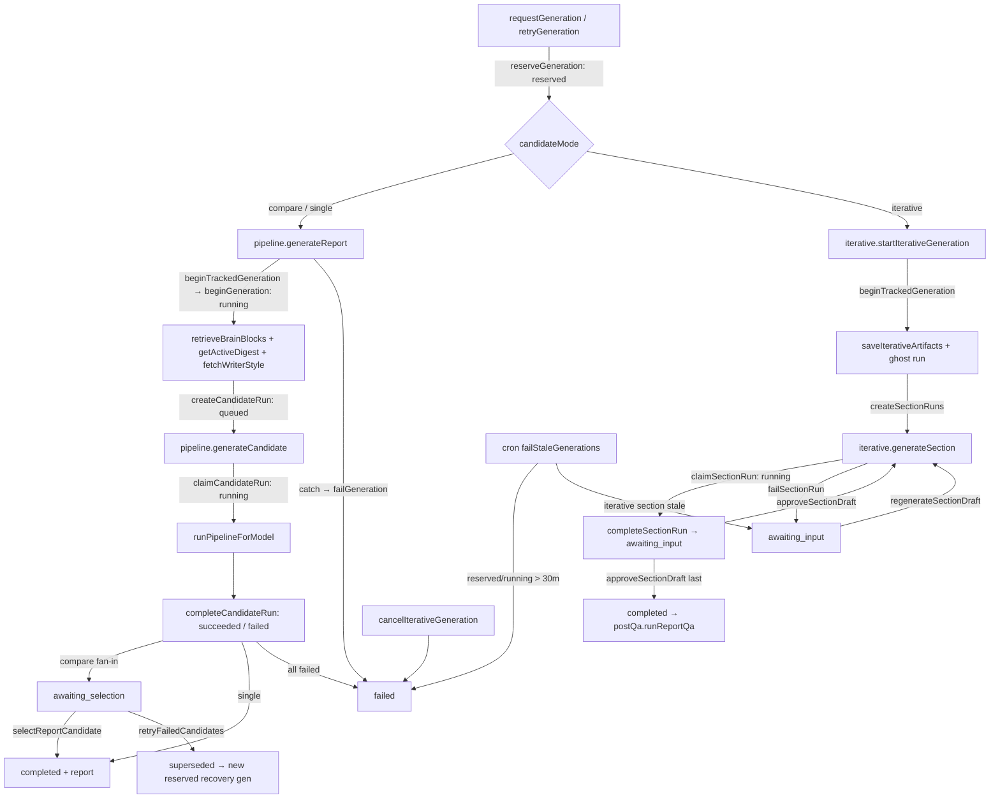
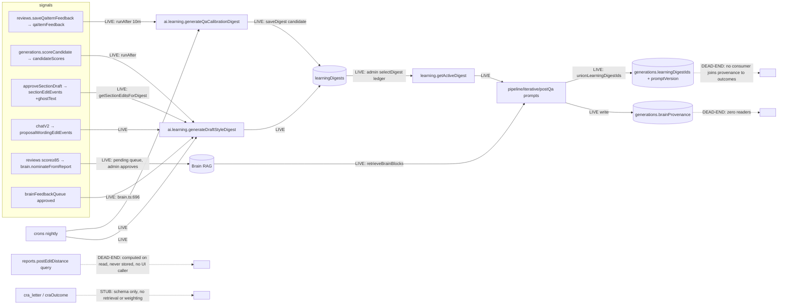

# Banhall AI engine and learn loop: architecture sweep (read-only)

HEAD `5a5f61c`, 2026-09-03. All cites `file:line`. Nothing modified.

## 1. Generation pipeline as built

Two pipelines share one reservation contract. `requestGeneration` (`convex/generations.ts:502`) calls `reserveGeneration`, which freezes transcripts (500k chars each, `:451`) and project documents (200k each, max 50, `:463-471`) into `generationSources`, inserts the generation as `reserved` (`:432`), flips the project to `generating`, and schedules either `internal.ai.pipeline.generateReport` or `internal.ai.iterative.startIterativeGeneration` by `candidateMode` (`:491-497`).

**One-shot / compare** (`convex/ai/pipeline.ts`): `generateReport` (`:407`) → `beginTrackedGeneration` (`:372`, hashes prompt program, `beginGeneration` stamps `promptVersion` and moves `reserved→running`, `generations.ts:713-735`) → `getGenerationInput` → `retrieveBrainBlocks` once (`:463`) → `getActiveDigest` ×2 (`:511-515`) + `fetchWriterStyle` → per model: `createCandidateRun` (`queued`, `generations.ts:870`) + schedule `generateCandidate` (`:553`). `generateCandidate` (`:584`) → `claimCandidateRun` (`queued→running`, `generations.ts:890-910`; refuses if the generation is no longer active) → `runPipelineForModel` (`:246`): analyzer → 3 section agents in parallel → banned-word scrub → `compressToFit` (≤2 squeezes, `:145`) → QA + chronology via `Promise.allSettled` (advisory, `:317`) → `createProvenance` → `completeCandidateRun` (`generations.ts:972`; `succeeded`/`failed`, fan-in: `awaiting_selection` for compare `:1107`, `completed` + report for single `:1127`, `failed` if all runs fail `:1147`).

**Iterative** (`convex/ai/iterative.ts`): `startIterativeGeneration` (`:60`) runs analyzer + Brain once, freezes them via `saveIterativeArtifacts` (`:185`), creates section runs (`pending/queued`), spawns a ghost one-shot run (`ghost: true`, `:212`), schedules `generateSection` (`:271`). `generateSection` → `claimSectionRun` → draft → `completeSectionRun` (run `awaiting_review`, generation `awaiting_input`, `generations.ts:1376-1384`). Writer `approveSectionDraft` (`:1880`) → next section `queued`, generation `running` (`:1961-1963`); final approval assembles the report, marks `completed` (`:2093`), sets `postQaStatus: running`, schedules `postQa.runReportQa` (`:2108-2111`). `regenerateSectionDraft` (`:2119`) requeues with attempt+1.

**Status ownership.** `generations.status`: `reserved` (reserveGeneration `:432`), `running` (beginGeneration `:730`; approveSectionDraft `:1963`; regenerateSectionDraft `:2149`), `awaiting_selection` (completeCandidateRun `:1107`; retryFailedCandidates recovery seed `:665`), `awaiting_input` (completeSectionRun `:1384`; failSectionRun `:1415`; reaper `:2286`), `completed` (completeCandidateRun `:1127`; approveSectionDraft `:2093`; selectReportCandidate `:2747`), `failed` (completeCandidateRun `:1147`; failGeneration `:1191`; cancelIterativeGeneration `:2183`; failStaleGenerations `:2300`; freeOrphanedGeneratingProjects `:2377`), `superseded` (retryFailedCandidates `:635`, terminal). `candidateRun.status`: `queued` (createCandidateRun `:870`), `running` (claimCandidateRun `:910`), `succeeded`/`failed` (completeCandidateRun; reaper `terminalizeOrphanedCandidateRuns` `:2310`). Section runs: `pending→queued→running→awaiting_review→approved|failed` (`schema.ts:1338-1343`). `postQaStatus`: `running` (`:1718`, `:2108`) → set by `saveReportQa` or `failed` (`:1672`, reaper `:2484`).

## 2. Prompt program and context assembly

- **`convex/ai/trustedContext*` does not exist.** Plan Phase 2 is unbuilt in generation.
- System prompts are static builders: `buildSection242SystemPrompt(styleOverrides)` etc. in `prompts.ts`; the two-tier locked/waivable rule assembly omits waived rule text (PSOS-49). No client content reaches the system prompt in generation (chat is different: `chatAgentV2.ts:410` concatenates `grounding` into `system`).
- User turn (analyzer, `analyzerAgent.ts:172-174`): transcript raw after a prefix, **no delimiters around the transcript**; context docs get `--- BEGIN [category:file]` / `--- END` fences (`:37-56`, `:128-148`); Brain exemplar block appended. Multi-transcript projects use `=== Transcript N: label ===` headers (`lib/transcripts.ts:96-105`).
- Trust: `CONTEXT_INPUTS_GUIDANCE` (`prompts.ts:834-839`) says writer notes are HIGHEST TRUST and beat the transcript; trust is still granted by the upload `category` field (`documents.ts:247`, `pipeline.ts:186-200`), unchanged from audit #3.
- Budgets: per-source caps only (transcript 500k, doc 200k at freeze; `getContextDocsForGeneration` 15k slice `documents.ts:250` is a different, unused-for-generation path). No total token budget; `MAX_TOTAL_TRANSCRIPT_CHARS = 2_000_000` (`lib/transcripts.ts:15`) is defined but referenced nowhere outside its module. Output budget: `lengthBudgetBlock` + `compressToFit` (`pipeline.ts:72-77`, `:145-171`).
- Section prompts: prefix + JSON analysis + Brain exemplars + length budget + `buildStyleGuidance(draftStyle, writerFlavor, overrides)` (`pipeline.ts:109-143`); iterative adds approved prior sections and regeneration guidance (`promptDefinitions.ts:87-102`).
- `promptProgram.ts` hashes every static constant/scaffold/schema/routing into `currentPromptVersion` (`:399-402`); runtime sentinels (`{{runtime.*}}`) are in the manifest as placeholders. Structured output: forced tool_choice, 2 attempts with repair scaffold, `unwrapEncodedJson` depth 3 (`structured.ts:11,36,86,106`).

## 3. Model / provider layer

- Catalogue in `shared/generationModels.ts`: `MODEL="claude-sonnet-5"`; Anthropic ids direct, `openai/*`, `google/*` via OpenRouter by `gatewayForModel`. `CANDIDATE_MODE_ROUTING`: compare needs two distinct ids; single/iterative fall back to Sonnet; default from `appSettings`.
- `clientForModel` (`providers.ts:97-107`) is the only routing point; all aux sites (`pd_review`, `financial`, `retrieval_brief`, `settings:style_analysis`, `admin:model_feedback_summary`, digests) stay on `instrumentedAnthropic`.
- Budget (CAP-6, `providers.ts:33-56`): action limit 600s, Anthropic `maxRetries=1`, timeout 240s → (1+1)×240+60 < 600. OpenRouter: 180s per attempt, one retry on 429/5xx, aborts not retried (`openrouter.ts:40,80`).
- Usage: every call through `instrument.ts` → `scheduleUsage` → `aiUsage.logUsage` with `generationId`/`candidateRunId`/`durationMs`; OpenRouter `usage.cost` preferred over `PRICING` (`aiUsage.ts:17-105`). `getGeneration` returns `promptVersion`, `learningDigestIds`, cost (`generations.ts:212`).
- No prompt caching in the generation path; only `brain/ingest.ts:41` uses `cache_control`. Compare mode still runs analyzer + QA per candidate (`runPipelineForModel` is per model).
- Provider config is env-key presence only (`lib/providerConfig.ts`); `providerReadiness.getCapabilities` surfaces it.

## 4. The learn loop

Verified by code:
- LIVE triggers: `reviews.ts:225-228` (10‑min debounce), `generations.ts:2897-2899`, `brain.ts:696-698`, `crons.ts:40-49`. Actions no-op below `MIN_FEEDBACK_ROWS=5` and when no new feedback (`ai/learning.ts:31-35,124`).
- Publication gate: `saveDigest` only inserts a candidate and freezes legacy choice on first save (`learning.ts:196-227`); `getActiveDigest` follows the append-only `learningDigestSelections` ledger (`:173-183`); `selectDigest` needs `settings.configure` and optimistic `expectedSelectionId` (`:287-334`). Admin UI at `src/routes/admin/reviews/+page.svelte:23-71`. Rollback = select an older digest; disable = `digestId: null`.
- Consumption: `pipeline.ts:511-527`, `iterative.ts:145-160` (qaCalibration only feeds the ghost QA; sections use deterministic checks), `postQa.ts:65`. Digest ids are unioned only when non-blank content is actually in the payload (`pipeline.ts:256-264`, `instrument.ts:48-56`).
- DEAD-END: `brainProvenance` has one writer (`brainRetrieval.ts:149`, `generations.ts:2502-2522`) and zero readers in `convex/` or `src/`. `postEditDistance` (`reports.ts:436`) has no `src/` caller and persists nothing. No `learningHealth.ts`, `lib/editDistance.ts`, or `lib/deidentify.ts` exist (Sprint 2 spec touchpoints unbuilt).
- STUB: `cra_letter` / `craOutcome` exist in `brain.ts:82-109` and metadata (`rag.ts:29-45`) but nothing filters or weights on outcome.

## 5. Reliability and failure modes

- Reapers (`crons.ts`): `failStaleGenerations` 30 min on `reserved`/`running` via `by_status_and_startedAt` (`generations.ts:2227-2350`); iterative running → section run failed + `awaiting_input` rather than whole-fail (`:2260-2292`); `awaiting_input` never reaped. `failStalePostQa` 15 min (`:2471`). `freeOrphanedGeneratingProjects` self-continuing sweep (`:2400`).
- Candidate isolation: each candidate is its own scheduled action with a durable run row; `claimCandidateRun` refuses claims on non-active generations (`:890-915`). QA/chronology failure never fails a candidate (`pipeline.ts:313-326`). Brain, digests, writer style each swallow errors (`brain/retrieve.ts:145-149,385-388`; `pipeline.ts:527-529`; `writerStyle.ts`).
- Entry-phase failure: `beginTrackedGeneration` fails the row with a phase-named error instead of waiting for the reaper (`pipeline.ts:372-404`).
- Partial compare: `retryFailedCandidates` marks the original `superseded` and seeds succeeded candidates into a linked recovery generation (`generations.ts:576-712`).
- Remaining risks: `progressLog` is rewritten by spread-append on every line (`:1966`, `:2288`, etc.), so long runs write O(n²) and can race concurrent appends; no total input token budget (a 20×500k transcript freeze passes and goes straight to the analyzer); Convex transaction write bounds at freeze are documented but unenforced (`lib/transcripts.ts:9-15`); iterative ghost run consumes a full one-shot budget per iterative generation; OpenRouter per-attempt 180s×2 + upstream is fine, but `compressToFit` adds up to 6 sequential-ish calls per candidate after the section fan-out with no per-candidate wall-clock accounting.

## 6. Test coverage of orchestration

64 test files; 49 use `convex-test`. Orchestration seams covered:
- Attribution/provenance: `generationAttribution.test.ts` (21; real entry actions, `getGeneration` cost matrix), `instrument.test.ts` (5).
- Recovery: `generationRecovery.test.ts` (16: reaper terminalization, `failStalePostQa`, CAP-7 superseded, `requestReportQa` gate), `generationReaper.test.ts` (3), `reaperIntegration.test.ts` (2), `generationEntryFailure.test.ts` (parametrised `it.each` blocks).
- Input freezing/citations: `generationInput.test.ts` (11).
- Learn loop: `learning.test.ts` (11: governed publication, distillation stream), `brainErase/Feedback/Unlearn`.
- Providers: `providers.test.ts` (CAP-6 budget), `openrouterRetryLoop.test.ts` (16), `openrouterCore.test.ts` (28), `structured.test.ts` (5).
- Prompts: `prompts.test.ts` (23), `promptScaffolds.test.ts` (5), `qaChecks.test.ts` (26), `brain/retrieve.test.ts` (6) + `retrieveFloorEdges`.

Gaps: no test drives `runPipelineForModel` end-to-end with a fake client (section fan-out, scrub, compress, allSettled QA); no test for iterative `approveSectionDraft` → assemble → ghost snapshot ordering; no prompt-injection test; no test that `promptVersion` changes when a scaffold changes (only "same program same hash" in attribution tests, per spec); no eval harness.

## 7. Invariants a builder could not infer

Enforced in code:
- One active generation per project; `claimCandidateRun` and `claimSectionRun` re-check generation status (`generations.ts:890-915`, `:1325-1340`).
- `superseded` is terminal and cannot be retried again (`:584-590`).
- Ghost run is never selectable and never used as section context; its candidate row is deleted, only a snapshot survives (`:2025-2080`).
- Digest id provenance only records digests whose non-blank content was in the payload (`pipeline.ts:256-264`).
- Waived house-style rules are omitted from the system prompt, not merely de-emphasised; `bannedWords` waiver also disables the mechanical scrub (`pipeline.ts:165-167`, `:284-286`).
- `styleOverrides` are frozen into `agentOutputs` so post-QA reruns score identically (`pipeline.ts:349-351`, `getPostQaInput`).
- Brain served results are re-joined to `brainSources.status === approved` on every search (`brain/retrieve.ts:181-196`).
- Approved-first ordering in iterative: earlier sections must be approved before later ones (`generations.ts:1915`).
- Anthropic (1+1)×240s+60s < 600s action budget (`providers.ts:33-56`, tested).

Documented only (not enforced):
- `MAX_TOTAL_TRANSCRIPT_CHARS` (`lib/transcripts.ts:15`, "writers enforce it in transcripts-3": no reference in `convex/transcripts.ts`).
- "Post-QA on a completed generation may extend `learningDigestIds`" (spec story 10) is enforced by absence of a guard, not by a test.
- Prompt program hash is stamped once at begin; in-flight deploys go unrecorded (documented in spec, no guard).
- Blind A/B: `getCandidates` returns model identity to every project user (`generations.ts:2635`), so "blind" is a UI convention only.
- Writer notes "HIGHEST TRUST" vs. the `unreliable narrator` label is a prompt-text contradiction, not code.

## 8. Divergences from plan and audit

Plan (`docs/ai-architecture-plan.md`): Phase 1 (provenance, single routing point, reapers) present. Phase 2 trusted-context boundary absent (no `trustedContext`, transcript undelimited, chat grounding still in `system`). Phase 3 measurement partially wired (provenance stored) but not read.

Audit findings, verified against code:

| # | Status | Evidence |
|---|---|---|
| 1 P0 authz | **Fixed** | `lib/auth.ts:44-63` checks `isAnonymous` and `role` before project lookup |
| 2 P0 markProposalApplied | **Fixed** | `chatV2.ts:543-605`: `requireReportEditAccess`, revision check, snapshot, revision bump |
| 3 P0 untrusted content in system prompt | **Partial** | Generation: docs fenced in user turn (`analyzerAgent.ts:45-56`); transcript unfenced; trust by category unchanged. Chat: `chatAgentV2.ts:410` still in `system`. No injection tests |
| 4 P0 unbounded input | **Open** | Per-source caps only (`generations.ts:451,466`); no total budget |
| 5 P1 PII into digests | **Open** | No `deidentify.ts`; no privacy instruction in `ai/learning.ts` |
| 6 P1 no measurement | **Partial** | `promptVersion`/`learningDigestIds`/cost recorded and readable; PED unstored, `brainProvenance` write-only, no evals |
| 7 P1 timeout × retries | **Fixed** | `providers.ts:33-56` + `providers.test.ts` |
| 8 P1 provenance dies on edit | Out of slice (review) | not verified here |
| 10 P1 QA advisory-only | **Open** by design | `qaChecks.ts:1-10`, `pipeline.ts:313` |
| 13 P1 retryFailedCandidates | **Fixed** | CAP-7 `superseded` + recovery generation (`generations.ts:576-712`) |
| 14 P2 revocation intent-only | **Fixed** | `brain/erase.ts:26-30` confirmed via `getEntry`; `rag.ts:69-116` closes embed race |
| 15 P2 digest provenance/diversity | **Open** | `ai/learning.ts` has no writer/project diversity gate; `sourceCount` only |
| 16 P2 negative-signal stub | **Open** | `brain.ts:82-109` schema only |
| 17 P2 compare duplicates analyzer, no caching | **Open** | `runPipelineForModel` per model; no `cache_control` in generation |
| 18 P2 cost attribution | **Fixed** | `aiUsage.by_generationId`, `getGeneration` cost |
| 19 P2 prompt/digest version | **Fixed** | `beginGeneration`, `unionLearningDigestIds` |
| 25 P2 generations.ts size, progressLog rewrite | **Open** | 2,997 lines (grew); spread-append still everywhere; reaper now indexed (`:2240-2250`) |

## 9. Open questions

1. Is the transcript deliberately unfenced while documents are fenced, or is that the first Phase 2 step? Same for `grounding` inside the chat system prompt.
2. Where is the total context budget meant to live: at `reserveGeneration` (transaction bounds) or at prompt assembly (token bounds)? `MAX_TOTAL_TRANSCRIPT_CHARS` suggests the former was planned and dropped.
3. Who is the intended reader of `brainProvenance` and PED? Sprint 2 spec names `/admin/learning`; nothing exists yet. Should PED be snapshotted at candidate selection, milestone, or publish?
4. Should `learningDigestIds` be allowed to grow after `completed` via post-QA (current behavior), or frozen at terminal status (original story text)?
5. Is the "HIGHEST TRUST" writer-notes rule intentional given the "unreliable narrator" label on the same category?
6. Does the ghost run's full one-shot cost per iterative generation earn its keep, given its only consumer is `sectionEditEvents.ghostText` and a comparison snapshot?
7. Should blind A/B be enforced server-side (strip `model` from `getCandidates` until scored) or is exposure accepted now?
8. Compare mode: is sharing one analyzer output across candidates (as iterative already does) acceptable, or is per-model analysis part of the A/B?