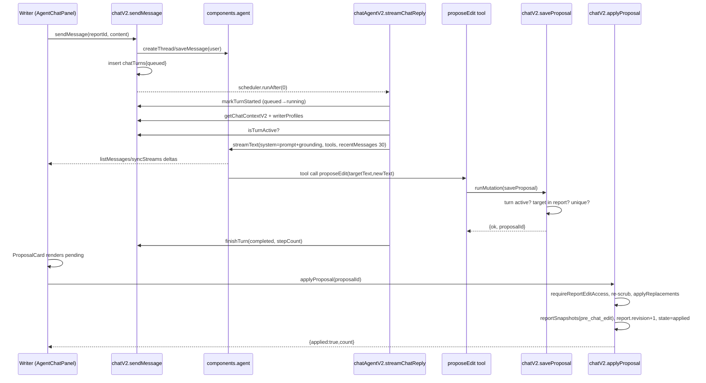
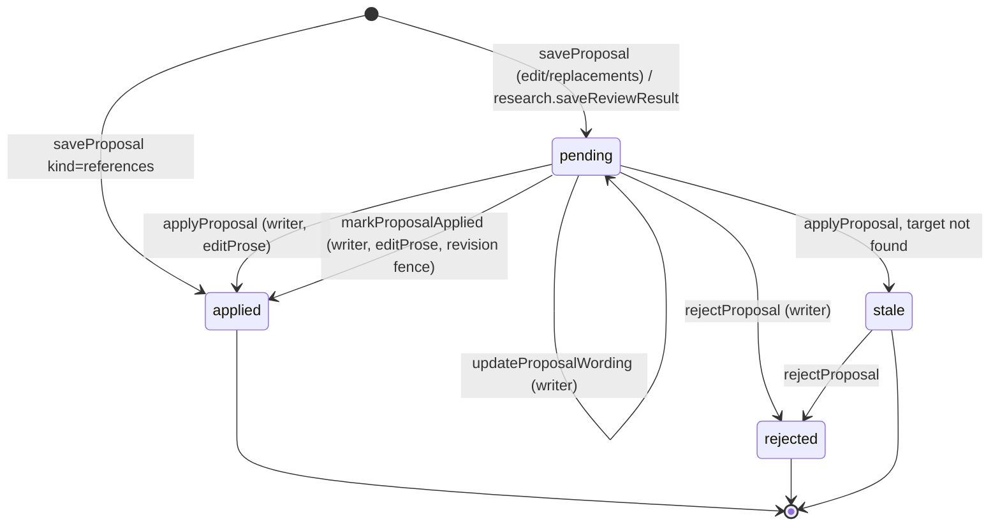
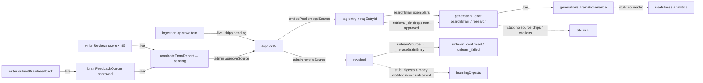
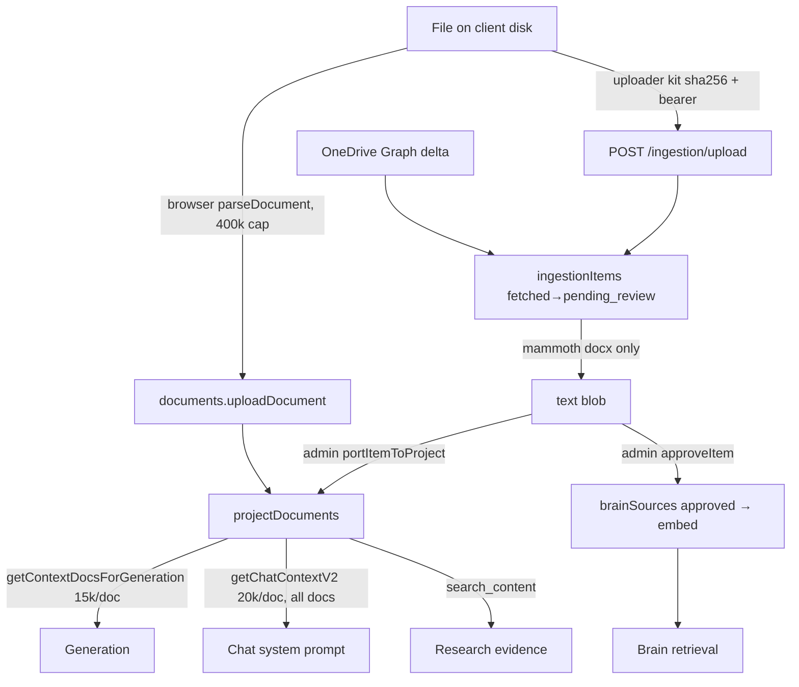

## 1. Chat architecture as built

**Tables.** `agentChatThreads` (report→component thread map, `schema.ts:818`), `chatTurns` (app-owned turn timing/status, `:830`), `chatProposals` (`:855`), `proposalWordingEditEvents` (`:1651`). Thread history, messages and stream deltas live inside `components.agent`. `chatMessages`/`chatThreads` are write-dead: only reader is `chat.ts:9-40` `listProjectLog` (used by `LogsPanel.svelte`); retirement noted `chat.ts:5-7`.

**@convex-dev/agent usage.** `Agent` + `createTool` + `stepCountIs` (`chatAgentV2.ts:6-13`); `createThread/saveMessage/listUIMessages/syncStreams/abortStream` in `chatV2.ts:12-19`. Deep-imports still present: `src/lib/chat/agentInternal.ts:11-18` pulls `dist/deltas.js`, `dist/UIMessages.js`, `dist/shared.js` for the Svelte `useUIMessages` port; version-pinned per comment.

**Streaming + stop fences.** `sendMessage` inserts `chatTurns{queued}` then schedules `streamChatReply` (`chatV2.ts:319-336`). Three fences: (1) `markTurnStarted` CAS queued→running (`:600-633`); (2) `isTurnActive` re-check after context load (`chatAgentV2.ts:404-409`); (3) `saveProposal` refuses when turn is terminal (`chatV2.ts:711-728`). `abortStreaming` patches turn→aborted and calls component `abortStream` (`:347-377`). Streaming: `streamText(..., {saveStreamDeltas:true})` (`chatAgentV2.ts:411-438`). Reaper: `failStaleChatTurns` cron every 10 min, 15-min cutoff, indexed `by_status`, terminal rows untouched (`chatV2.ts:678-701`, `crons.ts:29-34`).

**Context per turn** (`chatAgentV2.ts:301-400`). Everything goes into `system:` = static `buildChatSystemPromptV2(styleOverrides)` + grounding: full report plain text; analyzer JSON (from the report's own generation, fallback to newest completed, `chatV2.ts:823-842`); **every** non-archived `projectDocuments` body, 20k chars each, uncapped count (`:844-847`, `chatAgentV2.ts:366-373`); writer personal instructions ≤`MAX_INSTRUCTIONS_CHARS` only when a waiver exists (`:384-387`); last 6 non-reference proposals as "PRIOR EDIT DECISIONS" (`chatV2.ts:850-869`). Model history: `CHAT_CONTEXT_OPTIONS = {recentMessages:30, excludeToolMessages:true}` frozen (`chatAgentV2.ts:218-224`), passed at `:436`. User message = writer text + optional highlight excerpt + refine block (`chatV2.ts:303-317`).

**Tools** (`chatAgentV2.ts:38-190`): `proposeEdit` (single verbatim target→newText, scrubbed unless waived, must match exactly 1), `proposeReplacements` (multi find/replace, each must match ≥1), `highlightPassages` (references; row inserted directly as `state:"applied"`, `chatV2.ts:797`), `searchBrain` (k=3, docType pd, industry/scienceCode from project; reports `degraded` honestly). All four write only through `internal.chatV2.saveProposal`. `stopWhen: stepCountIs(5)`, `maxOutputTokens 16384`, adaptive thinking.

**Proposal lifecycle.** Producers: chat tools via `saveProposal` (pending), research `saveReviewResult` (pending, `requireUniqueTarget:true`, `agentThreadId="research:<id>"`, `research.ts:733-744`). Transitions: pending→applied by `applyProposal` (`chatV2.ts:379-486`) or `markProposalApplied` (`:510-585`); pending→stale by `applyProposal` when 0 matches (`:441-448`); pending/stale→rejected by `rejectProposal` (`:663-676`; applied cannot be rejected); pending wording edited in place by `updateProposalWording` (state unchanged, `:590-661`). No stale→pending, no reject→anything.

**applyProposal vs markProposalApplied.** `applyProposal`: server applies pairs to stored PM JSON, apply-time re-scrub per applier policy, uniqueness guard, `pre_chat_edit` snapshot, hash + revision+1, `provenanceId` cleared. `markProposalApplied`: client submits the stepped-through document with `expectedRevisionNumber` fence, `assertEditorDocument` (≤1M chars, JSON object), same snapshot/revision write in one txn, no scrub (writer authored). Both gate on `requireReportEditAccess` (`roleCapabilities.ts:82-105`). `highlightPassages`: `AgentChatPanel.svelte:377-395` auto-calls `onReferenceText` for the newest proposal (scroll+highlight, no human gate; read-only).

## 2. "Agents propose, humans apply" enforcement

| Path | Reaches prose? | Gate |
|---|---|---|
| Chat tools → `saveProposal` | No; inserts `chatProposals` only (`chatV2.ts:703-800`) | internalMutation, stop fence |
| `applyProposal` | Yes | `requireReportEditAccess` + pending-state check + snapshot + revision bump (`:386-484`) |
| `markProposalApplied` | Yes | same + `expectedRevisionNumber` CAS (`:545-550`) |
| Research `saveReviewResult` | No; `chatProposals` row only (`research.ts:733`) | applied via `applyProposal`, `requireUniqueTarget` |
| `highlightPassages` | No prose; UI scroll only | none (read-only) |
| `searchBrain` | No | read-only |
| `updateProposalWording` | No (proposal text only) | `requireInternalProjectAccess` only, not editProse (`:600`) — acceptable since apply is gated |

No AI code path writes `reports.content` directly in this slice. Other prose writers outside the slice (`updateReportContent`, `acceptEdit`, `restoreSnapshot`, `approveSectionDraft`, `selectReportCandidate`) are listed as editProse-gated in `product-domain.md:1461-1466`; not re-verified here.

## 3. Brain architecture as built

**`brainSources` states:** `pending | approved | revoked`. Transitions: `importSource` (`brain.ts:113-176`) → pending, or approved when `approve:true` (admin `importPdPair`, CLI `seedPdPair`, ingestion `finalizeApproval` `ingestion.ts:170-215`); `approveSource` pending→approved (admin, `:328-343`); `revokeSource` approved→revoked (admin, `:361-404`); `reweightSource` re-embeds if approved (`:507-527`); `removeSourcePermanently` refuses approved (`:243-260`). Every mutation gated by `assertAdmin` (`:53-58`). Dedupe by FNV-1a content hash (`:65-72`, `by_hash`).

**Nomination paths:** (a) from review: `reviews.ts:97-103` schedules `nominateFromReport` when writer score ≥85 → pending, tier 0.4, **verbatim** report text incl. project title (`brain.ts:216-235`); (b) from writer feedback: `reviewFeedback` approved+promotable → pending `writer_feedback` source (`:641-692`) and schedules draft-style digest; (c) from upload: ingestion `approveItem` → **approved** immediately (`ingestion.ts:253-291`); (d) CLI seed. No nomination path from chat.

**Embedding/ingest** (`ai/brain/ingest.ts`): Workpool `embedPool` maxParallelism 1, 6 retries (`brain.ts:28-32`). `embedSource` no-ops unless `status==="approved"` (`brain.ts:296-318`, `ingest.ts:78-84`). Single namespace `"brain"` (`rag.ts:30`), filters `industryApproved{industry,approved}` + `docType` (`:31`), `importance = writerTier`, `key = kind:hash`, `contentHash`. Chunking: `defaultChunker` + optional Haiku Contextual Retrieval when `BRAIN_CONTEXTUAL=1` (`ingest.ts:13,113-125`). Model `voyage-3-large` 1024d (`embeddings.ts:20-23`). `ingestOnComplete` writes `ragEntryId`, audit row, and compensates revoke-during-embed race (`rag.ts:62-125`).

**Retrieval** (`ai/brain/retrieve.ts:216-352`): hybrid search limit 30, `vectorScoreThreshold 0.3`, chunkContext ±1, optional industry/docType filters, scienceCode appended to query text; governance join drops non-approved sourceIds (`:176-192`); rerank via Voyage `rerank-2.5` topN ≤12, `maxRetries 1`, floor 0.35, tier blend `score×(0.6+0.4·tier)`, `pickScienceRouted`; fallback to raw order with 0.25 floor; `degraded:true` only on search failure. Usage rows `brain:query_embedding:*`, `brain:rerank:*`. Consumers: generation (`brainRetrieval.ts:63-190`, 4 sequential retrievals, writes `generations.brainProvenance`, `generations.ts:2521`), chat `searchBrain`, research `collectBrainEvidence` (k=3). Provenance readers: none found (`rg brainProvenance` → 1 writer).

**Feedback:** `submitBrainFeedback` scoped to accessible report/project, body ≤10k, rule ≤1k (`brain.ts:538-601`). `reviewFeedback` admin, status fence (`:648-650`).

**Unlearn/erase:** `revokeSource` → `unlearnSource` action → `eraseBrainEntry` (read, delete, re-read; `erase.ts:22-37`) → `recordUnlearnConfirmed` clears `ragEntryId` iff unchanged, writes `unlearn_confirmed` (`brain.ts:451-469`); failure → `unlearn_failed` + backoff retries to `UNLEARN_MAX_ATTEMPTS=5` (`:476-506`). No-entry revoke writes `unlearn_confirmed` by construction (`:394-403`). Revoked row keeps full `content`.

## 4. Ingestion architecture as built

**Project documents:** `fileType` enum incl. `msg`, `eml`, `xlsx`, `image` (`documents.ts:15-25`); `category` enum `previous_pd|scoping_notes|writer_notes|background|other` (`:27-33`), client-settable. Parsing is browser-side (`parseDocument.ts`): cap 400k chars (`:51`), PDF timeout 60s, `.msg` via `@kenjiuno/msgreader` (`:254-277`), `.eml` via `emlToText` (`:280-283`), `.mbox` first 50 messages (`:293-307`). Server `uploadDocument` dedupes by `(fileName, content)` exact match, skips empty content (`documents.ts:67-127`); `emailMigration.ts` is unrelated (user email normalization migration).

**Upload attempts:** `documentUploadAttempts` keyed `(projectId, attemptKey UUIDv4)` (`lib/uploadAttempts.ts:12-25`); cap 100/project, failures retained first (`:34-65`); stale in_progress >10 min displayed failed at read time; client outbox `src/lib/uploads/attemptOutbox.ts`, batch 50 (`outboxFlush.ts:18`).

**Corpus ingestion** (`ingestionItems`): kinds `pd|transcript|supporting|unknown` from folder convention (`ingestionClassify.ts:31-56`): `audio` segment→transcript, parent contains "submit" + doc(x)→pd. Statuses `discovered→fetched→pending_review→approved|rejected|failed|deleted`, pair math per client+FY (`ingestion.ts:45-70`). Path A: Graph delta sync (`ingestionSync.ts`), text via mammoth for docx only, PDF/.doc land with note and cannot be approved (`:154-171`); text blob ≤700 KB, preview 8k. Path B: HTTP upload. `ingestionPort.portItemToProject` (admin, approved PDs only) creates/attaches a historical project + `previous_pd` document.

**HTTP endpoint** `POST /ingestion/upload` (`http.ts:33-146`): bearer `INGEST_API_KEY` (≥32 chars else 503), constant-time compare, path sanitized ≥2 segments, `?hash` must equal server-recomputed sha256, extension allowlist `docx|doc|pdf|txt|vtt`, 15 MB cap, classification server-side, dedupe by `driveItemId=local:<path>` + hash. Can only stage `ingestionItems` (never Brain). **No rate limit.** Key rotation = `convex env set` (`DEV-HANDOFF.md:36-40`).

**Research** (`research.ts`, `ai/research/*`): writer selects text → `startResearch` (bounds 12k/12k/2k, one active per writer/report) → `@convex-dev/workflow` fan-out: project-document full-text search, OpenRouter `openai/gpt-5.6-sol` + `perplexity/sonar-deep-research`, Brain k=3 → reviewer `anthropic/claude-sonnet-5` → `chatProposals` pending edit. External brief is redacted (names/emails/phones/URLs, `core.ts:47-61`). Only slice with redaction.

## 5. Security posture of external surfaces

- `convex/http.ts`: Better Auth routes (`authComponent.registerRoutes`, `:15`); `/ingestion/upload` as above. No other routes.
- `src/routes/api/auth/[...all]/+server.ts`: proxy to Convex auth only.
- Uploader key: single shared static bearer for all clients, generated by `setup.sh` (`openssl rand -hex 32`, `:55`), stored in `uploader-config.json` in the kit. That file plus `upload-log.txt` are gitignored and untracked (verified `git check-ignore`, `git ls-files`), but the working tree currently holds a live dev key. Blast radius: stage arbitrary ≤15 MB files into the admin review queue (storage cost, queue spam); cannot read data or reach the Brain.
- Share token: `projects.shareToken` 192-bit (`projects.ts:1104-1108`); `getProjectAccess` grants `client_review` only when `sharedReportId` set (`lib/auth.ts:104-127`); `getProjectByShareToken` returns metadata only; comments accept `shareToken`. Not in this slice's write paths.
- Admin pages: `/admin/brain` redirects unauthenticated only (`+page.svelte:51-55`); role enforcement is server-side via `adminOrNull`/`assertAdmin`.

## 6. Cost & bounds

| Bound | Exists | Where |
|---|---|---|
| Steps/turn = 5, output 16k tokens/step | yes | `chatAgentV2.ts:214,265` |
| History 30 non-tool messages | yes | `:218-224` |
| Document bodies in chat: 20k/doc, **no doc-count or total cap** | partial | `:366-373`, `chatV2.ts:844-847` |
| Message length on `sendMessage` | **none** | `chatV2.ts:235` |
| Per-user/project chat budget, rate limit | **none** (`rg rateLimit` empty) | |
| Usage logging per step (`chat_v2`) | yes | `chatAgentV2.ts:242-283` |
| `listProposals`/`listTurns` window 200 turns | yes | `chatV2.ts:64` |
| Brain: search 30, rerank 12, k≤4, exemplar 6k chars, Voyage usage logged | yes | `retrieve.ts:72-76,357` |
| Brain rerank fallback rate | not measured | |
| Research: input caps, one active/writer/report, claims 20, warnings 10 | yes | `research.ts:110-120`, `:697-712` |
| Ingestion: 15 MB, 700 KB text, batches 20×6, pages 40 | yes | `ingestionSync.ts:36-40` |
| HTTP endpoint rate limit | **none** | |
| Embed pool serial + backoff | yes | `brain.ts:28-32` |

## 7. Invariants a builder could not infer

| Invariant | Enforced | Documented-only |
|---|---|---|
| Only `saveProposal` may create tool proposals; it is the last stop fence | code shape only; comment `chatV2.ts:711-715` | yes |
| Turn status CAS: terminal never overwritten | `finishTurn`, `failStaleChatTurns` (`:650-700`) | |
| Proposals must be applied by the applier's banned-words policy, not the sender's | `applyProposal:400-420` | comment |
| `requireUniqueTarget` is producer-declared, not origin-inferred | `:452-459` | comment |
| Vector index holds only approved rows; any `ragEntryId` on a non-approved row is failure evidence | `getBrainSourceForIngest`, `ingestOnComplete`, `recordUnlearnConfirmed` guards; served-result join | comment `brain.ts:45-49` |
| Every RAG filterName must be set on every add | comment `rag.ts:32-35` | **documented-only** |
| Embedding model/dimension change requires new RAG instance + re-embed | `embeddings.ts:14-17` | **documented-only** |
| Retrievals during generation must be sequential (Voyage 3 rpm) | loop shape `brainRetrieval.ts:130` | comment |
| Brain exemplars are patterns, never facts | prompt text only | **prompt-only** |
| `chatMessages` table is read-only legacy | nothing prevents writes | **documented-only** |
| Deep-import paths of `@convex-dev/agent` must be re-verified on upgrade | pin in package.json | comment |
| `data/brain-seed.json` never committed | `.gitignore` | |
| Ingestion approve skips the pending queue (unlike every other nomination) | none | undocumented |

## 8. Divergences from docs and audit

| # | Status | Evidence |
|---|---|---|
| 2 `markProposalApplied` bypass | **fixed** | `chatV2.ts:510-585`: editProse, snapshot, revision fence, JSON check; tests `chatProposals.test.ts:176-336` |
| 3 untrusted content in system prompt (chat) | **open** | `chatAgentV2.ts:389-395` still concatenates report, docs, analyzer, instructions under `system`; no BEGIN/END or data-not-instructions clause in `buildChatSystemPromptV2` (`prompts.ts:904-950`). Generation side has markers (`analyzerAgent.ts:44-46`, `prompts.ts:845`). No injection tests. |
| 12 unbounded chat cost | **partial** | recentMessages 30 done; doc bodies still all-docs; no budget/rate limit/message cap |
| 14 revocation intent-only | **fixed** | confirmed erasure, `ragEntryId` clearing, `unlearn_confirmed/failed`, embed no-op on non-approved; `brainUnlearn.test.ts`, `brainErase.test.ts` |
| 16 negative-signal stub | **open** | `cra_letter`/`craOutcome` accepted but no writer, no second namespace (`rag.ts:30`) |
| 22 listProposals unbounded / listMessages throws | **fixed** | 200-turn window `chatV2.ts:64-92`; empty page on missing thread `:130-137` |
| 23 no regenerate/retry, no optimistic bubble | **open** | only send-failure retry (`AgentChatPanel.svelte:840-857`); no regenerate on failed/completed turns; no optimistic user bubble |
| T6 client privacy | **open** | `nominateFromReport` still verbatim incl. title (`brain.ts:216-235`); redaction exists only in research (`core.ts:47`) |
| T1 `submitBrainFeedback` access | fixed | `brain.ts:551-571` |
| `the-brain.md` says Sprint-1-era "revoke = deleted" | now accurate; but doc still claims `/admin/brain` "admin role only" via URL; server queries return null for non-admins, page only redirects unauthenticated |

## 9. Open questions

1. Should ingestion `approveItem` land as `pending` like every other nomination path, so all approvals share one review pane and one audit shape?
2. Is the single shared `INGEST_API_KEY` acceptable long-term, or should the endpoint take per-client keys and a rate limit before the ~500-file bulk import?
3. Who owns Phase 2 trusted-context for chat: move report/docs/analyzer out of `system` into one delimited user-role evidence message and add injection tests?
4. Chat document context: cap by count/total chars, or select by relevance (the research module already has `selectProjectEvidence`)?
5. `brainProvenance` has a writer and no reader; is the learning-health panel still planned, and should rerank-fallback be recorded as a usage row so the Voyage 3 rpm problem is visible?
6. Should `nominateFromReport` run `redactExternalText`-style de-identification before the row is created, given revoked rows retain full content?
7. Is `chatMessages`/`chatThreads` scheduled for drop after `LogsPanel` migrates to agent threads?
8. `updateProposalWording`/`rejectProposal` gate on internal access, not `report.editProse`; intended?