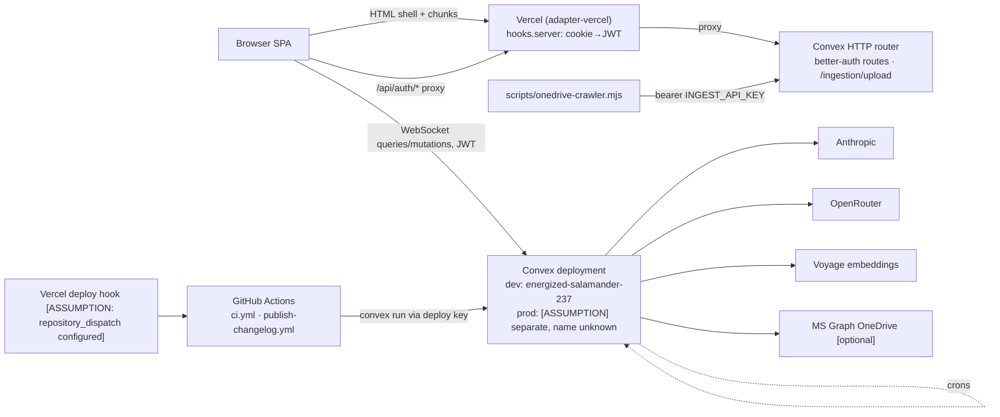

## 1. Frontend paradigm as built

**Routing / layout.** Flat SvelteKit file routes, one root layout (`src/routes/+layout.svelte`), one nested layout (`settings/+layout.svelte`). No route groups; area grouping is by convention only. Root layout owns: `setupConvex(PUBLIC_CONVEX_URL)` + `createSvelteAuthClient` seeded from cookie state (`+layout.svelte:21-26`, `+layout.server.ts:7`), `PageErrorBoundary` (`<svelte:boundary>`, `PageErrorBoundary.svelte:39`), `ErrorMonitor` (window `error`/`unhandledrejection` → `api.errorReports.reportError`, `ErrorMonitor.svelte:50,115-116`), sonner Toaster, deploy-skew reload (`vite.config.ts:31`, `+layout.svelte:31-48`).

**Auth gate.** `hooks.server.ts:9-13` only extracts the Better Auth JWT from cookies and scopes it via `withServerConvexToken`; there is no server-side route guard. Every protected page redirects client-side with `$effect(() => !auth.isLoading && !auth.isAuthenticated && goto("/login"))` (pattern in `docs/svelte-migration.md:63`, implemented in `WorkspaceGate.svelte:75-79`). `/api/auth/[...all]/+server.ts` proxies Better Auth to Convex `http.ts` so cookies stay first-party (`authClient.ts:1-13`).

**Workspace gate.** `src/lib/workspace/WorkspaceGate.svelte` is the single branch point for `/dashboard`, `/projects`, `/my-work`, `/project/[id]`: subscribes `api.workspaceRollout.getAccess`, resolves `current | preview | loading` via pure `resolveWorkspaceRouteState` (`workspaceExperience.ts`), `?workspace=current` always wins and skips the query (`:64-66`), fail-closed. Routes pass snippets or hrefs (`project/[id]/+page.svelte:11-18`).

**Data fetching.** Client-only. No `+page.server.ts` anywhere except the root layout (auth state) and a `settings/+page.ts` redirect. All data is `useQuery(api.x, () => authed ? args : "skip")` from convex-svelte; args are getters, `"skip"` gates on auth (`svelte-migration.md:47-55`). `useStableQuery` (`stableQuery.svelte.ts`) holds the last result across arg changes to avoid spinner flash. Pages are effectively SPA shells rendered with SSR-empty data; SSR serves the shell only.

**State management.** Component-local runes. Only two `.svelte.ts` stores: `stableQuery.svelte.ts`, `chat/uiMessages.svelte.ts`. Everything else in `src/lib/{dashboard,workspace,workflow,mywork,uploads}/*.ts` is pure functions (presentation, sorting, preferences serialization). Mutations: `useMutation(api.x)` then `await`. **No optimistic updates** anywhere (`rg withOptimisticUpdate` → 0 hits); the reactive subscription is the "optimistic" layer. Errors decoded from `ConvexError.data.{code,message}` via `src/lib/errors.ts` (`userErrorCode`, `userErrorMessage`), mapped to dialogs or toasts (`CurrentProjectPage.svelte:763-782`). Offline upload receipts use an outbox (`uploads/attemptOutbox.ts`, `outboxFlush.ts`) keyed by `createRequestId()` (`requestId.ts:36`).

**Component layering.** bits-ui + shadcn-svelte (`components.json`) → `src/lib/components/ui/` (45 files; `Button`, `Input`, `tooltip/`, `DateRangePicker`, `UserMenu`) → feature dirs (`project/`, `editor/`, `chat/`, `workspace/`, `generation/`, …). Two page-sized containers dominate: `project/PreviewProjectPage.svelte` (2305 lines) and `project/CurrentProjectPage.svelte` (1782), plus `editor/Editor.svelte` (1359) and `chat/AgentChatPanel.svelte` (1315). Presentational components take props/callbacks; containers own queries.

**Editor architecture.** Canonical stored format = **Tiptap JSON serialized as a string** in `reports.content` (`schema.ts:527`, `v.string()`). Backend builds it framework-free with `convex/lib/tiptapReport.ts:buildTiptapDocument` (H1 title, three H2 with load-bearing heading text `"Line 242 — …"`, `horizontalRule` separators, `[GAP: …]` spans highlighted `#FEF3C7`, `:46-101`). Frontend `Editor.svelte` mounts `svelte-tiptap` with `getEditorExtensions()` (`tiptapConfig.ts`: StarterKit h1-3, Placeholder, Highlight multicolor, CharacterCount, Underline). Autosave: debounced `JSON.stringify(editor.getJSON())` → `onUpdate` → `api.reports.updateReportContent`, serialized through `pendingSaveChain`, echo-suppressed via `lastSavedContent` (`Editor.svelte:729-745`). Reverse direction: `src/lib/reportSections.ts:parseCanonicalReport` walks the JSON with a zod node schema, matches the heading strings, emits `CanonicalReportBody` with diagnostics (`MISSING_SECTION`, `UNSUPPORTED_NODE`, `UNRESOLVED_GAP`…). Section metrics come from `convex/lib/lineLimits.ts` shared across runtimes.

**Export path.** `canonicalizeExportPreflight` → frozen DTO (`exportValidation.ts:82-108`) → `validateExport` (errors/warnings; GAP no longer blocks, `:110-118`) → `api.reports.authorizeExport({expectedRevisionNumber, expectedContentHash})` → `isSameExportRevision` check → lazy `import("$lib/exportTemplateDocx")` + `import("file-saver")` (`CurrentProjectPage.svelte:724-727`) → `exportToTemplateDocx` fetches `/templates/schedule60.docx`, patches `word/document.xml` via JSZip string surgery in Courier (`exportTemplateDocx.ts:154-203`) → `completeExport({canonicalDtoHash, documentHash})` or `failExport`. SSR constraint: `file-saver` touches `window` at module init; `exportTemplateDocx` is only ever dynamically imported (AGENTS.md pitfall; enforced only by the two call sites).

```mermaid
flowchart TD
  L["+layout.svelte<br/>setupConvex · auth · ErrorBoundary · Toaster"]
  L --> AUTH
  L --> WS
  L --> PROJ
  L --> REV
  L --> ADMIN
  L --> MISC
  subgraph AUTH[auth]
    login["/login"]; signup["/signup/[token] invite accept"]; apiauth["/api/auth/[...all] proxy→Convex"]
  end
  subgraph WS[workspace · WorkspaceGate]
    home["/ landing"]; dash["/dashboard (rollback surface)"]; projects["/projects board"]; mywork["/my-work lanes"]; requests["/requests"]; alerts["/alerts"]
  end
  subgraph PROJ[project]
    pnew["/project/new intake"]; pq["/project/questionnaire"]; pid["/project/[id] report editor<br/>Current | Preview via gate"]; pfin["/project/[id]/financial"]
  end
  subgraph REV[review · anonymous]
    rev["/review/[shareToken] NameGate → ReadOnlyEditor + comments"]
  end
  subgraph ADMIN[admin · role=admin client-checked]
    users["/admin/users invites"]; models["/admin/models"]; brain["/admin/brain"]; ingest["/admin/ingestion"]; reviews["/admin/reviews"]; usage["/admin/usage"]; tags["/admin/tags"]; rules["/admin/house-rules"]; backfill["/admin/backfill"]
  end
  subgraph MISC[misc]
    settings["/settings → /settings/account | /settings/writing"]; changelog["/changelog"]; style["/styleguide"]
  end
```

```mermaid
flowchart LR
  subgraph Q[useQuery subscriptions]
    q1[projects.getProject]; q2[reports.getLatestReport]; q3[generations.getLatestGeneration]; q4[comments.listComments]; q5[pdReviews.getLatestPdReview]; q6[snapshots.getGhostSnapshot]; q7[generations.getIterativeState]
  end
  Q --> P["CurrentProjectPage / PreviewProjectPage<br/>(container, runes state)"]
  P -->|content string| E["Editor.svelte<br/>svelte-tiptap · getJSON()"]
  E -->|debounced JSON| m1[reports.updateReportContent]
  P --> m2[generations.requestGeneration / cancelIterative / requestReportQa]
  P --> m3[snapshots.createManualSnapshot]
  P --> m4[chatV2.markProposalApplied]
  P --> m5[reports.authorizeExport → completeExport | failExport]
  P --> GEN["IterativeStepper<br/>approveSectionDraft · regenerateSectionDraft"]
  P --> CHAT["AgentChatPanel<br/>chatProposals → applyProposal (human applies)"]
  m5 -.lazy import.-> X["exportTemplateDocx (browser only)<br/>JSZip patch schedule60.docx"]
  m1 --> CVX[(Convex)]; m2 --> CVX; m3 --> CVX; m4 --> CVX; m5 --> CVX; GEN --> CVX; CHAT --> CVX
  CVX -.reactive push.-> Q
```

## 2. Frontend conventions enforced vs documented

| Convention | Enforced | Where |
|---|---|---|
| Svelte 5 runes only | **Yes** | `vite.config.ts:24-25` forces `runes: true` for non-node_modules; legacy syntax fails compile |
| No React/JSX/Next | Partial | React deps removed from `package.json`; nothing lints against re-adding |
| Type-safe API calls | Yes | `svelte-check` via `npm run check` (CI) |
| Design tokens, no ad-hoc hex | **Docs only** | `docs/design-system.md`; no stylelint/eslint (no `eslint.config.*` exists despite `eslint` in devDeps; `npm run lint` is just svelte-check) |
| Font weight ≤500 | **Docs only** | 77 svelte files still contain `font-bold`/`font-semibold` |
| bits-ui over native controls | Docs only | |
| Active tab = primary fill | Docs only | |
| Component structure (route-owned content under shared admin shell) | Partial | source-string test `src/routes/admin/adminWorkspaceRoutes.test.ts:9-11` |
| No `sveltekit()` in component config | Comment-guarded only | `vitest.component.config.ts:19` |

## 3. Operational envelope

- **Hosting:** Vercel, `@sveltejs/adapter-vercel` (`vite.config.ts:27`), `vercel.json` sets framework + `PUBLIC_BUILD_TIME` at build. No CD workflow in repo; Vercel git integration deploys on push `[ASSUMPTION]`. Prod origin `https://banhall.vercel.app` hard-coded as trusted origin (`convex/auth.ts:22`). Version polling every 60 s + `vite:preloadError` reload handle deploy skew.
- **Convex:** No `convex.json`. `.env.local` has `CONVEX_DEPLOYMENT=dev:…`; docs name dev deployment `energized-salamander-237` (`docs/todos/psos/tasks/PSOS-12.md:112`). Prod deployment name not in repo. **No `convex deploy` step in CI**; backend deploys are manual/local `[ASSUMPTION]`. Components: rag, agent, workpool `embedPool`, workflow `researchWorkflow`, betterAuth (`convex.config.ts:41-55`).
- **Auth:** Better Auth via `@convex-dev/better-auth`, email+password only, `requireEmailVerification: false` (`auth.ts:118-121`). Invite-only in two layers: `hooks.before` on `/sign-up/email` checks `inviteToken` (`auth.ts:129-166`) and the `user.onCreate` trigger re-checks a pending unexpired invite transactionally (`auth.ts:41-64`). App `users` table is authoritative for role; synced by trigger. Anonymous access: `/review/[shareToken]` uses public `getProjectByShareToken` + `getOrCreateCommenter` (name gate), no session. `errorReports.reportError` is deliberately unauthenticated (`errorReports.ts:12-16`).
- **Providers / env names:** Convex `env` schema (`convex.config.ts:20-38`): `ANTHROPIC_API_KEY`, `VOYAGE_API_KEY`, `OPENROUTER_API_KEY`, `MS_TENANT_ID`, `MS_CLIENT_ID`, `MS_CLIENT_SECRET`, `MS_DRIVE_ID`, `MS_ROOT_PATH`, `INGEST_API_KEY`. Raw `process.env`: `SITE_URL`, `BETTER_AUTH_TRUSTED_ORIGINS`, `BRAIN_CONTEXTUAL`, `ONEDRIVE_INGEST_KEY` (crawler script). Frontend: `PUBLIC_CONVEX_URL`, `PUBLIC_CONVEX_SITE_URL`, `PUBLIC_AGENT_CHAT`, `PUBLIC_BUILD_TIME`, `PUBLIC_SITE_URL`. CI secret: `CONVEX_CHANGELOG_DEPLOY_KEY`. `env.example` is stale (`NEXT_PUBLIC_*` names). No email provider configured.
- **Crons (`convex/crons.ts`):** every 10 min: fail stale generations (>30 min), stale PD reviews, stale post-QA, stale chat turns (>15 min); every 5 min: `oversight.sweepStalled`, `myWorkBackfill.sweepStalled`; daily 08:00/08:15 UTC: QA calibration digest, draft style digest.
- **HTTP routes (`convex/http.ts`):** Better Auth routes via `authComponent.registerRoutes`; `POST /ingestion/upload` bearer-key, path-sanitized, extension allowlist, size cap (`:31-33`).
- **Secrets:** Convex dashboard env + Vercel env; `.env.local` gitignored; factory rules forbid agents rotating secrets (`AGENTS.factory.md`).
- **Observability:** Self-hosted only: `errorReports` table fed by `ErrorMonitor` (client) and `debugTools.ts`; admin views it. `aiUsage` spend tracking (`admin/usage`, `DailySpendChart`). No Sentry/PostHog/log drain (`rg sentry|posthog|datadog` → 0). 34 `console.error/warn` in convex land in Convex logs only.
- **Rate limiting:** None inbound. Only provider 429 handling (`ai/providers.ts:178`) and the Voyage workpool serialization.



## 4. Test strategy as built

- **Unit (node/edge):** `vitest.config.ts` projects: `convex` (edge-runtime, 68 files, 51 using `convex-test`, 30 s timeout), `shared` (5), `src` (43, node). Total 116 run by `npm test`.
- **Component:** `vitest.component.config.ts`, real Chromium via `@vitest/browser-playwright`, 49 `*.component.test.ts` (workspace 14, ui 8, project 7, mywork 5, upload 4, dashboard 3, routes 3…). Serial (`fileParallelism: false`), stubs for `$app/*`, `$env/*`, `convex-svelte`, auth. **Not run in CI**; local-only per AGENTS.md.
- **`tests/` dir:** 15 files written for `bun:test`; only `tests/aiUsage.test.ts` is in the vitest include (`vitest.config.ts:19`). The other 14 (`diff`, `snapshots`, `reportEdits`, `projectReviewAccess`, …) are **dead unless someone runs `bun test`**; several duplicate `src/lib/*.test.ts`.
- **E2E:** None. No `playwright.config.*`, no `e2e/`, no `.factory/verify/`.
- **CI (`ci.yml`):** PR + push main: `npm run check` + `npm test`, `PUBLIC_CONVEX_URL` placeholder. No convex tsc, no component tests, no build.
- **`scripts/loop-verify.sh`:** convex tsc + check + test + PowerShell uploader tests (`pwsh` required; not in CI). Used as `[verify].commands` by `.factory/factory.toml` and bmad-loop; `min_verdict = "test-verified"`.
- **Not covered:** e2e/auth flow, export docx byte-level output against real template, generation pipeline against live providers, prompt-injection, load/perf, accessibility automation, visual regression beyond `__screenshots__` in component tests, invite/signup hooks in Better Auth.

## 5. Build & release

- Vite 8 + SvelteKit 2.63, Tailwind v4 plugin, Svelte 5.56. `npm run check` = `svelte-kit sync && svelte-check`; sync materializes `$env/static/public` so `PUBLIC_CONVEX_URL` must exist (`ci.yml:16-18`, `loop-verify.sh:7`). `npm run lint` is an alias of check; no ESLint config.
- **Changelog pipeline:** `publish-changelog.yml` fires on `repository_dispatch: vercel.deployment.promoted` (prod, ref main) or manual; checks out deployed SHA, runs `scripts/publish-changelog.mjs` → `git log -400` → watermark from `changelog:lastProcessedCommits` → per-work-day `npx convex run ai/changelogPipeline:publishDay` (Haiku rewrite, upsert by `workDay`) using `CONVEX_DEPLOY_KEY`. `convex/changelog.ts` also has manual `publishEntry`/`deleteEntry`/`markSeen`.
- **Factory/bmad-loop:** Factory: one worktree per ticket `.factory/worktrees/<key>`, branch `factory/<key>`, merge into integration branch (`merge_strategy = "merge"`), human runs `factory ship` to push/PR; agents never push (`AGENTS.factory.md`). bmad-loop: `isolation = "none"`, edits checkout in place, squashes per story; docs warn not to push mid-run (`bmad-loop.md`). Latest main commit shows hand-merged factory branch after ticket-file conflict (`git log`: `5a5f61c`). Net: two orchestrators with different isolation models; branch discipline rests on humans.
- **Migrations:** No `@convex-dev/migrations`. Pattern is "widen then backfill": optional new fields (`schema.ts:533` comment "2026-09-03 widen"), plus hand-rolled paginated `internalMutation` backfills with resumable sweeps (`ownerBackfill.ts`, `myWorkBackfill.ts` + cron `sweepStalled`, `dashboardBackfill.ts`), admin UI at `/admin/backfill`.

## 6. Invariants a future builder could NOT infer from compliant code

| Invariant | Enforced | Documented |
|---|---|---|
| Report H2 heading strings are the parse contract (`buildTiptapDocument` ↔ `parseCanonicalReport`) | Tests in `reportSections.test.ts`/`exportValidation.test.ts` | comment `tiptapReport.ts:44-46` |
| `GAP_CAPTURE_RE` must stay in sync with `GAP_MARKER_RE` | No | comment `tiptapReport.ts:6-7` |
| `exportTemplateDocx`/`file-saver` only via dynamic import | No (SSR would crash at runtime) | AGENTS.md, `svelte-migration.md` |
| Auth guard is client-side `$effect`; SSR must never assume a user | No | `svelte-migration.md:61-65` |
| Queries must `"skip"` until `auth.isAuthenticated` | No (unauthed query just errors) | `svelte-migration.md:47-50` |
| `?workspace=current` never subscribes the access query | `WorkspaceGate.component.test.ts` | product-domain amendment |
| Export must re-authorize on `(reportId, revisionNumber, contentHash)` | `isSameExportRevision` unit test + server check | code comments only |
| `authClient.baseURL` must be app origin, not Convex site | No | `authClient.ts:9-13` |
| `tests/` files are bun:test, not vitest | No | nowhere |
| Don't add `sveltekit()` to component config | No | config comment + AGENTS.md |
| Invite-only signup enforced in two layers, both required | `convex/invites*.test.ts`? (not verified) | `auth.ts` comments |
| `projects.createdBy` never repurposed; AI never mutates prose directly | `chatProposals.test.ts` partial | AGENTS.md policy |
| `runes: true` forced except node_modules | Yes, vite config | |

## 7. Gaps in the operational envelope

- No staging/preview Convex deployment paired with Vercel previews; prod deploy of backend is undocumented and uncoupled from CI (schema drift between Vercel preview and dev Convex possible).
- No backup/restore, PITR, or export-of-data story for Convex.
- No third-party error tracking, alerting, uptime checks, SLOs, or on-call/incident runbook; `errorReports` is a table nobody is paged on.
- No inbound rate limiting or per-user AI spend caps (usage is observed, not enforced).
- No data-retention/PII policy (transcripts, client names, comments from anonymous reviewers, `errorReports` with UA + URL).
- No CD gate: CI does not run `convex tsc`, component tests, or `vite build`; a broken build reaches Vercel.
- `env.example` stale; no `.env.example` for `PUBLIC_*`.
- No e2e test of the login → project → export loop; docx output never verified against the real `schedule60.docx` in CI.
- No dependency/security scanning; `xlsx` pinned to a tarball URL.
- Two competing orchestration systems (factory worktrees vs bmad-loop in-place) with no stated precedence.

## 8. Open questions

1. What is the production Convex deployment name, and who runs `npx convex deploy`? Is it Vercel build (`convex deploy --cmd`) or a laptop?
2. Is the Vercel → GitHub `repository_dispatch` for `vercel.deployment.promoted` actually configured, or is changelog publishing effectively `workflow_dispatch` only?
3. Are the 14 bun-only `tests/*.test.ts` intended to be deleted, or ported into the vitest projects?
4. Should component tests join CI now that they exist for 49 files, given Playwright install cost (~1 min)?
5. Is `requireEmailVerification: false` with no email provider a deliberate permanent choice (invite token is the verification)?
6. Which orchestrator is canonical going forward: factory (worktrees) or bmad-loop (in-place)? The `5a5f61c` hand-merge suggests friction.
7. Who owns the `errorReports` queue operationally, and is there any threshold that should page someone?
8. Should `?workspace=current` and the rollout allowlist be retired (both dashboards are ~2k lines each and diverging)?