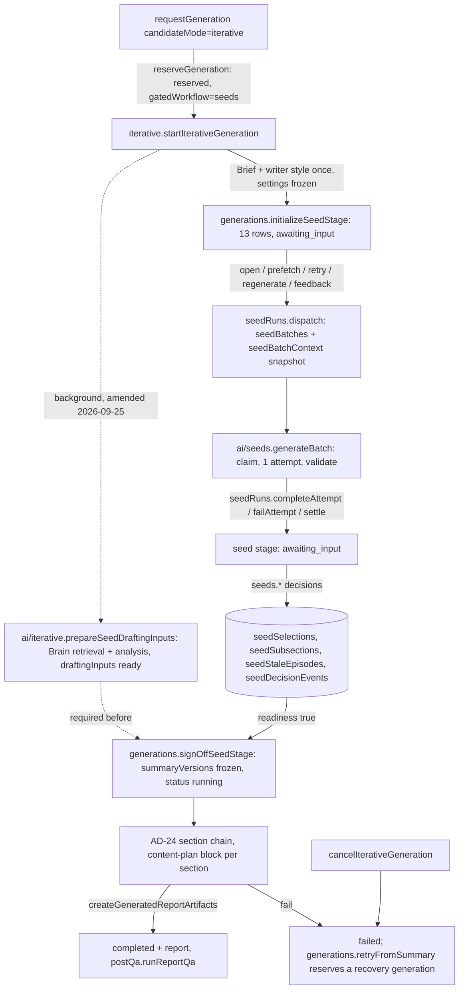
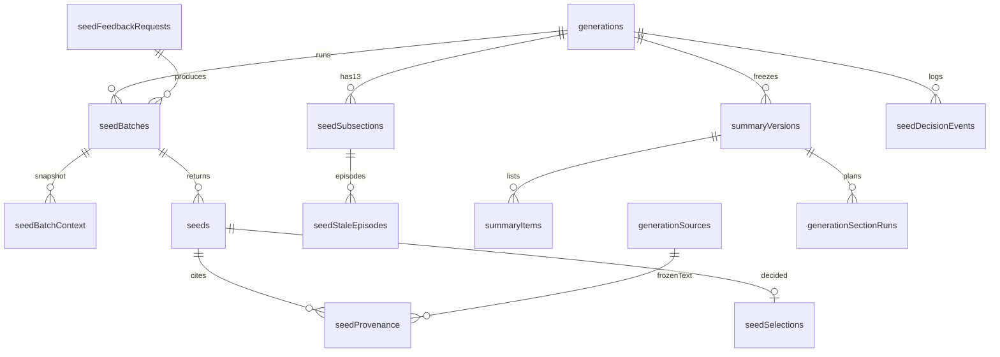

# Architecture Spine — Step-by-step PD generation: idea seeds before prose

## Design Paradigm

Inherited: **pipes-and-filters AI engine on Convex** (parent AD-1). This feature adds one filter, the **seed stage**, to the existing `iterative` pipeline between the Brief stage and the first section, plus a human-gated wait modelled like today's section-approval wait. Nothing new orchestrates: the generation row still drives, run rows still claim with CAS, and the writer's decisions are rows the drafting chain reads. Lifecycle transitions of the generation stay in `convex/generations.ts` (parent AD-2); decision mutations live in `convex/seeds.ts`; the Node action lives in `convex/ai/seeds.ts`; its transactional internal mutations live in the default-runtime module `convex/seedRuns.ts`.



| Unit | Lives in |
| --- | --- |
| Subsection vocabulary (13 roles) | `shared/pdSubsections.ts` |
| Mode-selector list | `shared/generationModes.ts` |
| Seed contract, canonical decision DTO, revisions, dispatch identity (pure) | `convex/lib/seedContract.ts`, `convex/lib/seedRevisions.ts`, `convex/lib/seedDispatch.ts` |
| Workflow resolver (pure) | `convex/lib/gatedWorkflow.ts` |
| Project-scoped registry (pure) | `convex/lib/projectScopedTables.ts` |
| Node action + prompt | `convex/ai/seeds.ts`; scaffolds in `convex/ai/promptDefinitions.ts`; stage in `convex/ai/promptProgram.ts`; slots in `convex/ai/instrument.ts` |
| Transactional run mutations (default runtime) | `convex/seedRuns.ts` |
| Decision mutations and queries | `convex/seeds.ts` |
| Generation lifecycle (initialize, sign-off, cancel, retry, reaper) | `convex/generations.ts` |
| Schema | `convex/schema.ts` (eleven tables, AD-33) |
| Workspace UI | `src/lib/components/seeds/`, hosted by `project/CurrentProjectPage.svelte` and `PreviewProjectPage.svelte` |

## Inherited Invariants

| Inherited | From parent | Binds here |
| --- | --- | --- |
| AD-1 paradigm, dependency direction | 2026-09-03 | seed stage is a filter in `convex/ai/`; `src/` imports `shared/` and runtime-free `convex/lib` only |
| AD-2 three state axes; `generations.status` written only by `convex/generations.ts` | 2026-09-03 | no new status value; initialize, sign-off, cancel and retry live in `generations.ts`; seed state on its own rows; workflow stage untouched |
| AD-3 one prose-write path | 2026-09-03 | prose from the Summary is created by `createGeneratedReportArtifacts`; no eighth revision writer |
| AD-4 agents propose, humans apply | 2026-09-03 | seeds are not prose; they never enter `chatProposals` or the report |
| AD-5 frozen inputs, one active generation, `awaiting_input` never reaped | 2026-09-03 | the seed stage waits in `awaiting_input`; provenance cites frozen `generationSources` |
| AD-7 + Q3 interim | 2026-09-03 | seed mutations use `requireReportEditAccess`; `createdBy` never consulted (AD-14) |
| AD-8 three H2 parse contract | 2026-09-03 | Subsections are never headings |
| AD-9 / AD-27 routing, action budget, named slots | 2026-09-03 | one attempt per action; two new slots; seed requests are metered and never refused (owner decision 2026-09-17), matching AD-27 |
| AD-11 / AD-30 trusted context, 12-document cap | 2026-09-03 | decisions, feedback and excerpts are data blocks in user messages |
| AD-15 domain contract wins | 2026-09-03 | parent amendments C2 and C4 were approved on 2026-09-17 and recorded in `docs/product-domain.md`; C1 and C3 withdrawn |
| AD-16 / AD-26 style precedence | 2026-09-03 | seed and drafting prompts consume the frozen `getEffectiveWriterStyle` projection only |
| AD-19 / AD-21 project-scoped rows, data classes | 2026-09-03 | eleven new tables carry `projectId`; this feature builds the AD-19 registry (AD-45); seed text is C1/C2 |
| AD-23 Brief pattern | 2026-09-03 | template for child rows, named writers, validated citations, absent-not-empty |
| AD-24 per-section chain | 2026-09-03 | sign-off hands into this chain; `single`/`compare` untouched; the iterative gate change is a proposed amendment |
| AD-25 Compliance Notes | 2026-09-03 | coverage and skip rows are model verdicts inside the existing Self-check call, joined by plan reference |

## Conflicts with the parent (owner approval required, AD-15)

The parent is read-only here. Each row is a proposed amendment; the slice named cannot land before the owner approves it.

| # | Feature rule | Parent rule | Proposed amendment | Gates |
| --- | --- | --- | --- | --- |
| C1 | (withdrawn 2026-09-17) the owner decided there is no seed-stage cap; AD-34 now meters and never refuses, matching AD-27 | AD-27: no call is refused on budget | none | — |
| C2 | AD-31/AD-37: for seeds generations the gate is Summary sign-off, not section approval | AD-24: "`iterative` mode and its approval gate are unchanged" | AD-24 gains: "for `gatedWorkflow = seeds` the gate is the seed stage's sign-off; section-approval generations keep theirs" — **approved by the owner 2026-09-17**, recorded in `docs/product-domain.md` | unblocked |
| C3 | (withdrawn 2026-09-17) no cap means no extension mutation and no spend authority question | AD-7/Q10 | none | — |
| C4 | AD-37: a signed-off item matching a Claim Exclusion is drafted and recorded, not repaired | AD-25: Self-check verdicts against Claim Exclusions with at most one repair | AD-25 gains: "a plan item the writer confirmed against an exclusion is not repaired; the row records `tier: conflict`" — **approved by the owner 2026-09-17**, recorded in `docs/product-domain.md` | unblocked |
| C5 | AD-45 builds the registry and the whole-schema guard | AD-19 [TARGET]: registry named, never built | none; AD-45 realises the TARGET and is a prerequisite slice | slice 0 |
| C6 | AD-39: seed generations produce no `sectionEditEvents`; the edit-distance baseline is the generated snapshot | AD-12 measurable learning | none; the digest reader labels the mode not included and `reportEditDistance` keeps its generated-snapshot baseline (same as single mode) | slice 3 |

## Invariants & Rules

### AD-31 — The seed stage is a declared stage of the `iterative` topology, initialized durably, waiting in `awaiting_input`

- **Binds:** FR-1, FR-5, FR-27, FR-31, FR-32, FR-41; `convex/ai/promptProgram.ts`, `convex/ai/iterative.ts`, `convex/generations.ts`
- **Prevents:** a new generation status; a parallel state machine on `generations`; the reaper killing a writer mid-decision; a section chain starting before sign-off; an initialization failure that strands the generation; a seeds generation inferred from row absence.
- **Rule:** `topology.modes.iterative` declares `seeds` between `brief` and the first section. `reserveGeneration` writes `generations.gatedWorkflow: "sections" | "seeds"` (seeds for every new gated request once the feature ships). `startIterativeGeneration` runs analysis and Brief as today and calls `internal.generations.initializeSeedStage` (amended 2026-09-25, owner approved, decision 32: the Brief and the frozen writer style open the stage, and the analysis and Brain retrieval run in the background until sign-off; see Amendments) (default runtime, idempotent, keyed by generation): one mutation that records `generations.briefVersionId`, the frozen `writerSettings` projection and `lengthTarget` as the seed-stage settings, inserts the thirteen `seedSubsections` rows, sets `generations.status = awaiting_input` and appends the `initialized` event; on abort it records `generations.seedStageError` and leaves the generation `running` so `retryInitializeSeedStage` (public, `requireReportEditAccess`) can re-run it without re-running analysis. No ghost draft is scheduled (Q-A default). `getIterativeState` exposes `seedPhase: initializing | seeding | drafting | draftFailed | completed`, derived server-side from `gatedWorkflow`, row presence, `summaryVersionId` and `status`; hosts route on `seedPhase`, never on a boolean. Recovery: a `seeds` generation with `summaryVersionId` present is recovered by the ordered chain's existing terminal failure path; without it, the seed-stage rules (AD-34) apply; the generation itself is never reaped while `awaiting_input`. Enforcing tests: `convex/ai/promptProgram.test.ts` (stage order; no section before sign-off), `convex/generationLifecycle.test.ts` (initialize idempotent; abort recorded and retried; phases), `convex/generationRecovery.test.ts` (awaiting_input with a pending attempt is not reaped).

### AD-32 — One Subsection vocabulary, shared by prompts, QA, seeds and UI

- **Binds:** FR-2, FR-17, FR-21, FR-25; `shared/pdSubsections.ts`, `convex/ai/prompts.ts`, `convex/ai/qaChecks.ts`
- **Prevents:** four spellings of the same role; a Subsection with no drafting role; Subsections leaking into the report as headings.
- **Rule:** `shared/pdSubsections.ts` exports `PD_SUBSECTIONS: readonly {roleId, section: "s242"|"s244"|"s246", order: 1..13, kind: "standard"|"optional"|"multiple", title, objective}[]` with `roleId` values `company_context, goal_problem, passive_limitations, technological_objective, active_uncertainties, prior_year_status, workplan, hypothesis, experimentation, overall_advancement, specific_advancements, project_status, goal_improvements`, mapped one-to-one to the natural-language content roles in `convex/ai/prompts.ts:296/405/511` and `qaChecks.ts`; the prompt builders and QA import the list rather than restating it. A `shared` test asserts the bijection and order. `order` is the only upstream/downstream relation (AD-36). `buildTiptapDocument` is unchanged.

### AD-33 — Seed records are eleven project-scoped tables with a published writer matrix

- **Binds:** FR-9, FR-19, FR-24, FR-29, FR-33, FR-35; `convex/schema.ts`, `convex/seeds.ts`, `convex/seedRuns.ts`, `convex/generations.ts`, `convex/ai/seeds.ts`
- **Prevents:** seeds as arrays on the generation; seeds in `chatProposals`, `generationBriefEntries` or the report; two owners of one row; a mutation in a `"use node"` module; seed text in logs.
- **Rule:** Tables, each with `projectId` and `generationId`, registered in the AD-45 registry:
  - `seedSubsections` `{roleId, kind, state: untouched|generating|in_progress|approved|skipped|failed, currentContextRevision, selectionRevision, shownBatchId?, pendingBatchId?, priorState?, consecutiveFailures, activeStaleEpisodeId?, approvedBy?, approvedAt?, approvedSelectionRevision?, approvedContextRevision?, approvedWithConfirmation?, exclusionAcknowledgedAt?}` indexed `by_generationId` and `by_generationId_and_roleId` (unique per generation).
  - `seedBatches` `{roleId, operation: open|prefetch|retry|regenerate|feedback, dedupeKey, commandId, attemptId, feedbackRequestId?, consumedContextRevision, briefVersionId, settingsHash, status: queued|running|shown|superseded|failed, deliveredLateAt?, queuedAt, leaseExpiresAt, startedAt?, completedAt?, model, slot, promptVersion, requestsReserved, requestsMade?, settledAt?, seedsDropped?, error?}` indexed `by_generationId_and_roleId`, `by_status_and_leaseExpiresAt`, `by_generationId_and_dedupeKey`.
  - `seedBatchContext` (immutable snapshot) `{batchId, roleId, kind: selection|skip|feedback|ownFeedback|target, sourceRoleId, seedId?, feedbackRequestId?, bullets?: string[], text?: string, order, contributionHash}` indexed `by_batchId`; written by `encodeBatchContext(dto)` and read by `decodeBatchContext(rows)` in `convex/lib/seedRevisions.ts` (one row per DTO item, bullets kept as an array, the feedback target as a `target` row with its frozen wording); round trip asserted.
  - `seeds` `{batchId, roleId, order, bullets: string[] (1..2), tags: string[] (1..2), support: source_supported|writer_asserted, originalSupport, revisionOfSeedId?, feedbackRequestId?, uncertaintySeedId?, experimentSeedIds?}` indexed `by_batchId` and `by_generationId_and_roleId`; `seedProvenance` `{seedId, projectId, generationId, sourceId, sourceContentHash, startOffset, endOffset, exactExcerpt}` indexed `by_seedId` (offsets are UTF-16 code units into the stored `content`).
  - `seedSelections` `{seedId, roleId, selected, editedBullets?, editedBy?, editedAt?, selectedAt, version}` indexed `by_generationId_and_roleId` and `by_seedId` (unique per seed).
  - `seedFeedbackRequests` `{roleId, targetSeedId, targetWording: string[], instruction, status: active|suspendedBySkip|withdrawn, withdrawnAt?, batchId?}` indexed `by_generationId_and_roleId`, `by_targetSeedId`.
  - `seedStaleEpisodes` `{roleId, openedAt, reasons: roleId[], disposedAt?, disposition?: resolved|bypassed, freshAttemptCompleted?, freshSeedsInSnapshot?, olderSelectionsConfirmed?}` indexed `by_generationId_and_roleId`.
  - `summaryVersions` `{version, originGenerationId, briefVersionId, settingsHash, skippedRoleIds, readiness, signedOffBy, signedOffAt}` indexed `by_generationId`; `summaryItems` `{summaryVersionId, roleId, kind, order, seedId, bullets, support, tags, uncertaintySeedId?, experimentSeedIds?}` indexed `by_summaryVersionId_and_order`.
  - `seedDecisionEvents` (AD-39).
  - `generations` gains `gatedWorkflow?`, `seedStageError?`, `seedStageVersion?`, `briefVersionId?`, `summaryVersionId?`, `originGenerationId?`, `sourceIdMap?`, `seedRequestsReserved?`.

  Writer matrix (no other unit writes the row):

  | Table | Insert | Patch |
  | --- | --- | --- |
  | `seedSubsections` | `generations.initializeSeedStage` | `seeds.*` decisions; `seedRuns.dispatch/completeAttempt/failAttempt/reapAttempts` (state, pendingBatchId, priorState, consecutiveFailures, shownBatchId) |
  | `seedBatches`, `seedBatchContext` | `seedRuns.dispatch` | `seedRuns.claimAttempt/completeAttempt/failAttempt/reapAttempts/settleAttempt/markSuperseded` |
  | `seeds`, `seedProvenance` | `seedRuns.completeAttempt` | `seeds.edit` / `seeds.restoreWording` (`support` only) |
  | `seedSelections` | `seeds.select` | `seeds.select/edit/restoreWording/skip/unskip` |
  | `seedFeedbackRequests` | `seeds.giveFeedback` | `seeds.withdrawFeedback/skip/unskip`; `seedRuns.completeAttempt` (`batchId`) |
  | `seedStaleEpisodes` | `seeds.*` decisions (via the AD-36 helper) | `seeds.approve/skip`, `generations.cancelIterativeGeneration` |
  | `summaryVersions`, `summaryItems` | `generations.signOffSeedStage` | never |
  | `seedDecisionEvents` | every writer above plus `seeds.markBatchViewed` | never |
  | `generations` seed fields and `status` | Lifecycle fields and `status`: `generations.*` only (AD-2). `seedStageVersion`: the plain `bumpSeedStageVersion(ctx, generationId)` helper exported from `generations.ts`, called with the active `MutationCtx` by each `seeds.*` / `seedRuns.*` writer so the bump stays in that writer's transaction. `seedRequestsReserved`: `seedRuns.dispatch` under AD-34. | Same ownership as insert |

  Node code (`convex/ai/seeds.ts`) never writes; it calls `seedRuns.*` internal mutations. `reports`, `chatProposals`, `generationBriefEntries` never receive seed text. Enforcing tests: `convex/seeds.test.ts` (writer matrix via `convex-test` write spies per table; registry membership; no seed text in `errorReports` or events), `convex/projectErasure.test.ts` (AD-45).

### AD-34 — One attempt per action: dispatch identity, immutable input snapshot, lease, settlement and metering (no cap)

- **Binds:** FR-5, FR-12, FR-13, FR-27, FR-40, NFR-1, NFR-2, NFR-3; `convex/lib/seedDispatch.ts`, `convex/seedRuns.ts`, `convex/ai/seeds.ts`, `convex/ai/instrument.ts`, `convex/generations.ts` (reaper)
- **Prevents:** two attempts for one open; an open unable to reuse a prefetch; a live read relabelled with a dispatch hash; a queued attempt with no recovery; a late result overwriting a terminal outcome; a two-request attempt exceeding one action; an unmetered call; a request refused on usage.
- **Rule:** *Dispatch* (`seedRuns.dispatch`, one transaction): compute `dedupeKey` from `convex/lib/seedDispatch.ts` as `hash(generationId, roleId, class, contextRevision[, feedbackRequestId][, commandId])` where class is `initial` for `open|prefetch|retry` and `command` for `regenerate|feedback` (a `command` key includes the client `commandId`, so a deliberate second regenerate at the same revision is a new attempt while a transport-redelivered command is not); if a non-terminal batch exists for the key, return it; otherwise refuse if `seedSubsections.pendingBatchId` is set (`INVALID_STATE`); record `generations.seedRequestsReserved += 2` for usage display (never for admission: no seed request is refused on usage, owner decision 2026-09-17); insert the batch with a fresh `attemptId`, `consumedContextRevision = currentContextRevision`, `queuedAt`, `leaseExpiresAt = now + 10 min`, the `seedBatchContext` snapshot rows (the AD-36 canonical DTO of the Decision Set plus own active feedback, final wording included, per-role `contributionHash`; `targetWording` for feedback), `settingsHash`; set `pendingBatchId`; store `priorState`; schedule `internal.ai.seeds.generateBatch(batchId)`. *Action:* `claimAttempt` (CAS `queued → running`, re-checks `activeGenerationId` and `pendingBatchId === batchId`), reads only `decodeBatchContext` of the snapshot rows and the frozen settings, makes one model attempt under slot `generation:seeds:<roleId>` or `generation:seedFeedback:<roleId>` with SDK `maxRetries: 0`, request timeout 90 s, `max_tokens` 1200 and at most two requests (the existing two-attempt repair, shared by shape, tag, form and reference validation); every transport attempt counts as one request; then `completeAttempt` or `failAttempt`. *Completion:* applies only if `pendingBatchId === batchId` and the generation is `awaiting_input`; otherwise the terminal status stands and `deliveredLateAt` is set (usage still settled). `completeAttempt` inserts seeds (feedback: unselected, `revisionOfSeedId`), marks the previous shown batch `superseded` for `open|prefetch|retry|regenerate`, moves `shownBatchId`, sets state `in_progress` only if the row's state is still `generating`, clears `pendingBatchId`. `failAttempt` clears `pendingBatchId`, restores `priorState` only if the row's state is still `generating` (otherwise the current human state stands), increments `consecutiveFailures`, and sets `failed` (a display state; `retry` stays available) when `consecutiveFailures >= 3` and no shown batch exists; `completeAttempt` resets `consecutiveFailures`. `skip`, `cancelIterativeGeneration` and `signOffSeedStage` clear `pendingBatchId` in their own transaction, so any later completion for that attempt is recorded as late delivery; `unskip` never resurrects a late batch. *Settlement:* `settleAttempt(batchId, requestsMade)` is idempotent (`settledAt`) and called by complete, fail and the reaper (which settles at `requestsReserved`). *Recovery:* `failStaleGenerations` (in `generations.ts`, scheduled every 10 min) scans `seedBatches` `by_status_and_leaseExpiresAt` for `queued` and `running` rows past their lease and calls `failAttempt`; a dead attempt is visible as failed within 20 minutes; no new cron. *Usage read:* `getOutline` exposes `usage: {requests, notice: requests >= 40}` (informational only). There is no cap, no extension mutation and no hard maximum; usage per generation is reported in the scorecard under the parent's alert-only stance. Both slots join the AD-27 enum. Enforcing tests: `convex/lib/seedDispatch.test.ts` (open/prefetch share a key; two regenerates differ; redelivered command dedupes), `convex/seeds.test.ts` (dispatch/edit/claim interleaving asserts request bytes come from the snapshot and the batch is Outdated; one pending per role; late delivery never current; usage counted and never refused; three consecutive failures → failed with retry; settlement idempotent), `convex/generationReaper.test.ts` (queued and running past lease failed; priorState restored; generation untouched), `convex/ai/instrument.test.ts` (slots), `convex/ai/providers.test.ts` (seed call options: maxRetries 0, timeout 90 s).

### AD-35 — The seed contract is one pure, role-aware helper enforced server-side and reused by the client

- **Binds:** FR-5, FR-6, FR-7, FR-8, FR-9, FR-11, NFR-5; `convex/lib/seedContract.ts`, `convex/ai/seeds.ts`, `convex/seeds.ts`
- **Prevents:** client and server disagreeing on a valid seed; tags outside the set; an excerpt that does not match frozen bytes shown as grounded; prose creeping into bullets; a tool schema that cannot carry advancement references.
- **Rule:** `convex/lib/seedContract.ts` (no Convex runtime import) exports `SEED_TAGS = ["conservative","aggressive","high_level","detailed","technical","alternative_angle"]` (serialized values; display words map in `shared/pdSubsections.ts`), `MAX_BULLET_WORDS = 25`, `validateSeed`, `validateBatch`, `seedToolSchema(roleId, mode: batch|feedback)`. `validateSeed`: 1–2 bullets, each ≤ 25 whitespace-split words and one sentence (terminator `.`/`!`/`?` followed by whitespace or end, with a fixture-backed abbreviation and decimal allowlist), 1–2 tags from `SEED_TAGS`; for `specific_advancements`, when the generation has active `experimentation` selections, exactly one `uncertaintySeedId` that is an active `active_uncertainties` selection and ≥ 1 `experimentSeedIds` that are active `experimentation` selections of the same generation (foreign or inactive ids fail the seed). `validateBatch` (batch mode only): 3–5 valid seeds after drops, ≥ 2 distinct tags, and when ≥ 4 seeds both a one-bullet and a two-bullet seed; failure spends the attempt's two-request repair envelope, never a new attempt. Feedback mode validates 1–3 seeds with `validateSeed` only. The forced tool schema is generated by `seedToolSchema` so the producer and the validator share one shape (`{seeds: [{bullets, tags, provenance: [{sourceId, startOffset, endOffset, exactExcerpt}], uncertaintySeedId?, experimentSeedIds?}]}`). Provenance is validated like `createProvenance` (`sourceContentHash` equals the frozen row's hash and `content.slice(start, end) === exactExcerpt`); a seed whose every citation fails becomes `support = writer_asserted` rather than dropped. `seeds.edit` runs `validateSeed` on edited bullets and refuses with `INVALID_INPUT`. The no-narrative instruction lives in the prompt scaffold and the release semantic suite (AD-37) carries full-sentence negative fixtures. Enforcing tests: `convex/lib/seedContract.test.ts` (word and sentence fixtures; tag set; form diversity; reference validation incl. wrong-role, foreign-generation, inactive), `convex/ai/seeds.test.ts` (tool response validated through completion; invalid seed dropped; batch of two fails; bad excerpt → writer-asserted).

### AD-36 — Predecessor-only Decision Sets, a canonical decision DTO, immutable consumed revisions, approval as a challenged reconciliation, Stale derived with one open episode

- **Binds:** FR-8, FR-10, FR-11, FR-12, FR-14, FR-15, FR-17, FR-18, FR-19, FR-20, FR-30, FR-39, FR-40; `convex/lib/seedRevisions.ts`, `convex/seeds.ts`, `generations.seedStageVersion`
- **Prevents:** a Batch conditioned on a Successor; two hashes for one decision set; client-derived staleness; a rewritten consumed revision; an approval surviving a change to what was approved; a fresh Batch vouching for carried selections; a confirmation inferred rather than given; two open stale episodes; readiness computed two ways.
- **Rule:** `convex/lib/seedRevisions.ts` defines the versioned canonical DTO `{v: 1, items: [{roleId, kind: selection|skip|feedback|ownFeedback, seedId?, feedbackRequestId?, bullets?: string[], text?: string}]}` sorted by (`PD_SUBSECTIONS.order`, kind order selection<skip<feedback<ownFeedback, `seedId`, `feedbackRequestId`) so two requests on one target never tie (duplicate instruction text is two items), absent and empty collections both serialized as `[]`, strings as stored (no trimming), serialized with sorted object keys and hashed with sha256; `decisionSetOf(k)` = active selections (final wording), skips and active feedback of every role with `order < k`; `contextRevision(k) = hash(decisionSetOf(k) + own active feedback)`; per-role contribution hashes are stored alongside on `seedBatchContext` (dispatch) and on the `approve` event (approval), and `explainChange(snapshot, current)` returns `{changedRoleIds, restored: boolean}` used by every query (a restored contribution counts as unchanged). `selectionRevision(k) = hash(sorted [{seedId, bullets}] of active selections)`. Every public seed mutation runs in one transaction: `requireReportEditAccess` → `gatedWorkflow = seeds` and `awaiting_input` guard → `expectedSeedStageVersion` fence (`STALE_REVISION`) → write → recompute the changed row's `selectionRevision` and `currentContextRevision`, and `currentContextRevision` of every Successor → apply the transition table → `bumpSeedStageVersion(ctx, generationId)` → append the event. `bumpSeedStageVersion` is a plain helper exported from `convex/generations.ts`; it accepts the mutation's existing `MutationCtx` and does not invoke another mutation, so the domain write, version fence update and event are atomic. Transition table (own row): `select|deselect|edit|restoreWording` on a selected seed, `giveFeedback|withdrawFeedback`, `skip|unskip`, `restoreBatch` → if `state = approved` then `state = in_progress`; Successors with `state = approved` whose `approvedContextRevision != currentContextRevision` become Stale (derived; never stored) and, if `activeStaleEpisodeId` is null, a `seedStaleEpisodes` row opens and is pointed to, otherwise the changed `roleId` is appended to `reasons`. Outdated (read-side, per constituent): the shown batch, each feedback batch in the Shown Set, and each carried selection's batch are Outdated when their `consumedContextRevision != currentContextRevision`; a feedback batch is also Outdated when its request's `targetWording != current wording of the target`. `getSubsection` returns a server-owned `approvalChallenge = hash(seedStageVersion, sorted selected {seedId, bullets} hashes, their batch ids, changedRoleIds, matching claimExclusion entry ids)` plus the lists it summarises; `approve(roleId, expectedSeedStageVersion, approvalChallenge, acknowledgedCarriedSeedIds[], acknowledgedExclusionEntryIds[])` refuses with `INVALID_INPUT` unless the challenge recomputes equal and the acknowledged lists equal the lists the query reported; it needs ≥ 1 active selection and, for `specific_advancements`, valid references on every selected item (`domainError("INVALID_STATE", …, {reason: "UNLINKED_ADVANCEMENT"})`); it stores `approvedContextRevision = currentContextRevision`, `approvedSelectionRevision = selectionRevision`, `approvedWithConfirmation = acknowledgedCarriedSeedIds.length > 0`, `exclusionAcknowledgedAt` when applicable, and disposes the active episode `resolved` with `freshAttemptCompleted` (a batch with `consumedContextRevision = currentContextRevision` completed after `openedAt`), `freshSeedsInSnapshot`, `olderSelectionsConfirmed`. `skip` (kind optional only, else `INVALID_INPUT`) sets `skipped`, suspends the row's feedback (`suspendedBySkip`), deactivates its selections for `decisionSetOf`, the Summary and readiness, and disposes the active episode `bypassed`; `unskip` reactivates selections and suspended (not withdrawn) feedback into `in_progress`, or `untouched` when no batch ever existed; `cancelIterativeGeneration` disposes every open episode `bypassed`. `restoreWording` restores AI bullets and `support = originalSupport`; `restoreBatch(batchId)` moves `shownBatchId` back, marks the later batch `superseded`, and touches no selection. Navigation state is client-local. `convex/lib/seedReadiness.ts` owns the single pure `computeSeedReadiness` calculation and a transaction-local `readSeedReadiness(ctx, generationId)` loader (accepting `QueryCtx | MutationCtx`, importing neither `seeds.ts` nor `generations.ts`). The loader reads the complete generation-owned readiness inputs under the AD-44 bounds, never a truncated UI DTO. The registered `seeds.getReadiness` query and `generations.signOffSeedStage` both call that loader with their current context; sign-off does not import or invoke the registered query. The calculation returns blocking roleIds and is ready iff every `standard`/`multiple` row is `approved` and not Stale, every `optional` row is `approved`-and-not-Stale or `skipped`, and no selected `specific_advancements` item is unlinked; it is re-evaluated inside the sign-off mutation before any Summary or lifecycle write, so readiness and those writes share one transaction. Enforcing tests: `convex/lib/seedRevisions.test.ts` (insertion-order permutations; absent vs empty; edit-then-restore unchanged; changed-role explanation for two snapshots), `convex/seeds.test.ts` (successor-only staleness; own change reverts approval; consumed revision immutable; carried selections force acknowledgment; challenge mismatch refused; R0→R1→R0→R2 opens one episode; outdated late batch shown not applied; skip/unskip/cancel dispositions; withdrawn feedback never resurrected; unlinked refused; readiness matrix; query/sign-off parity; readiness loss before sign-off leaves Summary and lifecycle unchanged; version conflict).

### AD-37 — Sign-off freezes a Summary version in `generations.ts`, hands into the section chain, records coverage by plan reference, and retries by lineage

- **Binds:** FR-16, FR-23, FR-24, FR-25, FR-26, FR-27, FR-28, FR-41; `convex/generations.ts`, `convex/ai/orderedGeneration.ts`, `convex/ai/section24xAgent.ts`, `convex/ai/selfCheck.ts`, `convex/lib/complianceNote.ts`
- **Prevents:** a status write outside `generations.ts`; a mutable plan under a running draft; an eighth AD-3 revision writer; a skipped role resurrected from the Brief; coverage notes joined by text; a retry that re-reads current inputs.
- **Rule:** `generations.signOffSeedStage(generationId, expectedSeedStageVersion)` (public, `requireReportEditAccess`, generation `awaiting_input`, `readSeedReadiness(ctx, generationId)` re-evaluated from `lib/seedReadiness.ts`, and since 2026-09-25 the drafting inputs `ready`; see Amendments) in one transaction inserts `summaryVersions` (`originGenerationId = generationId`, `skippedRoleIds`, `briefVersionId`, `settingsHash`) and `summaryItems` in the deterministic order (`PD_SUBSECTIONS.order`, then batch `_creationTime`, then `seeds.order`, Revised Seeds directly after their original; the same helper `orderShownSet` serves the Shown Set, the approve snapshot and the plan), stamps `generations.summaryVersionId`, appends `signOff` with a snapshot, sets `status = running`, creates `generationSectionRuns` in Build Order and schedules the AD-24 chain. Extends `createOrderedSectionRuns` and `generateOrderedSection` to accept `gatedWorkflow = seeds` with a `candidateRunId` created for the single drafting run and a payload carrying `summaryVersionId`; no gate parameter exists. After sign-off every `seeds.*` and `seedRuns.dispatch` call throws `domainError("INVALID_STATE", …, {reason: "SEED_STAGE_CLOSED"})`. Each section action receives a **content-plan block** built by `buildSectionPlan(summaryVersionId, section)` in `convex/lib/seedRevisions.ts`: that Section's `summaryItems` in order as a delimited data block (class `writer_decision`; `multiple` roles as ordered lists; `writer_asserted` items labelled and treated like Writer's Notes; `specific_advancements` items grouped by `uncertaintySeedId`, a group of two or more drafted as one advancement with facets), a **reference dictionary** of the immutable `summaryItems` reached by every `uncertaintySeedId`/`experimentSeedIds` of that Section's items (their final wording, labelled supporting context, never roles to draft, resolved through `summaryVersionId` only), and each skipped role of that Section as an explicit do-not-cover instruction; the sign-off token-budget check covers this closure. Content precedence in the section prompts: Locked Rules, then the plan, then Brief entries; style precedence (parent AD-26) is unchanged and the frozen effective style projection is consumed; Glossary Terms normalize wording only. The Self-check call (unchanged count) returns, per plan reference, a coverage verdict; `complianceNotes` gains `planRef?: {summaryVersionId, summaryItemId?, skippedRoleId?, mergedItemIds?}` and one `source: model` row is written per `summaryItem` (`instruction: "cover"`) and per skipped role (`instruction: "skip"`), `outcome applied|not_applied`, `paragraphIndex` as evidence when applied; a plan item that matches a Claim Exclusion is drafted and its exclusion row records `outcome: not_applied, tier: conflict` (C4). The report is created by `createGeneratedReportArtifacts`; `postQa.runReportQa` is scheduled as today; the generation completes; the report's edit-distance baseline is its first `reportSnapshots` row (as in single mode). Failure leaves the generation `failed`. `generations.retryFromSummary(failedGenerationId)` (public, `requireReportEditAccess`, `GENERATION_ACTIVE` fence) reserves a recovery generation with `retryOfGenerationId`, `originGenerationId`, `summaryVersionId` (the Summary keeps its origin; item `seedId`s resolve in the origin generation, read-only), copies the origin's frozen `generationSources` rows to new rows (same `contentHash`) and stores `sourceIdMap: {originSourceId, recoverySourceId}[]` on the recovery generation, a complete bijection over copied origin rows, always origin-to-current even for a retry of a retry; one resolver `resolveFrozenSource(generation, originSourceId)` serves seed and Brief citations and throws on a missing mapping rather than matching by hash; copies `generationArtifacts`, `briefId`, `writerSettings`, `lengthTarget`, stamps the current `promptVersion`, and enters the chain directly; it never re-reads current project inputs or profile. A release-blocking semantic suite (`scripts/seed-plan-eval.mjs`, fixtures: carried old selections after an upstream change, skipped role strongly supported by the Brief, corrected-then-withdrawn feedback, exclusion-matching selection, changed advancement links, full-sentence seeds as negatives) is judged by the reviewing manager and stored under `_bmad-output/test-artifacts/`. Enforcing tests: `convex/generationLifecycle.test.ts` (sign-off transitions in `generations.ts`; closed stage refuses; chain scheduled with plan block and skips; report via creation writer; retry copies sources with id map and never reads current inputs; legacy mutations refuse seeds and vice versa), `convex/ai/selfCheck.test.ts` (coverage and skip rows by planRef; merged advancement), `convex/orderedChainRecovery.test.ts` (iterative seeds entry and terminal failure).

### AD-38 — Seed prompts consume only the dispatch snapshot, under the trusted-context boundary and the prompt program

- **Binds:** FR-8, NFR-4, NFR-7; `convex/ai/seeds.ts`, `convex/ai/promptDefinitions.ts`, `convex/ai/trustedContext.ts`
- **Prevents:** writer decisions or transcript text in the system prompt; an action reading live decisions; an unversioned prompt; the injection suite skipping the new calls.
- **Rule:** The seed system prompt is policy plus the `styleOverrides` projection only, byte-stable per `(writerId, styleOverridesHash)` from the frozen settings. The user message is assembled by `trustedContext` from the `seedBatchContext` snapshot and the frozen sources only: Subsection objective (`PD_SUBSECTIONS`), Brief entries of `briefVersionId`, role-selected transcript excerpts (`client_transcript`), Predecessors' snapshot items in order (`writer_decision`), own active feedback (`writer_decision`; for feedback attempts the `targetWording` and instruction), the frozen length target and Writer Profile projection; nothing from a Successor and nothing read live. Output is the `seedToolSchema` forced tool under `two-attempt-repair`. All scaffold text lives in `promptDefinitions.ts` so `promptVersion` moves. `convex/ai/contextBoundary.test.ts` (fixtures under `convex/ai/__fixtures__/injection/`) gains seed and feedback fixtures. Enforcing tests: `convex/ai/promptScaffolds.test.ts` (seed scaffolds rendered; promptVersion moves), `convex/ai/contextBoundary.test.ts`, `convex/ai/seeds.test.ts` (request bytes derived from the snapshot only).

### AD-39 — Seed decisions are one discriminated, text-free, append-only event stream with a reader and a bound fixture

- **Binds:** FR-33, FR-34, FR-35, SM-2..SM-6, SM-C1, SM-C2; `seedDecisionEvents`, `convex/learningHealth.ts`
- **Prevents:** a write-only signal (parent AD-12); client text in a firm-wide table (AD-13); two event schemas; a view counted twice; a metric two readers compute differently.
- **Rule:** `seedDecisionEvents` `{kind, at, roleId?, batchId?, attemptId?, feedbackRequestId?, seedId?, actorUserId?: Id<"users">, actorSystem?: boolean, contextRevision?, selectionRevision?, contributionHashes?, outcome?, staleEpisodeId?, editRatio?, confirmed?, snapshot?: {items: [{seedId, wordingHash, selectionVersion}]}}` where `kind` is the closed union `initialized, batchDispatched, batchCompleted, batchFailed, batchLate, batchViewed, select, deselect, edit, restoreWording, feedbackRequested, feedbackWithdrawn, regenerate, retry, restoreBatch, skip, unskip, approve, staleOpened, staleDisposed, signOff, cancel`; `roleId` is required for role-scoped kinds and absent for generation-wide ones; exactly one of `actorUserId`/`actorSystem` is set (system for reaper, dispatch-by-prefetch, completion); generation-wide kinds are `initialized`, `signOff`, `cancel`; indexes `by_generationId_and_at` and `by_batchId_and_actorUserId_and_kind` (view dedupe: `markBatchViewed` inserts only when no row exists, in one transaction); ordering `(at, _creationTime)`; no bullet or feedback text ever. `learningHealth` gains one bounded query (`createReadBudget`) per period and `gatedWorkflow` computing exactly the PRD FR-34 list: batches viewed, seeds viewed/selected/edited, feedback requests with two immutable results written by `approve`: `firstApproveExposure {approveEventId, outcome: selected | not_selected | response_not_available}` at the first `approve` of the role after `feedbackRequested`, and `eligibleScore {approveEventId, selected}` at the first `approve` after `batchCompleted` (SM-5; `unresolved` while none exists); withdrawal reported separately and never changing either result, regenerates, stale episodes by disposition (resolved split by `freshAttemptCompleted`), requests per generation (median and p95), sign-offs, active time (sum of gaps < 10 min between consecutive events of the generation, any actor). Cohort: `gatedWorkflow = seeds`, excluding projects flagged development; cancelled generations are excluded from every figure except SM-C2 request counts, which include them. Reporting periods are `[from, to)` in firm time (`shared/firmTime.ts`); each figure is attributed by one timestamp: batches and seeds by `batchCompleted.at`, views by `batchViewed.at`, selections/edits/regenerates by their event `at`, feedback results by the scoring `approve.at`, stale episodes by `disposedAt` (open episodes reported as open, not counted), sign-offs by `signOff.at`, active time by the generation's `signOff.at`; joins across windows are required for attributed entities and the query returns `incomplete: true` when the read budget prevents them; historical periods are recomputed as of now, never frozen. The worked trace in `spec-step-by-step-seeds/build-sequence.md` is the versioned expected result for `convex/learningHealth.test.ts`. The seed flow inserts no `sectionEditEvents`; the draft-style digest reader labels seed generations not included. Latency reader (NFR-1): the same query reports dispatch-to-validated-result (`batchCompleted|batchFailed.at − queuedAt`, all attempts incl. failures and prefetch; median and p95), foreground dispatch-to-first-render (`batchViewed.at − queuedAt` for batches whose dispatch carried `roleOpen: true`, stored on the batch; reported, unthresholded) and sign-off-to-report-created (`report created at − signOff.at`) beside single-mode request-to-report on the same project and model; NFR-1's cohort text is cited verbatim in the query's doc comment. Enforcing tests: `convex/seeds.test.ts` (schema union; no text; view dedupe), `convex/learningHealth.test.ts` (versioned trace with timestamps; delayed response A/B; withdraw after score; skip/cancel disposition; period boundary; latency figures).

### AD-40 — Legacy generations keep their surfaces; the switch is one resolver and one phase projection

- **Binds:** FR-32; `convex/lib/gatedWorkflow.ts`, `convex/generations.ts`, `src/lib/components/project/*`
- **Prevents:** an in-flight `iterative` generation breaking on deploy; a date- or row-absence switch; two stepper implementations racing for one generation.
- **Rule:** `resolveGatedWorkflow(generation)` (runtime-free) returns the stored value, else `sections` for any `iterative` generation; it is the only resolver, used by `getIterativeState`, every `seeds.*`, `seedRuns.*`, legacy mutation guard, the reaper and `learningHealth`; new reservations always write the field. `getIterativeState` returns `gatedWorkflow` and `seedPhase` (AD-31). Hosts render the seed workspace for `seeds` (initializing and failed states before rows exist; `GenerationProgress` during `drafting`; the editor at `completed`) and `IterativeStepper` for `sections`; `approveSectionDraft` and `regenerateSectionDraft` refuse `seeds` generations and every seed mutation refuses `sections` generations (`INVALID_STATE`). No backfill. Enforcing tests: `convex/lib/gatedWorkflow.test.ts` (absent → sections; old awaiting_input; old completed; new reserved before initialization), `convex/generationLifecycle.test.ts` (cross-refusal), `src/lib/components/project/ReportLoading.component.test.ts` (routing by phase).

### AD-41 — The workspace renders server DTOs as states of the project route on the intake-workbench split contract

- **Binds:** FR-3, FR-4, FR-21, FR-22, FR-28, FR-36, FR-37, FR-38, NFR-8; `src/lib/components/seeds/`, `src/lib/components/project/*`, `shared/generationModes.ts`
- **Prevents:** a third docked pane beside the existing rail; a modal gate; a fourth drifted mode-selector copy; colour-only state; hover-only actions; the client reconstructing approval or readiness.
- **Rule:** `CurrentProjectPage` renders `seeds/SeedWorkspace.svelte` for `seedPhase = seeding`. The workspace reuses the intake-workbench split (`docs/design-system.md`, "Intake workbench (no-report state)" bullet near line 446): persistent left `SeedOutline` (`aside aria-label`), independent `overflow-y-auto` panes inside `h-dvh`, keyboard-operable resizable separator (clamped 24–55%, localStorage key `seeds.splitRatio`), and below `lg` an `aria-pressed` Outline/Work switch with one pane visible; the right rail keeps its three views and starts collapsed while the workspace is open; the Brief rail labels the version the run uses and marks newer edits as applying to the next generation, with "Regenerate with this Brief" disabled while a generation is active. The client renders the AD-44 DTOs and never derives Outdated, Stale, readiness or the approval challenge. Cards use `ui/Checkbox.svelte`, word pills for tags (display words from `shared/`), support status and state, `BriefSourceChip`-style provenance disclosure closed by default, visible Edit and Give feedback actions, Revised Seeds adjacent to their original and unselected, feedback chips with Withdraw; the action bar (Regenerate, Skip, Approve rendered as "Confirm and approve" with the challenge's carried items and changed roles listed when non-empty) is pinned at the bottom of the Subsection pane at every breakpoint; one primary action per surface; `aria-live="polite"`; on `STALE_REVISION` the client refreshes and keeps unsaved box text. `SeedSummaryReview.svelte` is a full-width in-page state toggled by `?view=summary` (pushState), never a modal, with sticky in-page Section/Subsection navigation (new pattern, recorded in `docs/design-system.md` in the same story), per-item Edit calling `seeds.edit`, read-only frozen settings from the generation, and re-render with blocking rows when an edit withdraws readiness. After `completed`, the report page offers "Signed-off summary" resolving `generations.summaryVersionId` (a recovery generation resolves the same id) in read-only mode. The mode-selector list moves to `shared/generationModes.ts` and all three selectors import it. Component props are typed from `convex/_generated` DTO types. Enforcing tests: `src/lib/components/seeds/*.component.test.ts` (checkbox semantics; disabled Approve; challenge listing; stale/outdated/failed word pills; withdraw chip; drawer below lg; conflict keeps text; summary edit and readiness loss; read-only post-completion), a `shared` test that the three selectors import the shared list.

### AD-42 — Prefetch is at most one Subsection ahead and shares the initial dedupe key

- **Binds:** FR-5; `convex/seeds.ts`, `convex/seedRuns.ts`
- **Prevents:** prefetch fan-out; a prefetch racing a writer-triggered open; prefetch touching a Subsection with any batch.
- **Rule:** `approve` dispatches one `prefetch` for the next `untouched` role in order only if that role has no `seedBatches` row and no pending batch; the dispatch uses the `initial` class key (AD-34), so a later writer `open` finds the in-flight or shown batch by key; never more than one prefetch is queued per generation. Enforcing tests: `convex/seeds.test.ts` (prefetch once; simultaneous open and prefetch yield one batch; prefetch skipped when a batch exists).

### AD-43 — Feedback is a recorded request yielding one to three unselected Revised Seeds, active until withdrawn

- **Binds:** FR-12, FR-39, SM-5; `convex/seeds.ts`, `convex/seedRuns.ts`, `convex/ai/seeds.ts`
- **Prevents:** an AI revision replacing a human choice without a human act; a feedback result judged by batch-level rules; lost lineage; a withdrawn instruction sent again; a revision of a changed target shown as current.
- **Rule:** `giveFeedback(seedId, text ≤ 300)` inserts `seedFeedbackRequests` `{targetSeedId, targetWording: current bullets, instruction, status: active}` and dispatches a `feedback` attempt (AD-34, `command` class, snapshot includes the target wording and instruction); the tool schema is `seedToolSchema(roleId, "feedback")`; `completeAttempt` inserts 1–3 seeds with `revisionOfSeedId`, `feedbackRequestId`, `support` per provenance, and no `seedSelections` row; the original's selection is untouched and the card shows "has revisions"; replacing is `select`/`deselect`. The feedback batch is Outdated by context or by target wording (AD-36). Active instructions enter `contextRevision` of their own role and every Successor's Decision Set; `withdrawFeedback` sets `withdrawn` (a decision change) and withdrawn instructions are never sent again; `skip` sets `suspendedBySkip` and `unskip` restores only suspended ones. Enforcing tests: `convex/ai/seeds.test.ts` (1–3 revisions; unselected; lineage to request), `convex/seeds.test.ts` (feedback in own and successor revisions; withdrawal; suspended vs withdrawn across skip/unskip; target-wording Outdated).

### AD-44 — Bounded, server-built DTOs: one Shown Set policy, paginated history, complete Summary

- **Binds:** FR-3, FR-4, FR-13, FR-21, NFR-6; `convex/seeds.ts`, `convex/lib/readBudget.ts`
- **Prevents:** a client reconstructing approval or readiness from a capped list; a five-seed query passing for the Shown Set; silently truncated signed-off decisions; three cursor conventions.
- **Rule:** `seeds.getOutline(generationId)` returns the thirteen rows with state, Stale reason DTO, preview lines (first line of each active selection, truncated server-side), counts, `budget`, `readiness` and `seedStageVersion`. `seeds.getSubsection(generationId, roleId)` returns `buildShownSet`: the shown batch's seeds, feedback groups (original plus its revisions), carried selections with their batch ids, per-item `outdated: {reason DTO} | null`, the total order from `orderShownSet`, the `approvalChallenge` with its carried and exclusion lists, and `seedStageVersion`; bounded by `createReadBudget` (there is no product limit on selections); when the budget trips, the query returns `truncated: true` and the client shows a "load full set" action that calls `seeds.listBatches(generationId, roleId, cursor)` (paginated by `_creationTime`, stable cursor); history is never silently dropped. `seeds.getSummary(generationId, versionId?)` returns the complete live or frozen Summary through `paginate` when it exceeds one page (the client concatenates pages; a partial render is labelled) and sign-off materializes every item regardless of count. Prompt inputs are bounded by `trustedContext` budgets; signed-off decisions are never truncated in the plan block (a plan exceeding the budget fails sign-off with `INVALID_INPUT` naming the role). Enforcing tests: `convex/seeds.test.ts` (Shown Set membership incl. deselected carried originals remain available in history; truncation signalled; summary complete; cursor stability).

### AD-45 — The project-scoped registry and whole-schema erasure guard are built first

- **Binds:** FR-35; parent AD-19; `convex/lib/projectScopedTables.ts`, `convex/projects.ts`, `convex/projectErasure.test.ts`
- **Prevents:** a registry that lists only new tables; a whole-schema guard that fails on day one; `deleteProject` losing existing blob and Brain cleanup.
- **Rule:** Slice 0 creates `convex/lib/projectScopedTables.ts` listing every table in `schema.ts` that carries `projectId`, each with a disposition `delete | detach | keep` and, for `delete`, the blob or component cleanup hook it needs; a schema-walk test fails on any unlisted `projectId` table; `deleteProject` first writes a durable deletion barrier (`projects.deletionStartedAt`) and terminalizes every non-terminal generation and run row of the project (`failed`, `pendingBatchId` cleared) in the same transaction, then purges through the registry with paginated internal mutations, keeping cleanup identifiers until blob and component cleanup succeed; every asynchronous writer (`seedRuns.*`, section chain, post-QA) checks the barrier and the run ownership before writing and records a late delivery instead; purge completion asserts no non-terminal run remains; today's storage and Brain erasure behaviour is preserved; the eleven seed tables are added to the registry (disposition `delete`) by slice 1. Enforcing tests: `convex/projectErasure.test.ts` (completeness; purge covers each listed table; existing cleanup unchanged; claim → delete → complete leaves no seed rows).

## Consistency Conventions

| Concern | Convention |
| --- | --- |
| Naming | tables `seedSubsections`, `seedBatches`, `seedBatchContext`, `seeds`, `seedProvenance`, `seedSelections`, `seedFeedbackRequests`, `seedStaleEpisodes`, `summaryVersions`, `summaryItems`, `seedDecisionEvents`; generation fields `gatedWorkflow`, `seedStageError`, `seedStageVersion`, `briefVersionId`, `summaryVersionId`, `originGenerationId`, `sourceIdMap`, `seedRequestsReserved`; role ids from `shared/pdSubsections.ts`; slots `generation:seeds:<roleId>`, `generation:seedFeedback:<roleId>`; modules `convex/seeds.ts` (decisions, queries), `convex/seedRuns.ts` (internal run mutations), `convex/ai/seeds.ts` (Node action), `convex/generations.ts` (lifecycle); components `src/lib/components/seeds/Seed*.svelte` |
| Data & formats | bullets `string[]` (1–2), tags serialized values from `SEED_TAGS`; offsets UTF-16 code units into the stored `content` (`content.slice(start, end) === exactExcerpt`); hashes sha256 hex over the AD-36 canonical DTO; timestamps epoch ms; `editRatio` 0..1; errors via `domainError(code, message, details)` whose `details.reason` is read as `error.data.reason` with existing codes only (`STALE_REVISION`, `INVALID_STATE`, `INVALID_INPUT`, `NOT_AUTHORIZED`, `GENERATION_ACTIVE`) |
| State & cross-cutting | closed unions for `state`, `status`, `operation`, feedback `status`, event `kind`; every public seed mutation: `requireReportEditAccess` → workflow and `awaiting_input` guard → `expectedSeedStageVersion` fence → write → AD-36 transition helper → plain `bumpSeedStageVersion(ctx, generationId)` helper from `generations.ts` → event, using one `MutationCtx` and one transaction; internal run mutations fenced by `pendingBatchId`, never by the writer version; terminal batch statuses never overwritten (`deliveredLateAt` is additive) |
| Queries | AD-44 DTOs; client uses `useQuery` with `"skip"` until authed and `useStableQuery` across `roleId` changes; no optimistic updates |
| Tests | every new mutation ships an authorization-branch `convex-test` case; the AD-27 slot allowlist (`convex/ai/instrument.ts`, `instrument.test.ts`) is extended in the same PR; AD-3/AD-4 have no central source-level guard list, so this feature extends `convex/reportAuthz.test.ts` and `convex/chatProposals.test.ts` with cases proving seeds never write prose or proposals; the writer matrix is asserted with write spies, not a hand-kept list; component tests under `vitest.component.config.ts` (never add `sveltekit()`) |

## Stack

Inherited from the parent spine; no new dependency. Re-verified against `package.json` 2026-09-16: `@sveltejs/kit` 2.70.3 (parent said 2.70.1), `@anthropic-ai/sdk` 0.91.1 (parent said 0.82.x), `@convex-dev/rag` `^0.7.5` (a caret range, not an exact pin); bits-ui, Vaul, convex-svelte, Svelte 5, vitest as pinned in the parent. The parent's Stack table should be refreshed in its next update.

## Structural Seed

```text
shared/
  pdSubsections.ts          # 13 roles: roleId, section, order, kind, title, objective (+ tag display words)
  generationModes.ts        # the one mode-selector list (Step by step, Single, Compare)
convex/
  lib/seedContract.ts       # SEED_TAGS, validateSeed, validateBatch, seedToolSchema
  lib/seedReadiness.ts      # pure computeSeedReadiness + transaction-local loader; no imports from registered-function owners
  lib/seedRevisions.ts      # canonical decision DTO, decisionSetOf, contextRevision, selectionRevision, explainChange, orderShownSet
  lib/seedDispatch.ts       # dedupeKey, attemptId, commandId helpers
  lib/gatedWorkflow.ts      # resolveGatedWorkflow
  lib/projectScopedTables.ts# AD-45 registry
  ai/seeds.ts               # "use node" generateBatch action (claim → one attempt → complete/fail via seedRuns)
  ai/promptDefinitions.ts   # + seed scaffolds
  ai/promptProgram.ts       # + seeds stage in topology.modes.iterative
  ai/instrument.ts          # + two slots
  seedRuns.ts               # internal mutations: dispatch, claimAttempt, completeAttempt, failAttempt, settleAttempt, markSuperseded, reapAttempts
  seeds.ts                  # public: select, edit, restoreWording, giveFeedback, withdrawFeedback, regenerate, retry, restoreBatch, skip, unskip, approve, markBatchViewed; queries getOutline, getSubsection, listBatches, getSummary, getReadiness
  generations.ts            # gatedWorkflow at reserve; initializeSeedStage (+retry); signOffSeedStage; cancel; retryFromSummary; failStaleGenerations seed scan; plain bumpSeedStageVersion(ctx, generationId) helper
  schema.ts                 # eleven tables + generation fields
src/lib/components/seeds/
  SeedWorkspace.svelte      # split host
  SeedOutline.svelte        # left pane / drawer
  SeedCard.svelte           # checkbox, bullets, tags, support, provenance, Edit, Give feedback, revisions
  SeedSubsectionPane.svelte # Shown Set, pinned action bar
  SeedSummaryReview.svelte  # full-width review + Sign off and generate
```



## Capability → Architecture Map

| Spec capability / PRD area | Lives in | Governed by |
| --- | --- | --- |
| CAP-1 (FR-1, FR-32) mode entry, discriminator, legacy | `generations.ts`, `lib/gatedWorkflow.ts`, `shared/generationModes.ts` | AD-31, AD-40, AD-41 |
| CAP-2 (FR-2..FR-4) vocabulary, Outline, navigation | `shared/pdSubsections.ts`, `seeds.getOutline`, `SeedOutline` | AD-32, AD-41, AD-44 |
| CAP-3 (FR-5..FR-7, FR-9) batch contract, attempts | `ai/seeds.ts`, `seedRuns.ts`, `lib/seedContract.ts` | AD-34, AD-35, AD-38 |
| CAP-4 (FR-8, FR-41) conditioning, frozen Brief and settings | `lib/seedRevisions.ts`, `seedRuns.dispatch`, `ai/seeds.ts` | AD-34, AD-36, AD-38 |
| CAP-5 (FR-10, FR-11, FR-39) select, edit, restore | `seeds.ts`, `SeedCard` | AD-33, AD-35, AD-36 |
| CAP-6 (FR-12) feedback | `seeds.ts`, `seedRuns.ts`, `ai/seeds.ts` | AD-43 |
| CAP-7 (FR-13) regenerate, previous batch | `seeds.ts`, `seedRuns.ts` | AD-34, AD-36, AD-44 |
| CAP-8 (FR-14) skip, unskip | `seeds.ts`, section prompts | AD-36, AD-37 |
| CAP-9 (FR-15, FR-17, FR-18, FR-40) approval, outdated, stale | `seeds.ts`, `lib/seedRevisions.ts` | AD-36 |
| CAP-10 (FR-19, FR-29, FR-30) persistence, fences | `seeds.ts`, `seedRuns.ts` | AD-33, AD-34, AD-36 |
| CAP-11 (FR-20..FR-22) readiness, review, edits | `lib/seedReadiness.ts`, `seeds.getReadiness`, `SeedSummaryReview` | AD-36, AD-41, AD-44 |
| CAP-12 (FR-23, FR-24, FR-28, FR-31) sign-off, summary, cancel | `generations.signOffSeedStage`, `cancelIterativeGeneration` | AD-37, AD-41 |
| CAP-13 (FR-16, FR-25..FR-27) drafting, coverage, retry | `orderedGeneration.ts`, section agents, `selfCheck.ts`, `retryFromSummary` | AD-37, inherited AD-24/25 |
| CAP-14 (NFR-1..NFR-3) metering, budget, latency | `seedRuns.ts`, `instrument.ts`, `learningHealth.ts` | AD-34, AD-39 |
| CAP-15 (FR-33..FR-35, NFR-4, NFR-7) events, reader, privacy, prompts | `seedDecisionEvents`, `learningHealth.ts`, `promptDefinitions.ts` | AD-38, AD-39, inherited AD-21 |
| CAP-16 (FR-36..FR-38, NFR-6, NFR-8) accessibility, responsive, design, read bounds | `src/lib/components/seeds/`, `seeds.ts` queries | AD-41, AD-44 |
| Registry prerequisite | `lib/projectScopedTables.ts`, `projects.ts` | AD-45 |

## Deferred

| Decision | Why it can wait |
| --- | --- |
| Distilling seed decisions into learning digests | Needs the AD-13 de-identification path and a diversity gate; the digest labels the mode not included until then (AD-39, C6) |
| A "positioning" default for Prose Generation | PRD OQ-3; the tag mix is on `summaryItems` if wanted later |
| Post-sign-off plan revision ("start from previous summary") | PRD §8.2; a new generation seeded from a `summaryVersions` row is additive to AD-37 |
| A second tag axis | PRD OQ-8; `seeds.tags` already an array validated against `SEED_TAGS` |
| Side-by-side comparison of two Batches | `restoreBatch` and `listBatches` cover reversal; juxtaposition is UI only |
| Retention window for seed tables | Parent Q9 / Q-C; the registry disposition is `delete` with the project until then |
| Batch latency numbers and the 40-request notice | Placeholders (12 s / 30 s; notice at 40) stand until a dated amendment; the reader is `learningHealth` (AD-39); owner Johnny; artifact: a measurement note in this memlog before slice 7 |

Release behaviour decided by the owner on 2026-09-17: no ghost draft for seeds generations (the generated-snapshot edit-distance baseline and its `learningHealth` reader remain, C6); no second per-section prose gate after sign-off (a change would route the chain through `generationSectionRuns.awaiting_review` and `approveSectionDraft` with the plan block, which AD-40 currently refuses for seeds).

## Open Questions

| Id | Question | Class |
| --- | --- | --- |
| Q-A | Decided 2026-09-17: the ghost draft is retired for seed generations. | Cost / measurement (closed) |
| Q-B | Decided 2026-09-17: no second gate; the writer lands in the editor after sign-off. | Product (closed) |
| Q-C | Decided 2026-09-17: seed records live and die with the project (registry disposition `delete`); no separate window. | Data lifecycle (closed) |
| Q-D | Decided 2026-09-17: C2 and C4 approved (recorded in `docs/product-domain.md`); C1 and C3 withdrawn (no cap); C5 and C6 acknowledged. | Governance (closed) |

## Amendments

### 2026-09-25: Reordered start (owner approved 2026-09-25, decision 32)

Recorded in `docs/product-domain.md` as "2026-09-25 (third): Reordered Step-by-step start". Speed research: `HANDOFF-banhall-files/research/speed-1-profile.md` (Blackpurl, 10,408 words: 200 s from click to first Seeds, of which the analyzer took 85.9 s and the Brief 83.5 s, one after the other).

- **AD-31 stage order.** Seeds read the Brief, the frozen sources, the frozen writer style and the writer's decisions, never the analysis or the Brain blocks, and the Brief reads only frozen sources. `startIterativeGeneration` therefore freezes the sources (facts or digests as before), then runs the Brief and the writer style side by side and calls `initializeSeedStage` as soon as both exist. Brain retrieval and the analyzer run in a separate scheduled action, `ai/iterative.prepareSeedDraftingInputs`, while the writer works the Seeds. `topology.modes.iterative.seeds` is `frozen-writer-style-artifact`, `brief`, `seed-stage-human-gate`, `{ backgroundUntilSignOff: [retrieval brief, Brain searches, analyzer] }`, the ordered chain after sign-off, then background QA. The provider requests of every stage are byte-for-byte unchanged (pinned by hash in `convex/seedStartupOrder.test.ts`); only `promptVersion` moves, because the topology is part of the program.
- **Writer style artifact.** The style Seeds read is frozen before the stage opens as `generationArtifacts` kind `writer_style` (the `brain_blocks` shape without `blocks`). The background step writes `brain_blocks` as `{ blocks, ...writer_style }`, identical to the old bytes, so drafting, QA, report chat and Summary recovery read it unchanged. The seed snapshot loader reads `writer_style` and falls back to `brain_blocks` for older generations. `initializeSeedStage` and `retryInitializeSeedStage` require the frozen writer settings and style (either artifact), no longer the analysis.
- **AD-37 sign-off precondition.** `generations.draftingInputs` (`preparing | ready | failed`, fenced by `attempt`) is a fourth sub-state machine in `shared/generationTransitions.ts`, written only through `transitionDraftingInputs` on an open seed stage. Startup starts it; `initializeSeedStage` starts it too when it is absent (a retry after a startup that died before scheduling it, or a startup that finished on the old code, which reads as ready at once), so an open seed stage always has its drafting inputs under way. Sign-off refuses `preparing` (`INVALID_STATE`, reason `DRAFTING_INPUTS_PREPARING`) and `failed` (`DRAFTING_INPUTS_FAILED`) in the same transaction that re-reads both artifacts, so drafting never starts without the analysis. An absent sub-state (a generation from before the reorder) reads as ready. `seeds.getOutline` returns `draftingInputs.status`; the Summary bar shows "Preparing the drafting context…" with a spinner, or the failure with "Try again" (`generations.retryDraftingInputs`, `requireReportEditAccess`).
- **Recovery.** A failed attempt never fails the generation or closes the seed stage. An attempt that gives no answer within 15 minutes (longer than the 10-minute action limit) is failed by `generations.expireDraftingInputs`, scheduled with it, so a deploy that kills the action cannot strand the Summary. The action re-checks its attempt before each paid call and its completion is fenced, so a cancel, deletion, sign-off or newer attempt drops its result. No `generations.status` move is added.
- **Not in scope:** faster compression, the Brief at upload, parallel sections.
- **Estimated effect (Blackpurl-size case):** first Seeds at about 97 s instead of 200 s (startup 2.4 s, Brief 83.5 s beside the writer style, initialization and the open about 0.2 s, first seed batch 11.2 s). The background step starts about 0.2 s after startup and is ready at about 105 s (retrieval brief 15.2 s, Brain 1.7 s, analyzer 85.9 s), long before a writer can decide 13 steps.
- **Enforcing tests:** `convex/seedStartupOrder.test.ts`, `convex/generationSeedSignoff.test.ts` (sign-off waits for the drafting inputs), `convex/ai/promptProgram.test.ts` (stage order), `shared/generationTransitions.test.ts`, `convex/generationTransitions.test.ts`, `src/lib/components/seeds/SeedSummaryReview.component.test.ts`.
