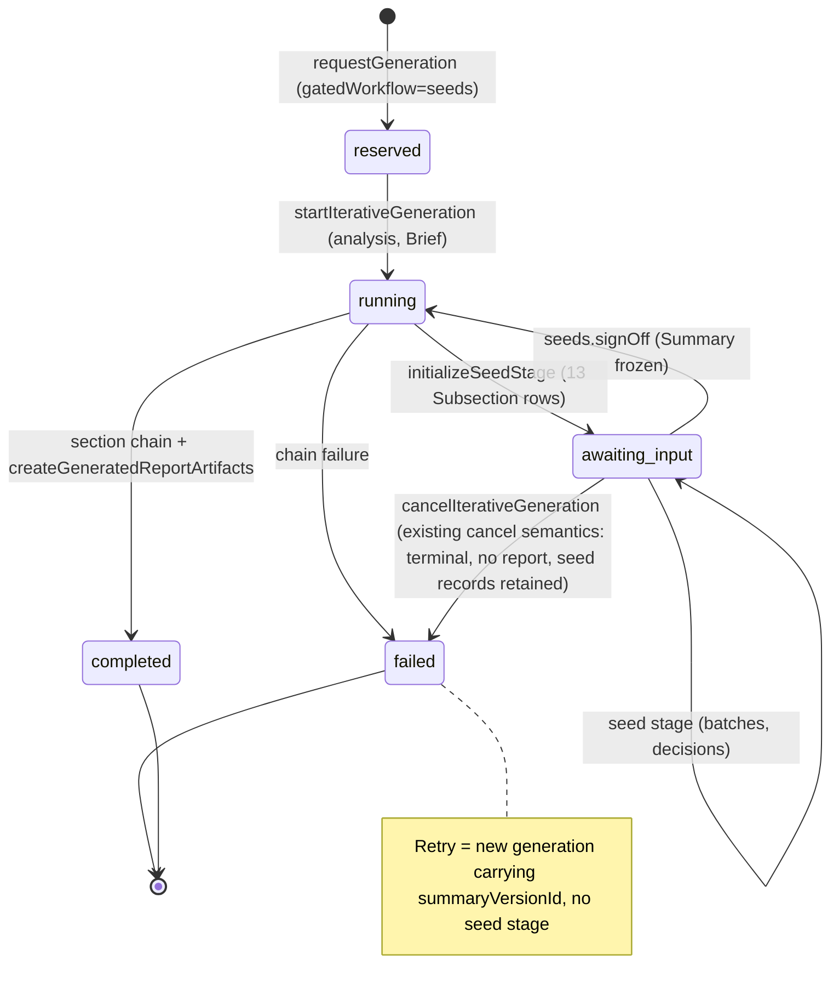
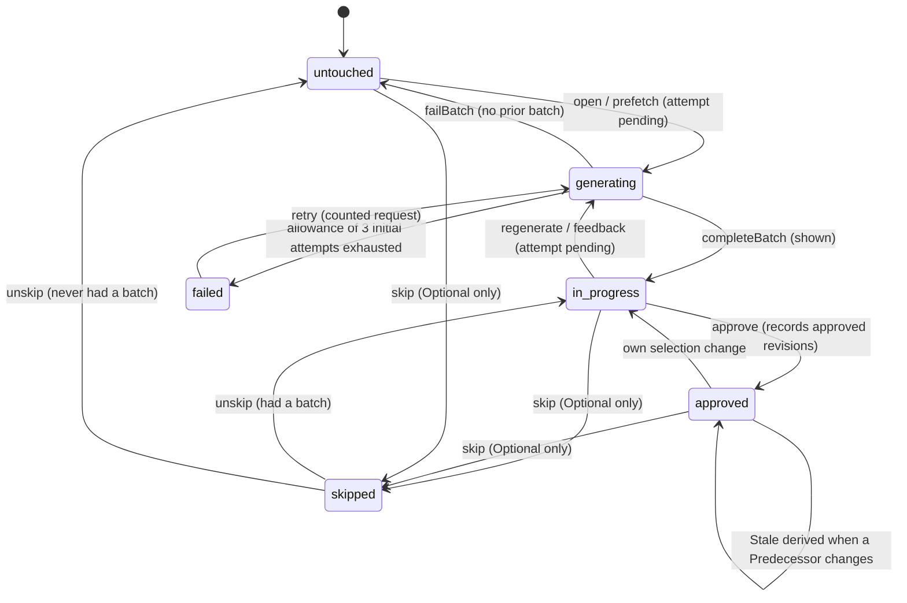
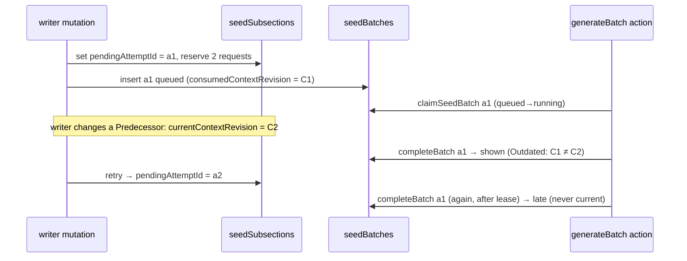

# State machines — Step-by-step PD generation

Diagrams for CAP-1, CAP-3, CAP-8, CAP-9, CAP-12 and CAP-13. The rules are in SPEC.md and the feature spine (AD-31, AD-34, AD-36, AD-37); these pictures carry shape only.

## Generation lifecycle (seeds workflow)



## Subsection state



Stale is not a stored state: `approved && (approvedContextRevision != currentContextRevision || approvedSelectionRevision != selectionRevision)`. Outdated is read-side: `shownBatch.consumedContextRevision != currentContextRevision`.

## Attempt ownership



## Approval and staleness across Subsections

```mermaid
flowchart LR
  S5[S5 approved] -- untick uncertainty --> S5b[S5 in progress]
  S5b -. currentContextRevision changes .-> S8[S8 approved → Stale]
  S5b -. .-> S9[S9 approved → Stale]
  S5b -. .-> S11[S11 in progress → shown batch Outdated]
  S8 -- regenerate + approve --> S8ok[S8 approved, episode resolved]
  S9 -- confirm and approve --> S9ok[S9 approved, episode resolved (confirmed)]
  S11 -- approve refused: outdated / unlinked --> S11r[regenerate → approve]
```
