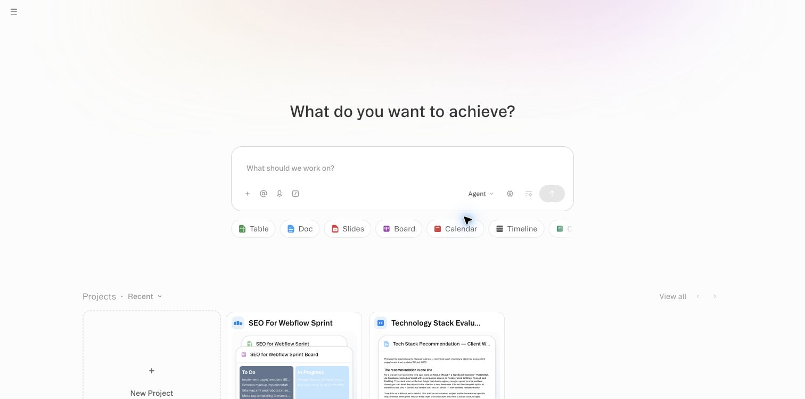
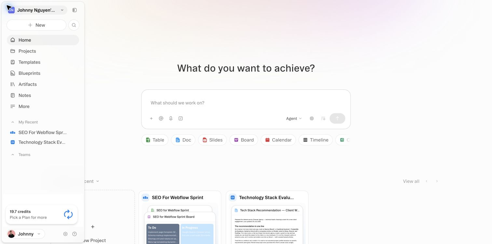
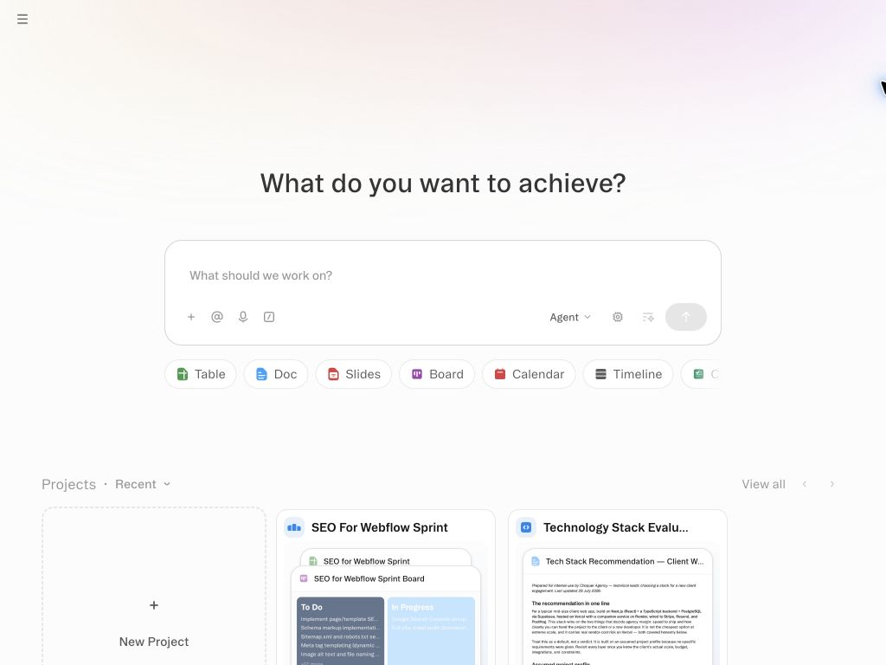
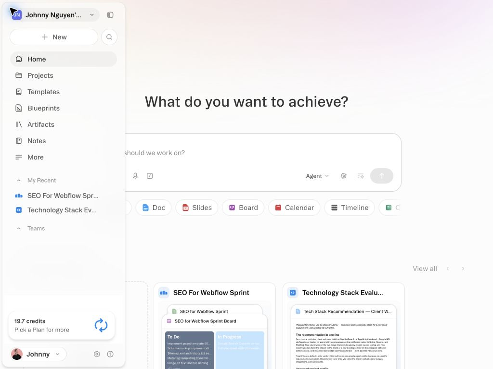
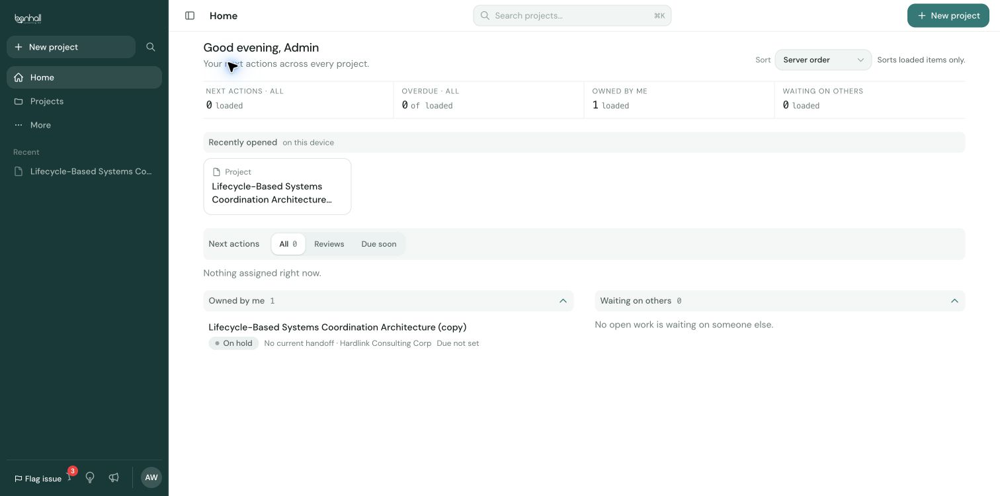
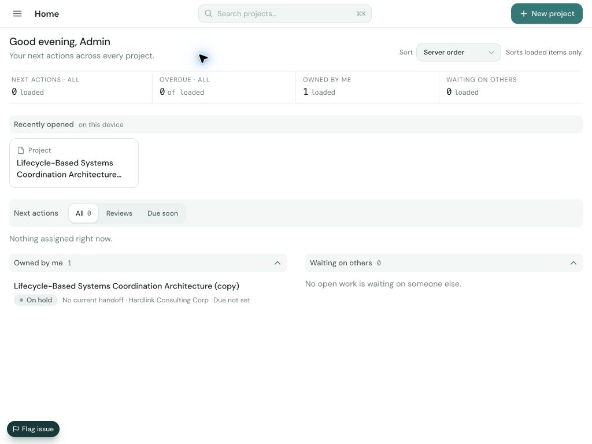
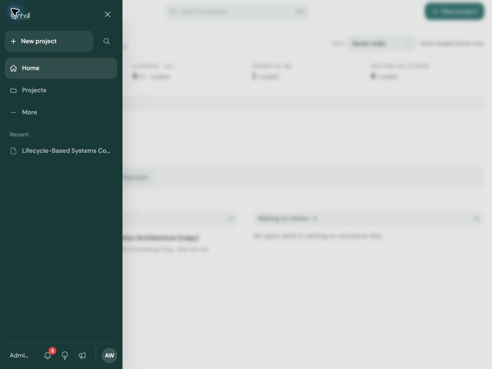
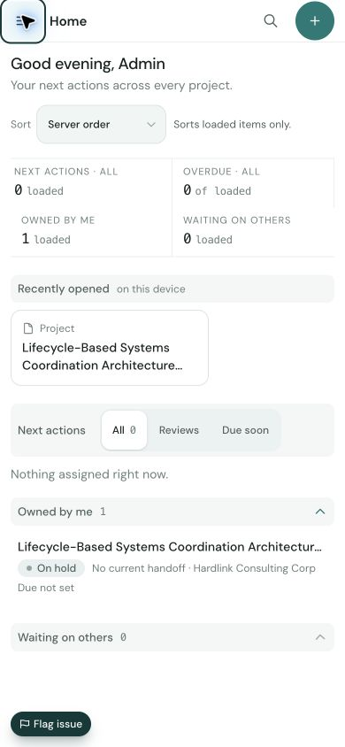
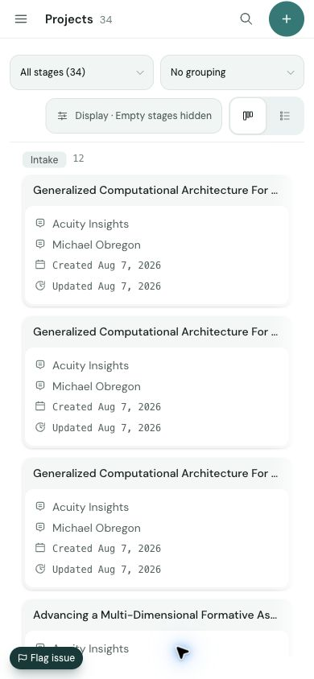
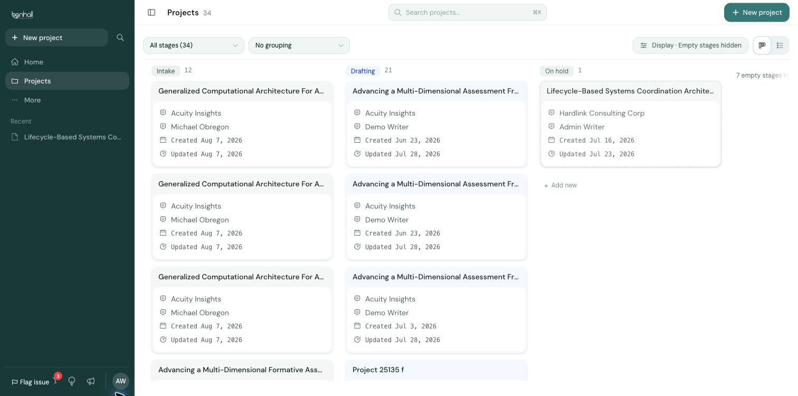

# Responsive/sidebar audit — Obvious.ai and Banhall

Date: 2026-08-07  
Browser: authenticated Google Chrome  
Mode: combined UX/accessibility audit, strictly read-only  
Banhall routes: `/my-work` and `/projects` only; `/changelog` was not opened.  
Original viewport: 1512×750 at DPR 2; restored to the same values after testing.

## Overall verdict

Banhall has the stronger narrow-screen accessibility model: a labelled modal drawer, scrim, body lock, 44 px drawer controls, focus wrapping, Escape dismissal, and focus return. Its responsive boundary is exact and its content/board containment is sound. The high-impact defect is the mobile account menu: it opens behind the drawer, leaving a focused menu in the accessibility tree with no visible menu. Secondary density misses remain on 32 px mobile disclosure headers and ~43.34 px account-menu rows.

Obvious uses the same 256 px floating overlay at all three tested widths. It has no dialog semantics or scrim, does not trap focus, ignores Escape, and returns focus to `BODY` after outside-click dismissal. Its opener and pin control are 28×28 px.

## Directly observed evidence

### 1. Obvious desktop, closed — healthy with accessibility risks

- 1512×750 viewport; no document scroll.
- Sidebar opener measured 28×28 px at x=12, y=8.
- Body and root overflow were `hidden` before opening.

### 2. Obvious desktop, open — visually clear, non-modal

- Floating sidebar: 256 px wide, inset 4 px on the left/top/bottom.
- No `dialog`, no `aria-modal`, and no full-viewport scrim.
- Workspace button 186×28 px; pin button 28×28 px; Home row 222×32 px.
- Escape did not close. Tab from the opener moved to the main Agent control, confirming no focus trap.
- Outside click closed it; focus landed on `BODY`, not the opener.

### 3. Obvious narrow and mobile — same overlay contract

- At 1024×768 and 390×844, the sidebar retained the 256 px floating treatment.
- On mobile it left a 134 px live content strip visible without a scrim.
- Escape and focus behavior matched desktop.

### 4. Banhall desktop Home — strong layout containment

- Persistent 255 px rail; header and main both start at x=255 and occupy the remaining 1257 px.
- Resizer is exposed as a vertical separator with values 220 / 255 / 360.
- Hide-rail control is 44×44 px with `aria-expanded=true` and `aria-controls=workspace-rail`.
- Desktop rail rows are 34 px high; footer icon controls are 32 px.

### 5. Banhall narrow Home and drawer — healthy

- Exact breakpoint: persistent rail at 1280 px; drawer opener at 1279 px.
- At 1024 px, header and main expand to the full viewport; document width stays 1024 px.
- Drawer is 255 px, `role=dialog`, `aria-modal=true`, with a full scrim and body overflow lock.
- Focus remains on the opener at first, then Tab enters at Close; Shift+Tab wraps to Account menu.
- Escape closes, restores body overflow, and returns focus to the opener.

### 6. Banhall mobile Home — strong shell, density misses

- Header opener, search, and New project controls are all 44×44 px.
- Every drawer link/button measured 44 px high and carries visible text or an accessible name.
- `Owned by me` and `Waiting on others` disclosures measured 32 px high.

### 7. Banhall mobile account menu — broken

- The account trigger reports expanded and a focused `role=menu` appears in the accessibility tree.
- Menu bounds are approximately 256×491 px at x=0, y=289.
- Menu z-index is 80 while the drawer is 110, so the menu is visually hidden behind the drawer.
- Menu rows measure about 43.34 px, slightly below the 44 px touch target.

### 8. Banhall Projects containment — healthy

- Desktop: 1225 px board viewport, 1328 px scroll track, 360 px columns; document remains 1512 px wide.
- Mobile: 366 px board viewport, 1298 px scroll track, 350 px visible columns; document remains 390 px wide.
- The shell/main own clipping; the board alone owns horizontal scroll.

## Responsive interaction contract

### Desktop, 1280 px and wider

- Use a persistent layout rail, default 255 px, resizable from 220–360 px.
- Header and main must share the same post-rail x-origin and never render beneath the rail.
- Keep a persistent 44×44 px hide/show control with truthful `aria-expanded` and `aria-controls`.
- No modal semantics, scrim, focus trap, or body lock are needed for the persistent rail.

### Narrow desktop/tablet, below 1280 px

- Remove the rail from layout and expose one 44×44 px opener in the header.
- Open a 255 px modal drawer with a full scrim; background content must not receive pointer or keyboard focus.
- Move focus into the drawer immediately, trap it, close with Close/Escape/scrim, and return focus to the opener.
- Lock body scroll only while open; keep the header/main full-width and prevent document overflow.

### Mobile

- Retain the narrow-screen modal contract and 44 px minimum target size for every drawer/header/account action.
- Keep visible text on primary navigation rows; give every icon-only control an accessible name and a hover/focus tooltip where hover exists.
- Portal nested menus above the drawer and scrim, collision-fit them to the viewport, keep them inside the drawer focus scope, and return focus to the account trigger on dismissal.
- Keep the page viewport-bound; feature surfaces such as boards own their own scroll.

## Exact Banhall mismatch list

1. **Mobile account menu is visually unavailable (defect).** The menu opens at z=80 behind the z=110 drawer. Obvious keeps its footer account/settings/help controls visible.
2. **Mobile account-menu rows are ~43.34 px (defect).** They miss Banhall's 44 px touch contract by ~0.66 px.
3. **Mobile Home disclosure headers are 32 px (defect).** `Owned by me` and `Waiting on others` are below the 44 px touch contract.
4. **Desktop shell model differs from Obvious (intentional product difference unless parity is required).** Banhall uses a persistent, resizing, content-reflowing rail at ≥1280; Obvious uses a floating 256 px overlay even at 1512.
5. **Material differs (intentional brand difference).** Banhall is edge-to-edge fir; Obvious is a light translucent 256 px card inset 4 px with 12 px corners.
6. **Narrow-screen modality differs (accessibility improvement).** Banhall supplies scrim, dialog semantics, body lock, focus trap, Escape, and focus return; Obvious supplies none of those.
7. **Opener/close density differs (accessibility improvement).** Banhall uses 44 px targets; Obvious's opener and pin controls are 28 px.
8. **Banhall desktop rail controls remain compact.** Primary rows are 34 px and footer icons 32 px. This is acceptable for pointer-dominant desktop only; it is not a reusable touch density.
9. **Initial drawer focus is deferred until the first Tab (polish/accessibility gap).** The opener retains focus immediately after open; the trap then redirects Tab to Close. The contract should move focus into the dialog at open.
10. **Icon tooltip evidence is incomplete.** Accessible names were present for Banhall Search, Alerts, Feature requests, What's new, Account menu, and drawer Close; no `title` attributes were present. Hover/focus tooltip rendering was not exercised.

## Evidence limits

- Desktop hide/show and Obvious pinning were not activated because both may persist a presentation preference, which would violate the read-only constraint.
- No screen-reader announcement testing, contrast calculation, browser zoom, reduced-motion, or OS-level touch testing was performed.
- Obvious body overflow is always hidden in the audited shell, so an overlay-specific scroll-lock delta could not be distinguished.
- Banhall `/settings`, `/changelog`, project creation, project cards, form controls, and all state-changing actions were not opened.
