# Banhall system map

How the pieces fit, what is solid, and what is not yet. Written 2026-09-03 against HEAD `005f115`. The binding decisions live in `_bmad-output/planning-artifacts/architecture/architecture-Banhall-2026-09-03/ARCHITECTURE-SPINE.md` (AD-1 to AD-22); this page is the readable projection. When they disagree, the spine wins.

Sibling docs: `product-domain.md` (the domain contract), `ai-architecture-plan.md` (AI target), `ai-engine-audit-2026-08-25.md` (findings), `the-brain.md`, `svelte-migration.md`, `design-system.md`.

## 1. One paragraph

A writer creates a project, attaches interview transcripts and supporting files, and asks for a draft. Convex freezes the inputs, runs a fixed pipeline (analyzer, three CRA section agents, scrub, compress, QA) on Claude, and writes a Tiptap JSON report. The writer edits in the browser, chats with an agent that can only *propose* edits (a human applies them), snapshots and exports to the Schedule 60 `.docx`. Every generation and chat call is metered. In the background, admin-approved exemplars (the Brain) and admin-published learning digests are injected into prompts so the system drifts toward how the firm's writers actually write. Workflow stage, ownership, and handoffs sit on the same project row but never cross-write with generation state.

## 2. The pipeline

```text
  transcripts + files          Convex                     AI engine (convex/ai/)                  writer surfaces
  ─────────────────    ──────────────────────    ────────────────────────────────────    ──────────────────────────
  /project/new   ──►   transcripts               reserveGeneration: freeze inputs        /project/[id]  Editor.svelte
  uploads        ──►   projectDocuments   ──►    analyzer ─► 242/244/246 agents   ──►    reports.content (Tiptap JSON)
  /ingestion/upload    generationSources         scrub ─► compress ─► QA                 snapshots, comments, export
  (bearer key)         (frozen copies)                    │                               AgentChatPanel ─► chatProposals
                                                          │                                   └─ human applyProposal
                                             ┌────────────┴──────────────┐
                                             │  Brain (RAG exemplars)    │  ◄── admin approves nominations
                                             │  learning digests         │  ◄── admin selects a digest
                                             │  writer style / house     │
                                             └───────────────────────────┘
```

Read the arrows as: nothing AI-generated reaches `reports.content` without a human action, and nothing enters the Brain or a live digest without an admin action.

## 3. Layers and dependency direction

| Layer | Directory | Contents |
| --- | --- | --- |
| Workflow core | `convex/*.ts` | `projects`, `projectWorkflow`, `workItems`, `reports`, `snapshots`, `comments`, `dashboard`, `myWork`, `users`, `invites`, `auth`, `http`, `crons`, `schema` (69 tables) |
| AI engine | `convex/ai/` | `pipeline`, `iterative`, `postQa`, `analyzerAgent`, `section24xAgent`, `qaAgent`, `chatAgentV2`, `research/`, `prompts`, `promptProgram`, `providers`, `openrouter`, `instrument`, `structured` |
| Knowledge sidecar | `convex/ai/brain/`, `convex/brain.ts`, `convex/learning.ts`, `convex/ai/learning.ts`, `convex/ai/brainRetrieval.ts` | RAG ingest / retrieve / erase, `brainSources` governance, digest distillation and selection ledger |
| Shared pure helpers | `convex/lib/` | `auth`, `roleCapabilities`, `contracts`, `dashboardProjection`, `snapshots`, `tiptapReport`, `lineLimits`, `transcripts`, `styleOverrides`, `providerConfig` |
| Isomorphic contracts | `shared/` | `capabilities`, `workflowStages`, `workflowTransitions`, `styleOverrides`, `generationModels`, `chatProposals`, `workItems`, `roles`, `bannedWords`, `humanProse` |
| Client | `src/routes`, `src/lib` | SvelteKit (SSR shell, hydrates into convex-svelte subscriptions), Svelte 5 runes, bits-ui primitives, Tiptap editor |

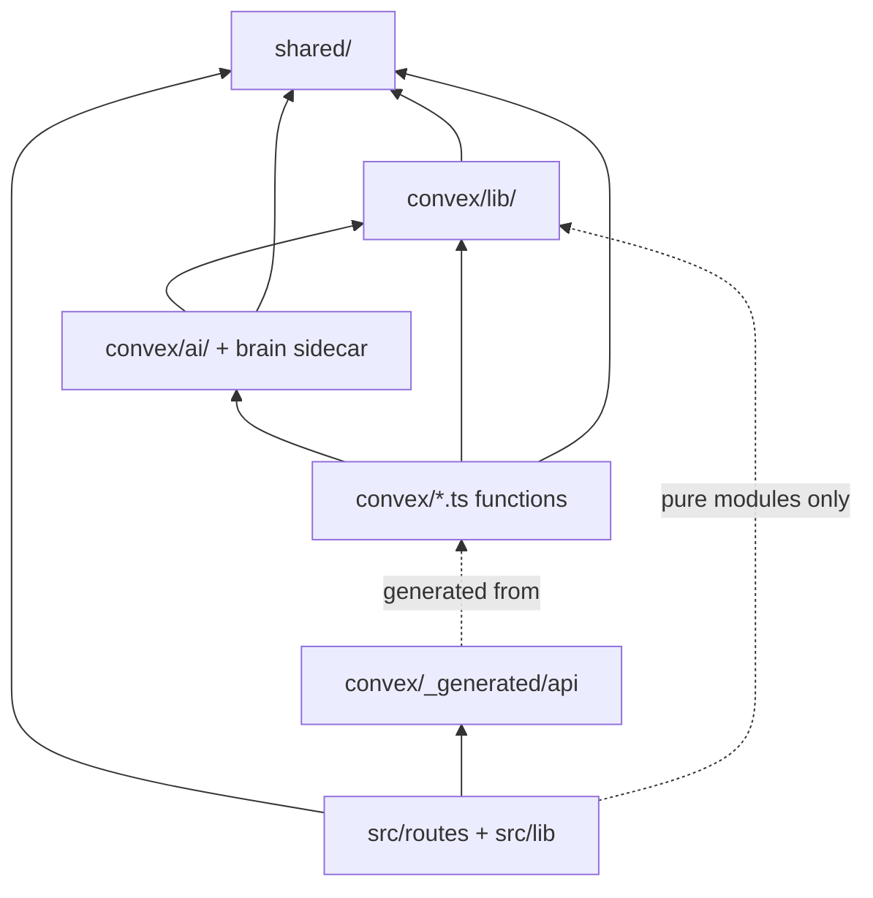

`src/` may import `shared/`, the generated `api`, and pure modules under `convex/lib/` (`lineLimits`, `transcripts`). It never imports Convex function modules or `convex/ai/`. This is documented only; nothing lints it yet (AD-1).

## 4. Deployment

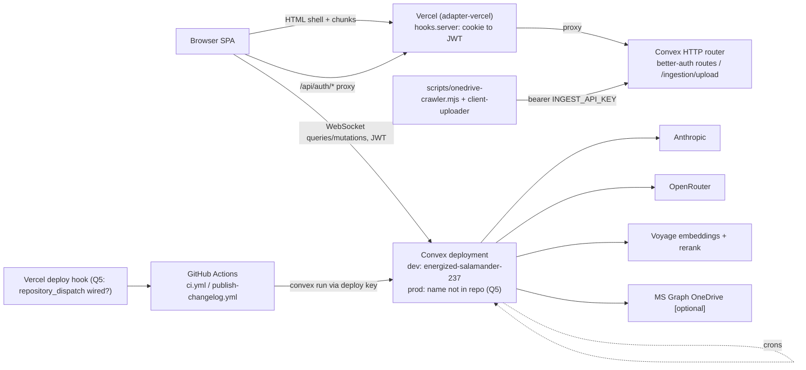

As found: frontend on Vercel via git integration; backend on Convex cloud with components `rag`, `agent`, `workpool`, `workflow`, `betterAuth`; there is no production deployment yet, `energized-salamander-237` serves developers and writers alike; CI runs `npm run check` and `npm test` only. Crons: stale generation / PD review / post-QA / chat-turn reapers every 10 min, oversight and my-work sweeps every 5 min, nightly digests 08:00 and 08:15 UTC. Target (AD-22): split into staging and prod at launch with `convex deploy` on merge to `main`; codegen diff and `vite build` in CI now.

## 5. Core entities

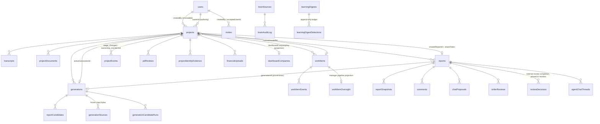

`projects` carries three state axes that never cross-write (AD-2): `workflowStage` (human), `generations.status` via `activeGenerationId` (technical), and legacy `status` (compatibility only). Planned but absent: `reportBranches`, `productionOutcomes`, `clients`, `claimPeriods`, `notifications`.

## 6. Workflow stages

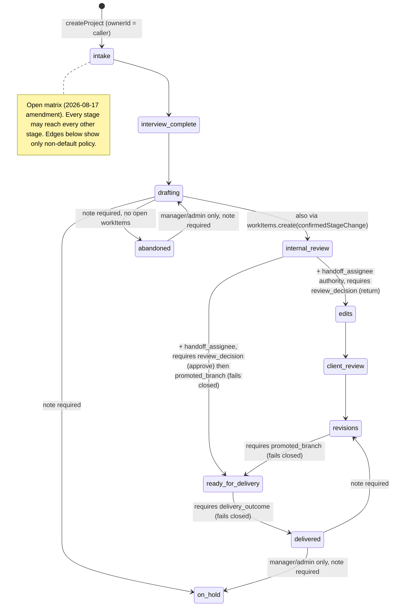

Every stage write goes through `patchProjectWorkflowStage`, which moves the dashboard `stageCounts` bucket in the same transaction and appends a `projectEvents` row. `ready_for_delivery` and `delivered` fail closed because `reportBranches` and `productionOutcomes` do not exist: **no project can reach a terminal stage today (Q1)**. The two internal-review completion edges also fail closed without a recorded reviewer decision (2026-09-04 amendment): `setWorkflowStage` requires a `reviewDecision` agreeing with the destination and writes one `reviewDecisions` row — reviewer, report, `revisionNumber`, `contentHash` — in the same transaction, typed `REVIEW_DECISION_REQUIRED` when absent and `INVALID_STATE` when the project has no report to pin. Checked before `promoted_branch` so it is observable on the approve edge.

## 7. Routes

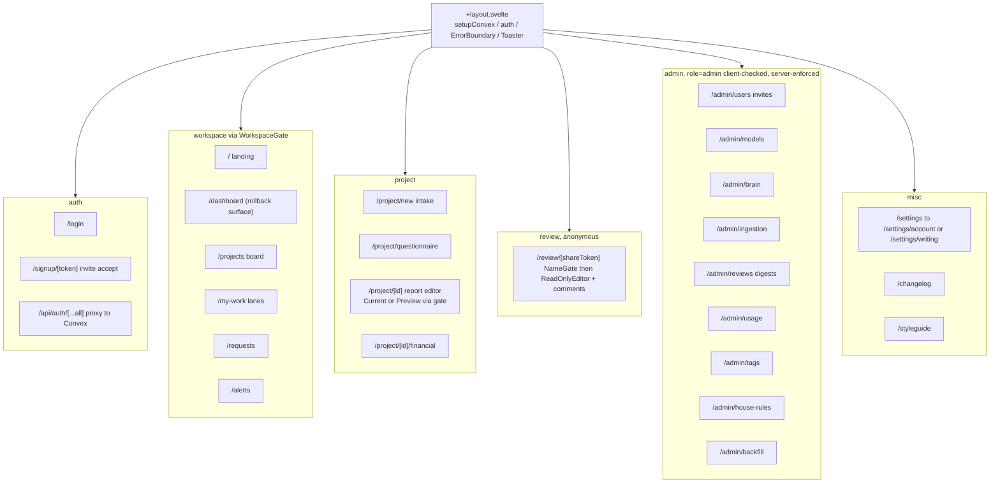

Client-side redirects are UX only; every query and mutation re-checks authorization in Convex (AD-7).

## 8. The report page

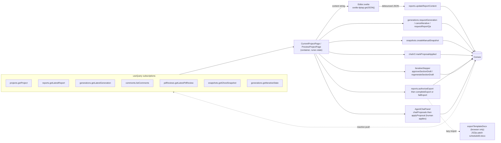

`reports.content` is a Tiptap JSON string whose three `Line 242 / 244 / 246` H2 headings are the parse contract between backend assembly and the client (`src/lib/reportSections.ts`). Export re-authorizes on `(reportId, revisionNumber, contentHash)`. Seven mutations may patch prose and two may create a report row (AD-3); no other code touches it.

## 9. Generation

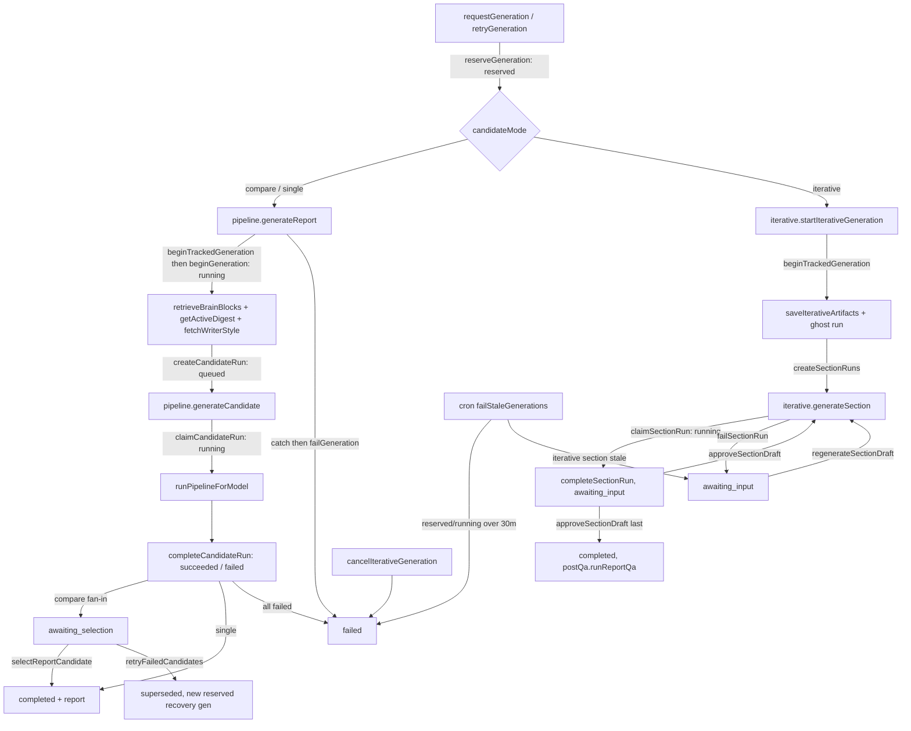

`reserveGeneration` copies every transcript and document into `generationSources` so provenance is byte-stable; `beginGeneration` stamps `promptVersion` and `learningDigestIds`. One active generation per project. Every model call goes through `clientForModel` and `instrument.ts` and lands in `aiUsage` (AD-5, AD-9).

## 10. Chat: agents propose, humans apply

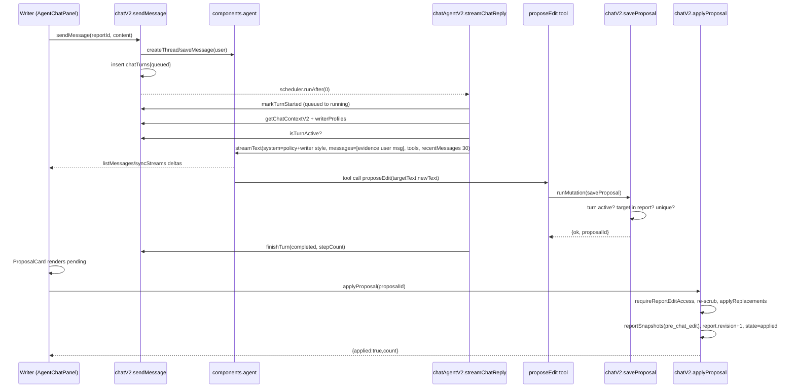

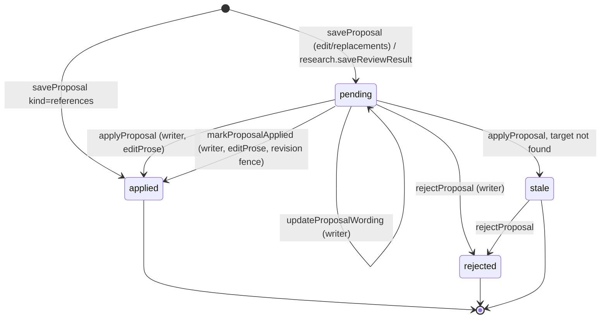

This is the invariant that makes the tool safer than ChatGPT: the model has no write path to prose (AD-4). Known gap: research inserts proposals directly rather than through `saveProposal` (divergence #48).

## 11. The Brain and the learning loop

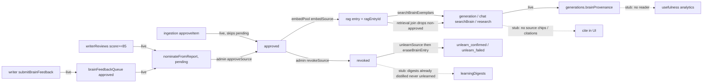

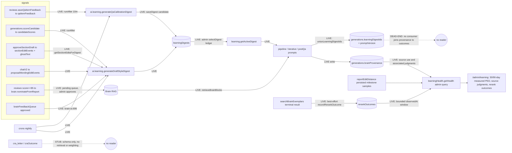

Read the solid arrows: the loop from writer signal to digest to prompt is live and governed. Read the dotted ones: nothing today can tell you whether the learning helps. Persisted post-edit distance, source provenance with associated judgments, and prospective rerank outcomes now feed `/admin/learning`. These bounded observational signals do not establish whether learning causes better reports; prompt/digest outcome attribution remains unmeasured, and CRA outcome signals remain schema only.

## 12. Verdict: is it a step up over pasting into ChatGPT?

| Claim | Today | Governed by |
| --- | --- | --- |
| Inputs are frozen and every draft traces to exact bytes, prompt version, and digests | Yes | AD-5 |
| The model cannot write prose; a human applies every proposal | Yes | AD-3, AD-4 |
| Workflow, ownership, handoffs are first-class and event-sourced | Yes | AD-2, AD-14, AD-15 |
| Knowledge is admin-governed; revocation is confirmed erasure | Yes | AD-6 |
| Every model call is metered and attributed | Yes | AD-9 |
| Style rules are tiered so CRA limits cannot be waived | Yes | AD-16 |
| Learning is measurable (does the Brain or a digest reduce editing?) | Partial: observed editing, source judgments and rerank reliability; no causal attribution | AD-12 |
| Client text cannot steer the model (trust boundary) | Partial: transcript fenced (CAP-2), trust from uploader role (CAP-3), chat evidence in a delimited user message (CAP-4); remaining CAP items open | AD-11, AD-11a |
| Client identities are stripped before firm-wide knowledge | No | AD-13 |
| Deleting a project erases its data | No: 8 of 49 tables, no blobs | AD-19 |
| Egress to AI providers is registered and class-gated | No register; OpenRouter has no `data_collection: deny` | AD-20, AD-21 |
| Destructive and money-spending writes need more than "any role" | No: ~50 paths authorize on the read gate | AD-7 |
| Spend alerts fire when a project runs hot | Metered, no alert yet (decision: alert only, never cap) | AD-9 |
| Staging, CI deploy, in-app alerts, backups | None; no prod deployment exists yet | AD-22 |

Summary: the workflow, provenance, and human-gating foundations are real and tested, and they are exactly what a paste-into-ChatGPT workflow lacks. The learning loop is wired but blind, the trust boundary is half-built, and data lifecycle and authorization ceilings are missing. Those four are Sprint 2 and the new AD-19 to AD-22.

## 13. Top risks

| # | Divergence | Why it matters |
| --- | --- | --- |
| 1 | `ready_for_delivery` and `delivered` fail closed | No project can be finished (Q1, product blocker) |
| 9 | Transcript fencing, uploader-role trust and the chat evidence boundary landed (CAP-2, CAP-3, CAP-4); the rest of AD-11 is open | Prompt injection channel narrowed; remaining CAP items are the follow-up |
| 11 | Verbatim client text and titles enter digests and the Brain | Client A's sentences and name can surface in client B's draft |
| 12 | `brainProvenance` and post-edit distance are write-only | Cannot prove learning works or roll back a bad digest on evidence |
| 39 | ~50 writes (delete document and blob, delete comment, research egress, chat spend, identity fields) need only "any role" | Any invited writer can act destructively on any client's project with no trail |
| 43 | `deleteProject` cascades 8 of 49 tables and no storage blobs | Frozen transcripts, files, snapshots, chat threads survive a delete |
| 44 | No egress register; OpenRouter without `data_collection: deny`; Graph `Files.Read.All`; research egress without consent | Confidentiality posture is not stated anywhere |
| 47 | Only 3 of 7 prose writers fence on `expectedRevisionNumber`; "current report" has two definitions | Interleaved section approvals and proposal applies can clobber each other; a proposal can land on a stale report |

Full register (51 rows, 8 fixed) is in the spine.

## 14. Open questions

| Id | Question | Class |
| --- | --- | --- |
| Q1 | Closed 2026-09-04: build `reportBranches` + `productionOutcomes`; terminal stages fail closed until then | Product |
| Q2 | `deleteProject` authority: `createdBy` or a `project.delete` capability? | Authorization |
| Q3 | Generation has no capability cell; any Consultant can generate anywhere. Intended? | Authorization |
| Q4 | Canonical orchestrator: factory or bmad-loop? | Process |
| Q5 | Closed 2026-09-04: no prod yet, one deployment serves everyone; split at launch. Open: is the changelog `repository_dispatch` wired? | Operations |
| Q6 | Ingestion `approveItem` skips the pending queue. Intentional? | Knowledge governance |
| Q7 | Closed by AD-11a | AI engine |
| Q8 | Port or delete the 14 dead bun tests; add component tests to CI? | Tests |
| Q9 | Retention windows (proposed 90 / 90 / 180 / 180 days) | Data lifecycle |
| Q10 | Closed 2026-09-04: Owner or Admin for delete / egress / spend / identity writes | Authorization |
| Q11 | Share-token rotation and expiry (proposed 30 / 90 days) | Authorization |
| Q12 | Closed 2026-09-04: no cap, alert only. Open: the threshold number | AI engine |
| Q13 | Closed 2026-09-04: in-app `/alerts` only | Operations |
| Q14 | Closed 2026-09-04: neither before launch | Authorization |

## 15. Stack

svelte 5.56.6, @sveltejs/kit 2.70.1, vite 8.1.5, tailwindcss 4.3.3, bits-ui 2.18, svelte-tiptap 3.0, convex 1.42.3, convex-svelte 0.14, @convex-dev/agent 0.6.4, @convex-dev/rag 0.7.5, @convex-dev/better-auth 0.12, ai 6.0.230 (v6 line by decision until AD-11 CAP-4 lands), @ai-sdk/anthropic 3.0, vitest 4.1, Node 22 in CI. Default model `claude-sonnet-5` direct; `openai/*` and `google/*` via OpenRouter; Voyage `voyage-3-large` + `rerank-2.5`.

## 16. Where to go next

1. Owner decisions taken 2026-09-04 (Q1, Q5, Q10, Q12, Q13, Q14). Still owner-level: Q2, Q3, Q6, Q11, and the Q12 threshold number.
2. AD-11a shipped (transcript fenced, writer's notes demoted, chat grounding moved to a user message, injection fixtures); continue with the remaining AD-11 CAP items.
3. Run the two Sprint 2 specs (`spec-ai-engine-sprint-2-boundary`, `spec-ai-engine-sprint-2-learn-chat`) through sprint planning; they build AD-11, AD-12, AD-13.
4. New stories not in either spec: AD-19 erasure cascade, `reportBranches` + `productionOutcomes` (Q1), Owner-or-Admin interim gate (Q10), in-app alerts (Q12, Q13), CI codegen diff and build (AD-22).
5. NFR evidence audit (`bmad-testarch-nfr`) once AD-11a and AD-19 land.
